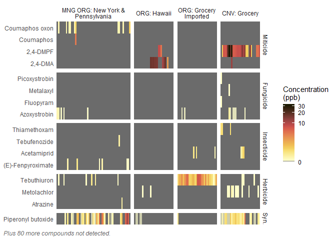
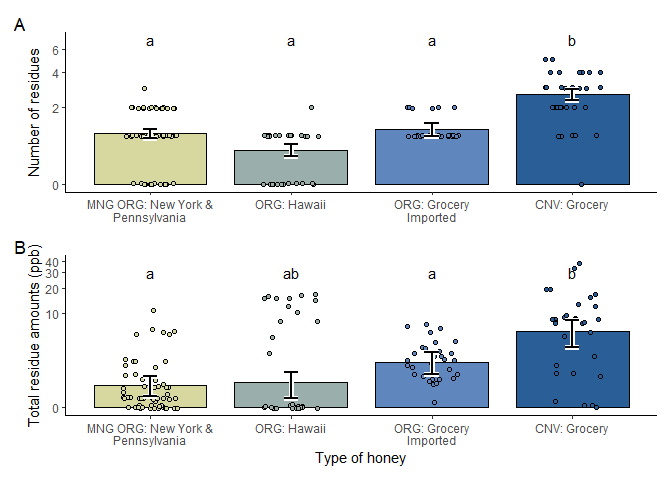
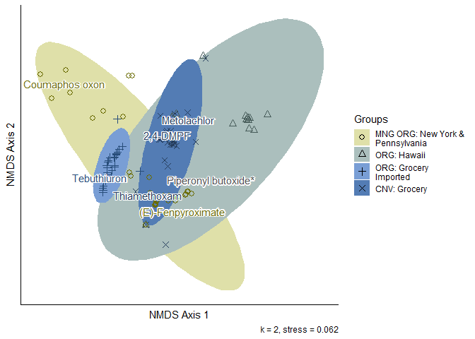

``` r
library(tidyverse)      # Easier data manipulation
library(readxl)         # Import Excel files directly
library(sf)             # Spatial data
library(crawlUtils)     # Provides function to expand st_bbox limits
library(basemaps)       # Downloads base map for ggplot
library(ggspatial)      # Provides lengend scale and north for map
library(ggrepel)        # Adds geom_text_repel function
library(khroma)         # Colors for heatmap
library(patchwork)      # Arrange ggplots in grids
library(ggedit)         # Ability to remove a geom for vis. abstract
library(gt)             # GTables
library(glmmTMB)        # GLMMs
library(performance)    # check_overdispersion
library(emmeans)        # Pairwise tests
library(indicspecies)   # Indicator Species Analysis 
library(vegan)          # For ordinations
library(ggordiplots)    # For generating ordination plot hulls
library(colorspace)     # darken() color function
# devtools::install_github("pmartinezarbizu/pairwiseAdonis/pairwiseAdonis")
library(pairwiseAdonis) # Pairwise PERMANOVA
library(units)          # Support units in R vectors, for set_units()
library(CropScapeR)     # Retrieve CDL Data
library(MuMIn)          # AICC comparison
library(ggeffects)      # glmm predictions

source("functions/std_error.R") # Standard error calc
```

Analysis, results and figures are organized according to where they
appear in the manuscript.

## 2. Methods

### Importing and cleaning data

First, we import some basic metadata on the honey samples, pesticides,
USDA organic tolerances, and experimental colonies.

``` r
# Import metadata
meta.Honey <- read_csv(
  "data/metadata/honey-meta.csv",
  na = "na",
  col_types = "fffff",
  col_select = -Store
)
meta.Cmpds <- read_csv(
  "data/metadata/pesticide-info-OREI.csv",
  col_types = "fffcc"
)
meta.Tols <- read_csv(
  "data/metadata/pesticide-tolerances.csv",
  col_types = "fdf"
)
meta.Cols <- read_csv(
  "data/metadata/colonies-OREI.csv",
  col_types = "ffff"
)
```

Next, we need to import the Excel files from the Cornell Chemical
Ecology Core Facility and convert them to a rectangular format for
analysis in R. We created a function, `read_pesticides()`, that does
this. The function pivots the pesticide data and tacks on the columns
containing the limits of quantification and detection. Some important
steps include:

1.  Read data from the spreadsheet.
2.  Import limits of detections (reported in ng of analyte).
3.  If data reads as `n.d.` or `N/F`, replace that observation with `0`
    ppb. If data reads as `<LOQ`, replace it with the sample-specific
    LOQ value for that compound, converted to ppb. (We divide the LOQ in
    ng by the sample weight). Likewise, `<ULOQ` values are converted to
    the ULOQ value.

We also follow guidelines in [USDA Publication 2613: Responding to
Results from Pesticide Residue
Testing](https://www.ams.usda.gov/sites/default/files/media/2613.pdf) to
determine whether residue levels in each sample exceed organic
tolerances. Basically, there are established limits for Amitraz and
Coumaphos in honey and wax. Residue limits for every other compound are
set at 10 ppb.

``` r
source("functions/read_pesticides.R")
# fmt: skip
data.H1.raw <- read_pesticides(
  frp_ss       = "data/pesticides/2025-04-09_BDM_Results_Project79.xlsx",
  frp_tab      = "Honey",
  frp_data     = "B4:CW77", 
  frp_lims     = "E78:CW80",
  frp_pestName = "E4:CW4",
  frp_limUnits = "ng")
# fmt: skip
data.H2.raw <- read_pesticides(
  frp_ss       = "data/pesticides/2025-04-09_BDM_Results_Project79.xlsx",
  frp_tab      = "Honey",
  frp_data     = "B83:CW156", 
  frp_lims     = "E157:CW159",
  frp_pestName = "E83:CW83",
  frp_limUnits = "ng")

# Store both honey dataframes in a list
list.H <- list(
  H1 = data.H1.raw,
  H2 = data.H2.raw
)
rm(data.H1.raw, data.H2.raw)

# We create a function that cleans up the pesticide data.
# This allows us to use the function on both batches of honey data at once
clean_pesticide_data <- function(x) {
  if (!any(grepl("ULOQ", names(x)))) {
    # If dataset reports ULOL vs ULOQ.
    # Mutate() functions below won't work unless we have an ULOQ value.
    # So we set this to NA just in case it's different from ULOQ
    ULOQ.col <- "ULOQ.ppb"
    x[[ULOQ.col]] <- NA
  }

  # <LOQs or >ULOQs get replaced with LOQ or ULOQ value, respectively
  x <- x %>%
    mutate(
      ppb = case_match(
        ppb,
        "<LOQ" ~ as.character(LOD.ppb),
        ">ULOQ" ~ as.character(ULOQ.ppb),
        .default = as.character(ppb)
      ),
      ppb = as.numeric(ppb),
      Cmpd = as.factor(Cmpd)
    )

  # Now we can drop the placeholder ULOQ column
  if (exists("ULOQ.col")) {
    x <- x %>% select(-starts_with("ULOQ"))
  }
  return(x)
}

# Clean up both batches of the honey dataset at once
list.H.clean <- map(list.H, ~ clean_pesticide_data(.x))

# Combine both files
data.H.Long <- bind_rows(list.H.clean[["H1"]], list.H.clean[["H2"]]) %>%
  separate_wider_delim(
    Sample.ID,
    delim = " ",
    names = c("Sample.Type", "Sample.ID")
  ) %>%
  mutate(
    Sample.ID = as.factor(as.integer(Sample.ID)),
    Cmpd = as.factor(Cmpd),
    ppb = as.numeric(ppb)
  ) %>%
  left_join(meta.Cmpds %>% select(Cmpd, Class.Pest), by = join_by(Cmpd)) %>%
  left_join(meta.Honey, by = join_by(Sample.ID)) %>%
  left_join(meta.Cols, by = join_by(Colony.ID)) %>%
  # fmt: skip
  select(Sample.ID, Colony.ID, Group, Brand, Apiary, Trt, Cmpd, Class.Pest, ppb,
    ends_with(".ppb")
  )

data.H.Wide <- data.H.Long %>%
  select(-Class.Pest, -ends_with(".ppb")) %>%
  pivot_wider(names_from = Cmpd, values_from = ppb)

# Clean up unused vars
rm(list.H, list.H.clean)

# Vectors we can use to consistently arrange the order of pesticides in
# plots and tables
styles.classLev <- c(
  "Miticide",
  "Antibiotic",
  "Synergist",
  "Insecticide",
  "Fungicide",
  "Herbicide"
)
styles.groupOrd <- c("OREI", "OG-HI", "OG-IMP", "CNV")
styles.group <- c(
  "OREI" = "MNG ORG: New York &\nPennsylvania",
  "OG-HI" = "ORG: Hawaii",
  "OG-IMP" = "ORG: Grocery\nImported",
  "CNV" = "CNV: Grocery"
)
```

### 2.1. Experimental apiary management

#### Figure 1. Map of the Eastern United States indicating the locations of organic apiaries in the states of New York and Pennsylvania

``` r
# A dataframe of apiaries and GPS coordinates.
meta.farms <- read.csv("data/landscape/apiary-locations-OREI.csv")

sf.farms <- meta.farms %>%
  st_as_sf(coords = c("Lon", "Lat"), crs = 4326)

plot_map <- function(df_coords, res, expand, fPull) {
  # Convert list of apiaries into coordinates to plot
  map.coords <- df_coords %>%
    st_transform(crs = st_crs(3857)) # basemap requires EPSG 3857 web mercator

  # Get a basemap zoomed out slightly from the apiary coordinates
  # Register for an API key at https://www.thunderforest.com/ and set the credential using
  # basemaps::set_defaults()
  map.base <- basemap_gglayer(
    ext = st_expand(st_bbox(map.coords), ef = expand),
    map_service = "mapbox",
    map_type = "outdoors",
    map_res = res,
    verbose = F
  )

  # Retrieves the extents of the map we just downloaded
  map.limits <- map.base$data %>% st_as_sf(coords = c("x", "y")) %>% st_bbox()

  # Assemble the map
  map <- ggplot(data = map.coords) +
    map.base +
    scale_fill_identity() + # Plot basemap in the colors it specifies

    # Plot apiary coordinates
    geom_sf(
      aes(geometry = geometry),
      pch = 21,
      stroke = 1,
      size = 2,
      fill = "black",
      color = "white"
    ) +

    # Set limits of map to those of basemap (hide other states)
    # and remove padding between plot and axes
    scale_x_continuous(limits = map.limits[c(1, 3)], expand = c(0, 0)) +
    scale_y_continuous(limits = map.limits[c(2, 4)], expand = c(0, 0)) +

    # North arrow
    annotation_north_arrow(
      location = "br",
      pad_y = unit(0.75, "cm"),
      pad_x = unit(0.25, "cm"),
      style = north_arrow_fancy_orienteering
    ) +

    # Add a white gradient behind scale for readability.
    # See @link https://stackoverflow.com/a/72827753/5025767
    annotation_custom(
      grob = grid::rasterGrob(
        image = colorRampPalette(c("transparent", "white"), alpha = T)(10), # Gradient
        # Anchor to bottom of plot. vjust positions bottom of rect. @ y = 0
        x = unit(0.5, "npc"),
        y = unit(0, "npc"),
        vjust = 0,
        # Gradient is 100% of plot width
        width = unit(1, "npc"),
        # Height is a multiple of the scale's Y padding
        height = 4 * unit(0.25, "cm")
      )
    ) +

    # Map scale
    annotation_scale(location = "br", pad_x = unit(0.5, "cm")) +

    labs(caption = "Base map source: Mapbox, Open Street Map") +

    # Remove axis titles and gridlines
    theme(
      axis.title = element_blank(),
      panel.grid = element_blank(),
      panel.border = element_rect(fill = NA),
      plot.caption = element_text(
        hjust = 0,
        vjust = 12,
        color = "grey40",
        size = 8
      )
    )
  # Return figure
  return(map)
}

# Create a spatial dataframe of farm locations and leader lines
# # fmt: skip
sf.labels <- data.frame(
  Apiary      = c("PA-3", "PA-2", "PA-1", "NY-3", "NY-2", "NY-1"),
  lab.lon     = c(-75,    -78.6,  -78.6,  -75.3,  -75,    -77.5),
  lab.lat     = c(41.2,   41.5,   40.5,   43.5,   42.4,   42.3)) %>% 
  st_as_sf(coords = c("lab.lon", "lab.lat"), crs = 4326)

# Create lines between apiaries and labels
sf.lines <- st_sf(
  crs = st_crs(sf.labels),
  Apiary = sf.labels$Apiary,
  geometry = st_sfc(mapply(
    function(p1, p2) {
      st_cast(st_union(p1, p2), "LINESTRING")
    },
    sf.labels$geometry,
    sf.farms$geometry,
    SIMPLIFY = FALSE
  ))
)

# Plot the map
(fig.1 <- plot_map(df_coords = sf.farms, res = 0.4, expand = 2) +
  geom_sf(data = sf.lines, linewidth = 0.5) +
  geom_text_repel(
    data = sf.labels,
    aes(label = Apiary, geometry = geometry),
    stat = "sf_coordinates",
    bg.r = 0.2,
    bg.color = "white",
    force = 0
  ) +
  theme(plot.caption = element_text(vjust = 0)))
```

<!-- -->

``` r
ggsave(
  "Figure_1.png",
  plot = fig.1,
  path = "figures",
  dpi = 500,
  width = 4,
  height = 5
)
```

#### Differences in limits between both UHPLC-MS/MS batches

``` r
difference <- function(vec) {
  diff <- max(vec) - min(vec)
  return(diff)
}

# Get just the compounds and limits
df.limits <- data.H.Long %>%
  select(Cmpd, ends_with(".ppb")) %>%
  unique()

df.limits %>%
  arrange(Cmpd) %>% # Sorts by compound. We see there's 2 limits for each compound.
  group_by(Cmpd) %>% # for each compound,
  # Compute difference between limits
  summarise(
    across(ends_with(".ppb"), list(diff = difference)),
    .groups = "drop"
  ) %>%
  # Now, for each limit, average differences across compounds and compute std. error.
  summarise(across(ends_with("_diff"), list(mean = mean, SE = std_error))) %>%
  signif(digits = 2) %>%
  # Values are easier to read if listed vertically
  transpose(keep.names = "Difference") %>%
  rename("Value (ppb)" = V1)
```

    ##           Difference Value (ppb)
    ## 1  LOD.ppb_diff_mean       0.071
    ## 2    LOD.ppb_diff_SE       0.020
    ## 3  LOQ.ppb_diff_mean       0.210
    ## 4    LOQ.ppb_diff_SE       0.060
    ## 5 ULOQ.ppb_diff_mean       5.600
    ## 6   ULOQ.ppb_diff_SE       0.000

``` r
# Save most conservative limit (maximum) for reporting in output tables
df.limits <- df.limits %>%
  group_by(Cmpd) %>%
  summarize(across(ends_with(".ppb"), ~ max(.)))
```

#### Table S2. List of 96 pesticides screened in honey samples

``` r
# Summary table by compound --------------------------------------------------------
df.cmpdSumm <- data.H.Long %>%
  group_by(Cmpd, Class.Pest) %>%
  # fmt: skip
  summarize(
      n.detect   = n_distinct(Sample.ID[ppb>0]),
      pct.detect = ifelse(n.detect > 0, n.detect / n_distinct(Sample.ID), NA),
      ppb.mean   = ifelse(n.detect > 0, mean(ppb),      NA),
      ppb.se     = ifelse(n.detect > 0, std_error(ppb), NA),
      ppb.min    = ifelse(n.detect > 0, min(ppb),       NA),
      ppb.max    = ifelse(n.detect > 0, max(ppb),       NA),
      .groups    = "drop") %>%
  arrange(desc(pct.detect)) %>%
  # Convert to factor in current order. Useful for charts using this dataframe
  mutate(
    Class.Pest = factor(Class.Pest, ordered = T, levels = styles.classLev)
  ) %>%

  # Add organic MRLS
  left_join(
    meta.Tols %>%
      select(Cmpd, MRL.H.ppm) %>%
      mutate(
        MRL.OG.ppb = MRL.H.ppm * 0.05 * 1000, # 5% of EPA, convert to ppb
        # Cmpd       = factor(Cmpd, ordered = T, levels = rev(df.cmpdSumm$Cmpd)),
        .keep = "unused"
      ),
    by = "Cmpd"
  ) %>%
  # Any compound with an undefined tolerance is set at 10ppb
  mutate(MRL.OG.ppb = ifelse(is.na(MRL.OG.ppb), 10, MRL.OG.ppb)) %>%

  # Add LOD and LOQs to summary table
  left_join(df.limits %>% select(-ULOQ.ppb), by = "Cmpd")

# Generate a nice clean table -------------------------------------------------------
df.cmpdSumm %>%
  select(-n.detect) %>%
  relocate(pct.detect, LOD.ppb, LOQ.ppb, MRL.OG.ppb, .before = ppb.mean) %>%
  # filter(ppb.mean > 0) %>%  # HIDE COMPOUNDS NOT DETECTED
  group_by(Class.Pest) %>%
  arrange(Class.Pest, desc(pct.detect)) %>%

  gt(rowname_col = "Cmpd") %>%
  tab_stubhead("Compound") %>%

  # Replace NAs with Not Detected
  sub_missing(missing_text = "ND") %>%

  fmt_number(columns = c(starts_with("ppb")), decimals = 3) %>%
  fmt_percent(columns = pct.detect, decimals = 1) %>%

  tab_spanner(label = "Amounts (ppb)", columns = 4:10) %>%
  # fmt: skip
  cols_label(
      ppb.mean   = "Mean",      ppb.se     = "SE",
      ppb.min    = "Min",       ppb.max    = "Max",
      pct.detect = "% Samples", MRL.OG.ppb = "Organic MRL",
      LOD.ppb    = "LOD",       LOQ.ppb    = "LOQ") %>% 
  tab_options(table.align = "left")
```

<div id="bebseqhojm" style="padding-left:0px;padding-right:0px;padding-top:10px;padding-bottom:10px;overflow-x:auto;overflow-y:auto;width:auto;height:auto;">
<style>#bebseqhojm table {
  font-family: system-ui, 'Segoe UI', Roboto, Helvetica, Arial, sans-serif, 'Apple Color Emoji', 'Segoe UI Emoji', 'Segoe UI Symbol', 'Noto Color Emoji';
  -webkit-font-smoothing: antialiased;
  -moz-osx-font-smoothing: grayscale;
}
&#10;#bebseqhojm thead, #bebseqhojm tbody, #bebseqhojm tfoot, #bebseqhojm tr, #bebseqhojm td, #bebseqhojm th {
  border-style: none;
}
&#10;#bebseqhojm p {
  margin: 0;
  padding: 0;
}
&#10;#bebseqhojm .gt_table {
  display: table;
  border-collapse: collapse;
  line-height: normal;
  margin-left: 0;
  margin-right: auto;
  color: #333333;
  font-size: 16px;
  font-weight: normal;
  font-style: normal;
  background-color: #FFFFFF;
  width: auto;
  border-top-style: solid;
  border-top-width: 2px;
  border-top-color: #A8A8A8;
  border-right-style: none;
  border-right-width: 2px;
  border-right-color: #D3D3D3;
  border-bottom-style: solid;
  border-bottom-width: 2px;
  border-bottom-color: #A8A8A8;
  border-left-style: none;
  border-left-width: 2px;
  border-left-color: #D3D3D3;
}
&#10;#bebseqhojm .gt_caption {
  padding-top: 4px;
  padding-bottom: 4px;
}
&#10;#bebseqhojm .gt_title {
  color: #333333;
  font-size: 125%;
  font-weight: initial;
  padding-top: 4px;
  padding-bottom: 4px;
  padding-left: 5px;
  padding-right: 5px;
  border-bottom-color: #FFFFFF;
  border-bottom-width: 0;
}
&#10;#bebseqhojm .gt_subtitle {
  color: #333333;
  font-size: 85%;
  font-weight: initial;
  padding-top: 3px;
  padding-bottom: 5px;
  padding-left: 5px;
  padding-right: 5px;
  border-top-color: #FFFFFF;
  border-top-width: 0;
}
&#10;#bebseqhojm .gt_heading {
  background-color: #FFFFFF;
  text-align: center;
  border-bottom-color: #FFFFFF;
  border-left-style: none;
  border-left-width: 1px;
  border-left-color: #D3D3D3;
  border-right-style: none;
  border-right-width: 1px;
  border-right-color: #D3D3D3;
}
&#10;#bebseqhojm .gt_bottom_border {
  border-bottom-style: solid;
  border-bottom-width: 2px;
  border-bottom-color: #D3D3D3;
}
&#10;#bebseqhojm .gt_col_headings {
  border-top-style: solid;
  border-top-width: 2px;
  border-top-color: #D3D3D3;
  border-bottom-style: solid;
  border-bottom-width: 2px;
  border-bottom-color: #D3D3D3;
  border-left-style: none;
  border-left-width: 1px;
  border-left-color: #D3D3D3;
  border-right-style: none;
  border-right-width: 1px;
  border-right-color: #D3D3D3;
}
&#10;#bebseqhojm .gt_col_heading {
  color: #333333;
  background-color: #FFFFFF;
  font-size: 100%;
  font-weight: normal;
  text-transform: inherit;
  border-left-style: none;
  border-left-width: 1px;
  border-left-color: #D3D3D3;
  border-right-style: none;
  border-right-width: 1px;
  border-right-color: #D3D3D3;
  vertical-align: bottom;
  padding-top: 5px;
  padding-bottom: 6px;
  padding-left: 5px;
  padding-right: 5px;
  overflow-x: hidden;
}
&#10;#bebseqhojm .gt_column_spanner_outer {
  color: #333333;
  background-color: #FFFFFF;
  font-size: 100%;
  font-weight: normal;
  text-transform: inherit;
  padding-top: 0;
  padding-bottom: 0;
  padding-left: 4px;
  padding-right: 4px;
}
&#10;#bebseqhojm .gt_column_spanner_outer:first-child {
  padding-left: 0;
}
&#10;#bebseqhojm .gt_column_spanner_outer:last-child {
  padding-right: 0;
}
&#10;#bebseqhojm .gt_column_spanner {
  border-bottom-style: solid;
  border-bottom-width: 2px;
  border-bottom-color: #D3D3D3;
  vertical-align: bottom;
  padding-top: 5px;
  padding-bottom: 5px;
  overflow-x: hidden;
  display: inline-block;
  width: 100%;
}
&#10;#bebseqhojm .gt_spanner_row {
  border-bottom-style: hidden;
}
&#10;#bebseqhojm .gt_group_heading {
  padding-top: 8px;
  padding-bottom: 8px;
  padding-left: 5px;
  padding-right: 5px;
  color: #333333;
  background-color: #FFFFFF;
  font-size: 100%;
  font-weight: initial;
  text-transform: inherit;
  border-top-style: solid;
  border-top-width: 2px;
  border-top-color: #D3D3D3;
  border-bottom-style: solid;
  border-bottom-width: 2px;
  border-bottom-color: #D3D3D3;
  border-left-style: none;
  border-left-width: 1px;
  border-left-color: #D3D3D3;
  border-right-style: none;
  border-right-width: 1px;
  border-right-color: #D3D3D3;
  vertical-align: middle;
  text-align: left;
}
&#10;#bebseqhojm .gt_empty_group_heading {
  padding: 0.5px;
  color: #333333;
  background-color: #FFFFFF;
  font-size: 100%;
  font-weight: initial;
  border-top-style: solid;
  border-top-width: 2px;
  border-top-color: #D3D3D3;
  border-bottom-style: solid;
  border-bottom-width: 2px;
  border-bottom-color: #D3D3D3;
  vertical-align: middle;
}
&#10;#bebseqhojm .gt_from_md > :first-child {
  margin-top: 0;
}
&#10;#bebseqhojm .gt_from_md > :last-child {
  margin-bottom: 0;
}
&#10;#bebseqhojm .gt_row {
  padding-top: 8px;
  padding-bottom: 8px;
  padding-left: 5px;
  padding-right: 5px;
  margin: 10px;
  border-top-style: solid;
  border-top-width: 1px;
  border-top-color: #D3D3D3;
  border-left-style: none;
  border-left-width: 1px;
  border-left-color: #D3D3D3;
  border-right-style: none;
  border-right-width: 1px;
  border-right-color: #D3D3D3;
  vertical-align: middle;
  overflow-x: hidden;
}
&#10;#bebseqhojm .gt_stub {
  color: #333333;
  background-color: #FFFFFF;
  font-size: 100%;
  font-weight: initial;
  text-transform: inherit;
  border-right-style: solid;
  border-right-width: 2px;
  border-right-color: #D3D3D3;
  padding-left: 5px;
  padding-right: 5px;
}
&#10;#bebseqhojm .gt_stub_row_group {
  color: #333333;
  background-color: #FFFFFF;
  font-size: 100%;
  font-weight: initial;
  text-transform: inherit;
  border-right-style: solid;
  border-right-width: 2px;
  border-right-color: #D3D3D3;
  padding-left: 5px;
  padding-right: 5px;
  vertical-align: top;
}
&#10;#bebseqhojm .gt_row_group_first td {
  border-top-width: 2px;
}
&#10;#bebseqhojm .gt_row_group_first th {
  border-top-width: 2px;
}
&#10;#bebseqhojm .gt_summary_row {
  color: #333333;
  background-color: #FFFFFF;
  text-transform: inherit;
  padding-top: 8px;
  padding-bottom: 8px;
  padding-left: 5px;
  padding-right: 5px;
}
&#10;#bebseqhojm .gt_first_summary_row {
  border-top-style: solid;
  border-top-color: #D3D3D3;
}
&#10;#bebseqhojm .gt_first_summary_row.thick {
  border-top-width: 2px;
}
&#10;#bebseqhojm .gt_last_summary_row {
  padding-top: 8px;
  padding-bottom: 8px;
  padding-left: 5px;
  padding-right: 5px;
  border-bottom-style: solid;
  border-bottom-width: 2px;
  border-bottom-color: #D3D3D3;
}
&#10;#bebseqhojm .gt_grand_summary_row {
  color: #333333;
  background-color: #FFFFFF;
  text-transform: inherit;
  padding-top: 8px;
  padding-bottom: 8px;
  padding-left: 5px;
  padding-right: 5px;
}
&#10;#bebseqhojm .gt_first_grand_summary_row {
  padding-top: 8px;
  padding-bottom: 8px;
  padding-left: 5px;
  padding-right: 5px;
  border-top-style: double;
  border-top-width: 6px;
  border-top-color: #D3D3D3;
}
&#10;#bebseqhojm .gt_last_grand_summary_row_top {
  padding-top: 8px;
  padding-bottom: 8px;
  padding-left: 5px;
  padding-right: 5px;
  border-bottom-style: double;
  border-bottom-width: 6px;
  border-bottom-color: #D3D3D3;
}
&#10;#bebseqhojm .gt_striped {
  background-color: rgba(128, 128, 128, 0.05);
}
&#10;#bebseqhojm .gt_table_body {
  border-top-style: solid;
  border-top-width: 2px;
  border-top-color: #D3D3D3;
  border-bottom-style: solid;
  border-bottom-width: 2px;
  border-bottom-color: #D3D3D3;
}
&#10;#bebseqhojm .gt_footnotes {
  color: #333333;
  background-color: #FFFFFF;
  border-bottom-style: none;
  border-bottom-width: 2px;
  border-bottom-color: #D3D3D3;
  border-left-style: none;
  border-left-width: 2px;
  border-left-color: #D3D3D3;
  border-right-style: none;
  border-right-width: 2px;
  border-right-color: #D3D3D3;
}
&#10;#bebseqhojm .gt_footnote {
  margin: 0px;
  font-size: 90%;
  padding-top: 4px;
  padding-bottom: 4px;
  padding-left: 5px;
  padding-right: 5px;
}
&#10;#bebseqhojm .gt_sourcenotes {
  color: #333333;
  background-color: #FFFFFF;
  border-bottom-style: none;
  border-bottom-width: 2px;
  border-bottom-color: #D3D3D3;
  border-left-style: none;
  border-left-width: 2px;
  border-left-color: #D3D3D3;
  border-right-style: none;
  border-right-width: 2px;
  border-right-color: #D3D3D3;
}
&#10;#bebseqhojm .gt_sourcenote {
  font-size: 90%;
  padding-top: 4px;
  padding-bottom: 4px;
  padding-left: 5px;
  padding-right: 5px;
}
&#10;#bebseqhojm .gt_left {
  text-align: left;
}
&#10;#bebseqhojm .gt_center {
  text-align: center;
}
&#10;#bebseqhojm .gt_right {
  text-align: right;
  font-variant-numeric: tabular-nums;
}
&#10;#bebseqhojm .gt_font_normal {
  font-weight: normal;
}
&#10;#bebseqhojm .gt_font_bold {
  font-weight: bold;
}
&#10;#bebseqhojm .gt_font_italic {
  font-style: italic;
}
&#10;#bebseqhojm .gt_super {
  font-size: 65%;
}
&#10;#bebseqhojm .gt_footnote_marks {
  font-size: 75%;
  vertical-align: 0.4em;
  position: initial;
}
&#10;#bebseqhojm .gt_asterisk {
  font-size: 100%;
  vertical-align: 0;
}
&#10;#bebseqhojm .gt_indent_1 {
  text-indent: 5px;
}
&#10;#bebseqhojm .gt_indent_2 {
  text-indent: 10px;
}
&#10;#bebseqhojm .gt_indent_3 {
  text-indent: 15px;
}
&#10;#bebseqhojm .gt_indent_4 {
  text-indent: 20px;
}
&#10;#bebseqhojm .gt_indent_5 {
  text-indent: 25px;
}
&#10;#bebseqhojm .katex-display {
  display: inline-flex !important;
  margin-bottom: 0.75em !important;
}
&#10;#bebseqhojm div.Reactable > div.rt-table > div.rt-thead > div.rt-tr.rt-tr-group-header > div.rt-th-group:after {
  height: 0px !important;
}
</style>
<table class="gt_table" data-quarto-disable-processing="false" data-quarto-bootstrap="false">
  <thead>
    <tr class="gt_col_headings gt_spanner_row">
      <th class="gt_col_heading gt_columns_bottom_border gt_left" rowspan="2" colspan="1" scope="col" id="a::stub">Compound</th>
      <th class="gt_col_heading gt_columns_bottom_border gt_right" rowspan="2" colspan="1" scope="col" id="pct.detect">% Samples</th>
      <th class="gt_center gt_columns_top_border gt_column_spanner_outer" rowspan="1" colspan="7" scope="colgroup" id="Amounts (ppb)">
        <div class="gt_column_spanner">Amounts (ppb)</div>
      </th>
    </tr>
    <tr class="gt_col_headings">
      <th class="gt_col_heading gt_columns_bottom_border gt_right" rowspan="1" colspan="1" scope="col" id="LOD.ppb">LOD</th>
      <th class="gt_col_heading gt_columns_bottom_border gt_right" rowspan="1" colspan="1" scope="col" id="LOQ.ppb">LOQ</th>
      <th class="gt_col_heading gt_columns_bottom_border gt_right" rowspan="1" colspan="1" scope="col" id="MRL.OG.ppb">Organic MRL</th>
      <th class="gt_col_heading gt_columns_bottom_border gt_right" rowspan="1" colspan="1" scope="col" id="ppb.mean">Mean</th>
      <th class="gt_col_heading gt_columns_bottom_border gt_right" rowspan="1" colspan="1" scope="col" id="ppb.se">SE</th>
      <th class="gt_col_heading gt_columns_bottom_border gt_right" rowspan="1" colspan="1" scope="col" id="ppb.min">Min</th>
      <th class="gt_col_heading gt_columns_bottom_border gt_right" rowspan="1" colspan="1" scope="col" id="ppb.max">Max</th>
    </tr>
  </thead>
  <tbody class="gt_table_body">
    <tr class="gt_group_heading_row">
      <th colspan="9" class="gt_group_heading" scope="colgroup" id="Miticide">Miticide</th>
    </tr>
    <tr class="gt_row_group_first"><th id="stub_1_1" scope="row" class="gt_row gt_center gt_stub">2,4-DMPF</th>
<td headers="Miticide stub_1_1 pct.detect" class="gt_row gt_right">19.2%</td>
<td headers="Miticide stub_1_1 LOD.ppb" class="gt_row gt_right">1.42</td>
<td headers="Miticide stub_1_1 LOQ.ppb" class="gt_row gt_right">4.26</td>
<td headers="Miticide stub_1_1 MRL.OG.ppb" class="gt_row gt_right">10.0</td>
<td headers="Miticide stub_1_1 ppb.mean" class="gt_row gt_right">1.805</td>
<td headers="Miticide stub_1_1 ppb.se" class="gt_row gt_right">0.399</td>
<td headers="Miticide stub_1_1 ppb.min" class="gt_row gt_right">0.000</td>
<td headers="Miticide stub_1_1 ppb.max" class="gt_row gt_right">32.970</td></tr>
    <tr><th id="stub_1_2" scope="row" class="gt_row gt_center gt_stub">2,4-DMA</th>
<td headers="Miticide stub_1_2 pct.detect" class="gt_row gt_right">7.5%</td>
<td headers="Miticide stub_1_2 LOD.ppb" class="gt_row gt_right">2.95</td>
<td headers="Miticide stub_1_2 LOQ.ppb" class="gt_row gt_right">8.88</td>
<td headers="Miticide stub_1_2 MRL.OG.ppb" class="gt_row gt_right">10.0</td>
<td headers="Miticide stub_1_2 ppb.mean" class="gt_row gt_right">0.999</td>
<td headers="Miticide stub_1_2 ppb.se" class="gt_row gt_right">0.303</td>
<td headers="Miticide stub_1_2 ppb.min" class="gt_row gt_right">0.000</td>
<td headers="Miticide stub_1_2 ppb.max" class="gt_row gt_right">16.671</td></tr>
    <tr><th id="stub_1_3" scope="row" class="gt_row gt_center gt_stub">Coumaphos oxon</th>
<td headers="Miticide stub_1_3 pct.detect" class="gt_row gt_right">6.8%</td>
<td headers="Miticide stub_1_3 LOD.ppb" class="gt_row gt_right">0.28</td>
<td headers="Miticide stub_1_3 LOQ.ppb" class="gt_row gt_right">0.85</td>
<td headers="Miticide stub_1_3 MRL.OG.ppb" class="gt_row gt_right">7.5</td>
<td headers="Miticide stub_1_3 ppb.mean" class="gt_row gt_right">0.032</td>
<td headers="Miticide stub_1_3 ppb.se" class="gt_row gt_right">0.013</td>
<td headers="Miticide stub_1_3 ppb.min" class="gt_row gt_right">0.000</td>
<td headers="Miticide stub_1_3 ppb.max" class="gt_row gt_right">1.318</td></tr>
    <tr><th id="stub_1_4" scope="row" class="gt_row gt_center gt_stub">Coumaphos</th>
<td headers="Miticide stub_1_4 pct.detect" class="gt_row gt_right">0.7%</td>
<td headers="Miticide stub_1_4 LOD.ppb" class="gt_row gt_right">4.73</td>
<td headers="Miticide stub_1_4 LOQ.ppb" class="gt_row gt_right">14.20</td>
<td headers="Miticide stub_1_4 MRL.OG.ppb" class="gt_row gt_right">7.5</td>
<td headers="Miticide stub_1_4 ppb.mean" class="gt_row gt_right">0.032</td>
<td headers="Miticide stub_1_4 ppb.se" class="gt_row gt_right">0.032</td>
<td headers="Miticide stub_1_4 ppb.min" class="gt_row gt_right">0.000</td>
<td headers="Miticide stub_1_4 ppb.max" class="gt_row gt_right">4.710</td></tr>
    <tr class="gt_group_heading_row">
      <th colspan="9" class="gt_group_heading" scope="colgroup" id="Antibiotic">Antibiotic</th>
    </tr>
    <tr class="gt_row_group_first"><th id="stub_1_5" scope="row" class="gt_row gt_center gt_stub">Avermectin B1a</th>
<td headers="Antibiotic stub_1_5 pct.detect" class="gt_row gt_right">ND</td>
<td headers="Antibiotic stub_1_5 LOD.ppb" class="gt_row gt_right">2.84</td>
<td headers="Antibiotic stub_1_5 LOQ.ppb" class="gt_row gt_right">8.52</td>
<td headers="Antibiotic stub_1_5 MRL.OG.ppb" class="gt_row gt_right">10.0</td>
<td headers="Antibiotic stub_1_5 ppb.mean" class="gt_row gt_right">ND</td>
<td headers="Antibiotic stub_1_5 ppb.se" class="gt_row gt_right">ND</td>
<td headers="Antibiotic stub_1_5 ppb.min" class="gt_row gt_right">ND</td>
<td headers="Antibiotic stub_1_5 ppb.max" class="gt_row gt_right">ND</td></tr>
    <tr class="gt_group_heading_row">
      <th colspan="9" class="gt_group_heading" scope="colgroup" id="Synergist">Synergist</th>
    </tr>
    <tr class="gt_row_group_first"><th id="stub_1_6" scope="row" class="gt_row gt_center gt_stub">Piperonyl butoxide</th>
<td headers="Synergist stub_1_6 pct.detect" class="gt_row gt_right">41.1%</td>
<td headers="Synergist stub_1_6 LOD.ppb" class="gt_row gt_right">0.05</td>
<td headers="Synergist stub_1_6 LOQ.ppb" class="gt_row gt_right">0.14</td>
<td headers="Synergist stub_1_6 MRL.OG.ppb" class="gt_row gt_right">10.0</td>
<td headers="Synergist stub_1_6 ppb.mean" class="gt_row gt_right">0.495</td>
<td headers="Synergist stub_1_6 ppb.se" class="gt_row gt_right">0.114</td>
<td headers="Synergist stub_1_6 ppb.min" class="gt_row gt_right">0.000</td>
<td headers="Synergist stub_1_6 ppb.max" class="gt_row gt_right">10.688</td></tr>
    <tr class="gt_group_heading_row">
      <th colspan="9" class="gt_group_heading" scope="colgroup" id="Insecticide">Insecticide</th>
    </tr>
    <tr class="gt_row_group_first"><th id="stub_1_7" scope="row" class="gt_row gt_center gt_stub">(E)-Fenpyroximate</th>
<td headers="Insecticide stub_1_7 pct.detect" class="gt_row gt_right">4.1%</td>
<td headers="Insecticide stub_1_7 LOD.ppb" class="gt_row gt_right">0.11</td>
<td headers="Insecticide stub_1_7 LOQ.ppb" class="gt_row gt_right">0.34</td>
<td headers="Insecticide stub_1_7 MRL.OG.ppb" class="gt_row gt_right">10.0</td>
<td headers="Insecticide stub_1_7 ppb.mean" class="gt_row gt_right">0.012</td>
<td headers="Insecticide stub_1_7 ppb.se" class="gt_row gt_right">0.006</td>
<td headers="Insecticide stub_1_7 ppb.min" class="gt_row gt_right">0.000</td>
<td headers="Insecticide stub_1_7 ppb.max" class="gt_row gt_right">0.688</td></tr>
    <tr><th id="stub_1_8" scope="row" class="gt_row gt_center gt_stub">Acetamiprid</th>
<td headers="Insecticide stub_1_8 pct.detect" class="gt_row gt_right">4.1%</td>
<td headers="Insecticide stub_1_8 LOD.ppb" class="gt_row gt_right">0.24</td>
<td headers="Insecticide stub_1_8 LOQ.ppb" class="gt_row gt_right">0.71</td>
<td headers="Insecticide stub_1_8 MRL.OG.ppb" class="gt_row gt_right">10.0</td>
<td headers="Insecticide stub_1_8 ppb.mean" class="gt_row gt_right">0.027</td>
<td headers="Insecticide stub_1_8 ppb.se" class="gt_row gt_right">0.012</td>
<td headers="Insecticide stub_1_8 ppb.min" class="gt_row gt_right">0.000</td>
<td headers="Insecticide stub_1_8 ppb.max" class="gt_row gt_right">1.242</td></tr>
    <tr><th id="stub_1_9" scope="row" class="gt_row gt_center gt_stub">Thiamethoxam</th>
<td headers="Insecticide stub_1_9 pct.detect" class="gt_row gt_right">2.1%</td>
<td headers="Insecticide stub_1_9 LOD.ppb" class="gt_row gt_right">0.95</td>
<td headers="Insecticide stub_1_9 LOQ.ppb" class="gt_row gt_right">2.84</td>
<td headers="Insecticide stub_1_9 MRL.OG.ppb" class="gt_row gt_right">10.0</td>
<td headers="Insecticide stub_1_9 ppb.mean" class="gt_row gt_right">0.020</td>
<td headers="Insecticide stub_1_9 ppb.se" class="gt_row gt_right">0.011</td>
<td headers="Insecticide stub_1_9 ppb.min" class="gt_row gt_right">0.000</td>
<td headers="Insecticide stub_1_9 ppb.max" class="gt_row gt_right">0.950</td></tr>
    <tr><th id="stub_1_10" scope="row" class="gt_row gt_center gt_stub">Tebufenozide</th>
<td headers="Insecticide stub_1_10 pct.detect" class="gt_row gt_right">0.7%</td>
<td headers="Insecticide stub_1_10 LOD.ppb" class="gt_row gt_right">0.14</td>
<td headers="Insecticide stub_1_10 LOQ.ppb" class="gt_row gt_right">0.42</td>
<td headers="Insecticide stub_1_10 MRL.OG.ppb" class="gt_row gt_right">10.0</td>
<td headers="Insecticide stub_1_10 ppb.mean" class="gt_row gt_right">0.003</td>
<td headers="Insecticide stub_1_10 ppb.se" class="gt_row gt_right">0.003</td>
<td headers="Insecticide stub_1_10 ppb.min" class="gt_row gt_right">0.000</td>
<td headers="Insecticide stub_1_10 ppb.max" class="gt_row gt_right">0.421</td></tr>
    <tr><th id="stub_1_11" scope="row" class="gt_row gt_center gt_stub">(S)-Indoxacarb</th>
<td headers="Insecticide stub_1_11 pct.detect" class="gt_row gt_right">ND</td>
<td headers="Insecticide stub_1_11 LOD.ppb" class="gt_row gt_right">1.14</td>
<td headers="Insecticide stub_1_11 LOQ.ppb" class="gt_row gt_right">3.41</td>
<td headers="Insecticide stub_1_11 MRL.OG.ppb" class="gt_row gt_right">10.0</td>
<td headers="Insecticide stub_1_11 ppb.mean" class="gt_row gt_right">ND</td>
<td headers="Insecticide stub_1_11 ppb.se" class="gt_row gt_right">ND</td>
<td headers="Insecticide stub_1_11 ppb.min" class="gt_row gt_right">ND</td>
<td headers="Insecticide stub_1_11 ppb.max" class="gt_row gt_right">ND</td></tr>
    <tr><th id="stub_1_12" scope="row" class="gt_row gt_center gt_stub">Acephate</th>
<td headers="Insecticide stub_1_12 pct.detect" class="gt_row gt_right">ND</td>
<td headers="Insecticide stub_1_12 LOD.ppb" class="gt_row gt_right">7.10</td>
<td headers="Insecticide stub_1_12 LOQ.ppb" class="gt_row gt_right">21.30</td>
<td headers="Insecticide stub_1_12 MRL.OG.ppb" class="gt_row gt_right">10.0</td>
<td headers="Insecticide stub_1_12 ppb.mean" class="gt_row gt_right">ND</td>
<td headers="Insecticide stub_1_12 ppb.se" class="gt_row gt_right">ND</td>
<td headers="Insecticide stub_1_12 ppb.min" class="gt_row gt_right">ND</td>
<td headers="Insecticide stub_1_12 ppb.max" class="gt_row gt_right">ND</td></tr>
    <tr><th id="stub_1_13" scope="row" class="gt_row gt_center gt_stub">Aldicarb</th>
<td headers="Insecticide stub_1_13 pct.detect" class="gt_row gt_right">ND</td>
<td headers="Insecticide stub_1_13 LOD.ppb" class="gt_row gt_right">99.42</td>
<td headers="Insecticide stub_1_13 LOQ.ppb" class="gt_row gt_right">298.25</td>
<td headers="Insecticide stub_1_13 MRL.OG.ppb" class="gt_row gt_right">10.0</td>
<td headers="Insecticide stub_1_13 ppb.mean" class="gt_row gt_right">ND</td>
<td headers="Insecticide stub_1_13 ppb.se" class="gt_row gt_right">ND</td>
<td headers="Insecticide stub_1_13 ppb.min" class="gt_row gt_right">ND</td>
<td headers="Insecticide stub_1_13 ppb.max" class="gt_row gt_right">ND</td></tr>
    <tr><th id="stub_1_14" scope="row" class="gt_row gt_center gt_stub">Aldicarb sulfone</th>
<td headers="Insecticide stub_1_14 pct.detect" class="gt_row gt_right">ND</td>
<td headers="Insecticide stub_1_14 LOD.ppb" class="gt_row gt_right">4.73</td>
<td headers="Insecticide stub_1_14 LOQ.ppb" class="gt_row gt_right">14.20</td>
<td headers="Insecticide stub_1_14 MRL.OG.ppb" class="gt_row gt_right">10.0</td>
<td headers="Insecticide stub_1_14 ppb.mean" class="gt_row gt_right">ND</td>
<td headers="Insecticide stub_1_14 ppb.se" class="gt_row gt_right">ND</td>
<td headers="Insecticide stub_1_14 ppb.min" class="gt_row gt_right">ND</td>
<td headers="Insecticide stub_1_14 ppb.max" class="gt_row gt_right">ND</td></tr>
    <tr><th id="stub_1_15" scope="row" class="gt_row gt_center gt_stub">Azinphos methyl</th>
<td headers="Insecticide stub_1_15 pct.detect" class="gt_row gt_right">ND</td>
<td headers="Insecticide stub_1_15 LOD.ppb" class="gt_row gt_right">2.36</td>
<td headers="Insecticide stub_1_15 LOQ.ppb" class="gt_row gt_right">7.07</td>
<td headers="Insecticide stub_1_15 MRL.OG.ppb" class="gt_row gt_right">10.0</td>
<td headers="Insecticide stub_1_15 ppb.mean" class="gt_row gt_right">ND</td>
<td headers="Insecticide stub_1_15 ppb.se" class="gt_row gt_right">ND</td>
<td headers="Insecticide stub_1_15 ppb.min" class="gt_row gt_right">ND</td>
<td headers="Insecticide stub_1_15 ppb.max" class="gt_row gt_right">ND</td></tr>
    <tr><th id="stub_1_16" scope="row" class="gt_row gt_center gt_stub">Bendiocarb</th>
<td headers="Insecticide stub_1_16 pct.detect" class="gt_row gt_right">ND</td>
<td headers="Insecticide stub_1_16 LOD.ppb" class="gt_row gt_right">0.31</td>
<td headers="Insecticide stub_1_16 LOQ.ppb" class="gt_row gt_right">0.93</td>
<td headers="Insecticide stub_1_16 MRL.OG.ppb" class="gt_row gt_right">10.0</td>
<td headers="Insecticide stub_1_16 ppb.mean" class="gt_row gt_right">ND</td>
<td headers="Insecticide stub_1_16 ppb.se" class="gt_row gt_right">ND</td>
<td headers="Insecticide stub_1_16 ppb.min" class="gt_row gt_right">ND</td>
<td headers="Insecticide stub_1_16 ppb.max" class="gt_row gt_right">ND</td></tr>
    <tr><th id="stub_1_17" scope="row" class="gt_row gt_center gt_stub">Carbaryl</th>
<td headers="Insecticide stub_1_17 pct.detect" class="gt_row gt_right">ND</td>
<td headers="Insecticide stub_1_17 LOD.ppb" class="gt_row gt_right">0.28</td>
<td headers="Insecticide stub_1_17 LOQ.ppb" class="gt_row gt_right">0.85</td>
<td headers="Insecticide stub_1_17 MRL.OG.ppb" class="gt_row gt_right">10.0</td>
<td headers="Insecticide stub_1_17 ppb.mean" class="gt_row gt_right">ND</td>
<td headers="Insecticide stub_1_17 ppb.se" class="gt_row gt_right">ND</td>
<td headers="Insecticide stub_1_17 ppb.min" class="gt_row gt_right">ND</td>
<td headers="Insecticide stub_1_17 ppb.max" class="gt_row gt_right">ND</td></tr>
    <tr><th id="stub_1_18" scope="row" class="gt_row gt_center gt_stub">Carbofuran</th>
<td headers="Insecticide stub_1_18 pct.detect" class="gt_row gt_right">ND</td>
<td headers="Insecticide stub_1_18 LOD.ppb" class="gt_row gt_right">0.07</td>
<td headers="Insecticide stub_1_18 LOQ.ppb" class="gt_row gt_right">0.21</td>
<td headers="Insecticide stub_1_18 MRL.OG.ppb" class="gt_row gt_right">10.0</td>
<td headers="Insecticide stub_1_18 ppb.mean" class="gt_row gt_right">ND</td>
<td headers="Insecticide stub_1_18 ppb.se" class="gt_row gt_right">ND</td>
<td headers="Insecticide stub_1_18 ppb.min" class="gt_row gt_right">ND</td>
<td headers="Insecticide stub_1_18 ppb.max" class="gt_row gt_right">ND</td></tr>
    <tr><th id="stub_1_19" scope="row" class="gt_row gt_center gt_stub">Chlorantraniliprole</th>
<td headers="Insecticide stub_1_19 pct.detect" class="gt_row gt_right">ND</td>
<td headers="Insecticide stub_1_19 LOD.ppb" class="gt_row gt_right">0.71</td>
<td headers="Insecticide stub_1_19 LOQ.ppb" class="gt_row gt_right">2.13</td>
<td headers="Insecticide stub_1_19 MRL.OG.ppb" class="gt_row gt_right">10.0</td>
<td headers="Insecticide stub_1_19 ppb.mean" class="gt_row gt_right">ND</td>
<td headers="Insecticide stub_1_19 ppb.se" class="gt_row gt_right">ND</td>
<td headers="Insecticide stub_1_19 ppb.min" class="gt_row gt_right">ND</td>
<td headers="Insecticide stub_1_19 ppb.max" class="gt_row gt_right">ND</td></tr>
    <tr><th id="stub_1_20" scope="row" class="gt_row gt_center gt_stub">Chlorpyrifos</th>
<td headers="Insecticide stub_1_20 pct.detect" class="gt_row gt_right">ND</td>
<td headers="Insecticide stub_1_20 LOD.ppb" class="gt_row gt_right">5.92</td>
<td headers="Insecticide stub_1_20 LOQ.ppb" class="gt_row gt_right">17.75</td>
<td headers="Insecticide stub_1_20 MRL.OG.ppb" class="gt_row gt_right">10.0</td>
<td headers="Insecticide stub_1_20 ppb.mean" class="gt_row gt_right">ND</td>
<td headers="Insecticide stub_1_20 ppb.se" class="gt_row gt_right">ND</td>
<td headers="Insecticide stub_1_20 ppb.min" class="gt_row gt_right">ND</td>
<td headers="Insecticide stub_1_20 ppb.max" class="gt_row gt_right">ND</td></tr>
    <tr><th id="stub_1_21" scope="row" class="gt_row gt_center gt_stub">Chlorpyrifos methyl</th>
<td headers="Insecticide stub_1_21 pct.detect" class="gt_row gt_right">ND</td>
<td headers="Insecticide stub_1_21 LOD.ppb" class="gt_row gt_right">42.61</td>
<td headers="Insecticide stub_1_21 LOQ.ppb" class="gt_row gt_right">127.82</td>
<td headers="Insecticide stub_1_21 MRL.OG.ppb" class="gt_row gt_right">10.0</td>
<td headers="Insecticide stub_1_21 ppb.mean" class="gt_row gt_right">ND</td>
<td headers="Insecticide stub_1_21 ppb.se" class="gt_row gt_right">ND</td>
<td headers="Insecticide stub_1_21 ppb.min" class="gt_row gt_right">ND</td>
<td headers="Insecticide stub_1_21 ppb.max" class="gt_row gt_right">ND</td></tr>
    <tr><th id="stub_1_22" scope="row" class="gt_row gt_center gt_stub">Clothianidin</th>
<td headers="Insecticide stub_1_22 pct.detect" class="gt_row gt_right">ND</td>
<td headers="Insecticide stub_1_22 LOD.ppb" class="gt_row gt_right">0.85</td>
<td headers="Insecticide stub_1_22 LOQ.ppb" class="gt_row gt_right">2.56</td>
<td headers="Insecticide stub_1_22 MRL.OG.ppb" class="gt_row gt_right">10.0</td>
<td headers="Insecticide stub_1_22 ppb.mean" class="gt_row gt_right">ND</td>
<td headers="Insecticide stub_1_22 ppb.se" class="gt_row gt_right">ND</td>
<td headers="Insecticide stub_1_22 ppb.min" class="gt_row gt_right">ND</td>
<td headers="Insecticide stub_1_22 ppb.max" class="gt_row gt_right">ND</td></tr>
    <tr><th id="stub_1_23" scope="row" class="gt_row gt_center gt_stub">Cyantraniliprole</th>
<td headers="Insecticide stub_1_23 pct.detect" class="gt_row gt_right">ND</td>
<td headers="Insecticide stub_1_23 LOD.ppb" class="gt_row gt_right">1.13</td>
<td headers="Insecticide stub_1_23 LOQ.ppb" class="gt_row gt_right">3.40</td>
<td headers="Insecticide stub_1_23 MRL.OG.ppb" class="gt_row gt_right">10.0</td>
<td headers="Insecticide stub_1_23 ppb.mean" class="gt_row gt_right">ND</td>
<td headers="Insecticide stub_1_23 ppb.se" class="gt_row gt_right">ND</td>
<td headers="Insecticide stub_1_23 ppb.min" class="gt_row gt_right">ND</td>
<td headers="Insecticide stub_1_23 ppb.max" class="gt_row gt_right">ND</td></tr>
    <tr><th id="stub_1_24" scope="row" class="gt_row gt_center gt_stub">Diazinon</th>
<td headers="Insecticide stub_1_24 pct.detect" class="gt_row gt_right">ND</td>
<td headers="Insecticide stub_1_24 LOD.ppb" class="gt_row gt_right">0.09</td>
<td headers="Insecticide stub_1_24 LOQ.ppb" class="gt_row gt_right">0.26</td>
<td headers="Insecticide stub_1_24 MRL.OG.ppb" class="gt_row gt_right">10.0</td>
<td headers="Insecticide stub_1_24 ppb.mean" class="gt_row gt_right">ND</td>
<td headers="Insecticide stub_1_24 ppb.se" class="gt_row gt_right">ND</td>
<td headers="Insecticide stub_1_24 ppb.min" class="gt_row gt_right">ND</td>
<td headers="Insecticide stub_1_24 ppb.max" class="gt_row gt_right">ND</td></tr>
    <tr><th id="stub_1_25" scope="row" class="gt_row gt_center gt_stub">Diflubenzuron</th>
<td headers="Insecticide stub_1_25 pct.detect" class="gt_row gt_right">ND</td>
<td headers="Insecticide stub_1_25 LOD.ppb" class="gt_row gt_right">9.47</td>
<td headers="Insecticide stub_1_25 LOQ.ppb" class="gt_row gt_right">28.41</td>
<td headers="Insecticide stub_1_25 MRL.OG.ppb" class="gt_row gt_right">10.0</td>
<td headers="Insecticide stub_1_25 ppb.mean" class="gt_row gt_right">ND</td>
<td headers="Insecticide stub_1_25 ppb.se" class="gt_row gt_right">ND</td>
<td headers="Insecticide stub_1_25 ppb.min" class="gt_row gt_right">ND</td>
<td headers="Insecticide stub_1_25 ppb.max" class="gt_row gt_right">ND</td></tr>
    <tr><th id="stub_1_26" scope="row" class="gt_row gt_center gt_stub">Dinotefuran</th>
<td headers="Insecticide stub_1_26 pct.detect" class="gt_row gt_right">ND</td>
<td headers="Insecticide stub_1_26 LOD.ppb" class="gt_row gt_right">3.55</td>
<td headers="Insecticide stub_1_26 LOQ.ppb" class="gt_row gt_right">10.65</td>
<td headers="Insecticide stub_1_26 MRL.OG.ppb" class="gt_row gt_right">10.0</td>
<td headers="Insecticide stub_1_26 ppb.mean" class="gt_row gt_right">ND</td>
<td headers="Insecticide stub_1_26 ppb.se" class="gt_row gt_right">ND</td>
<td headers="Insecticide stub_1_26 ppb.min" class="gt_row gt_right">ND</td>
<td headers="Insecticide stub_1_26 ppb.max" class="gt_row gt_right">ND</td></tr>
    <tr><th id="stub_1_27" scope="row" class="gt_row gt_center gt_stub">Fipronil</th>
<td headers="Insecticide stub_1_27 pct.detect" class="gt_row gt_right">ND</td>
<td headers="Insecticide stub_1_27 LOD.ppb" class="gt_row gt_right">0.57</td>
<td headers="Insecticide stub_1_27 LOQ.ppb" class="gt_row gt_right">1.70</td>
<td headers="Insecticide stub_1_27 MRL.OG.ppb" class="gt_row gt_right">10.0</td>
<td headers="Insecticide stub_1_27 ppb.mean" class="gt_row gt_right">ND</td>
<td headers="Insecticide stub_1_27 ppb.se" class="gt_row gt_right">ND</td>
<td headers="Insecticide stub_1_27 ppb.min" class="gt_row gt_right">ND</td>
<td headers="Insecticide stub_1_27 ppb.max" class="gt_row gt_right">ND</td></tr>
    <tr><th id="stub_1_28" scope="row" class="gt_row gt_center gt_stub">Fipronil sulfide</th>
<td headers="Insecticide stub_1_28 pct.detect" class="gt_row gt_right">ND</td>
<td headers="Insecticide stub_1_28 LOD.ppb" class="gt_row gt_right">0.28</td>
<td headers="Insecticide stub_1_28 LOQ.ppb" class="gt_row gt_right">0.85</td>
<td headers="Insecticide stub_1_28 MRL.OG.ppb" class="gt_row gt_right">10.0</td>
<td headers="Insecticide stub_1_28 ppb.mean" class="gt_row gt_right">ND</td>
<td headers="Insecticide stub_1_28 ppb.se" class="gt_row gt_right">ND</td>
<td headers="Insecticide stub_1_28 ppb.min" class="gt_row gt_right">ND</td>
<td headers="Insecticide stub_1_28 ppb.max" class="gt_row gt_right">ND</td></tr>
    <tr><th id="stub_1_29" scope="row" class="gt_row gt_center gt_stub">Flonicamid</th>
<td headers="Insecticide stub_1_29 pct.detect" class="gt_row gt_right">ND</td>
<td headers="Insecticide stub_1_29 LOD.ppb" class="gt_row gt_right">28.41</td>
<td headers="Insecticide stub_1_29 LOQ.ppb" class="gt_row gt_right">85.22</td>
<td headers="Insecticide stub_1_29 MRL.OG.ppb" class="gt_row gt_right">10.0</td>
<td headers="Insecticide stub_1_29 ppb.mean" class="gt_row gt_right">ND</td>
<td headers="Insecticide stub_1_29 ppb.se" class="gt_row gt_right">ND</td>
<td headers="Insecticide stub_1_29 ppb.min" class="gt_row gt_right">ND</td>
<td headers="Insecticide stub_1_29 ppb.max" class="gt_row gt_right">ND</td></tr>
    <tr><th id="stub_1_30" scope="row" class="gt_row gt_center gt_stub">Flupyradifurone</th>
<td headers="Insecticide stub_1_30 pct.detect" class="gt_row gt_right">ND</td>
<td headers="Insecticide stub_1_30 LOD.ppb" class="gt_row gt_right">0.43</td>
<td headers="Insecticide stub_1_30 LOQ.ppb" class="gt_row gt_right">1.28</td>
<td headers="Insecticide stub_1_30 MRL.OG.ppb" class="gt_row gt_right">10.0</td>
<td headers="Insecticide stub_1_30 ppb.mean" class="gt_row gt_right">ND</td>
<td headers="Insecticide stub_1_30 ppb.se" class="gt_row gt_right">ND</td>
<td headers="Insecticide stub_1_30 ppb.min" class="gt_row gt_right">ND</td>
<td headers="Insecticide stub_1_30 ppb.max" class="gt_row gt_right">ND</td></tr>
    <tr><th id="stub_1_31" scope="row" class="gt_row gt_center gt_stub">Imidacloprid</th>
<td headers="Insecticide stub_1_31 pct.detect" class="gt_row gt_right">ND</td>
<td headers="Insecticide stub_1_31 LOD.ppb" class="gt_row gt_right">1.14</td>
<td headers="Insecticide stub_1_31 LOQ.ppb" class="gt_row gt_right">3.41</td>
<td headers="Insecticide stub_1_31 MRL.OG.ppb" class="gt_row gt_right">10.0</td>
<td headers="Insecticide stub_1_31 ppb.mean" class="gt_row gt_right">ND</td>
<td headers="Insecticide stub_1_31 ppb.se" class="gt_row gt_right">ND</td>
<td headers="Insecticide stub_1_31 ppb.min" class="gt_row gt_right">ND</td>
<td headers="Insecticide stub_1_31 ppb.max" class="gt_row gt_right">ND</td></tr>
    <tr><th id="stub_1_32" scope="row" class="gt_row gt_center gt_stub">Malaoxon</th>
<td headers="Insecticide stub_1_32 pct.detect" class="gt_row gt_right">ND</td>
<td headers="Insecticide stub_1_32 LOD.ppb" class="gt_row gt_right">0.12</td>
<td headers="Insecticide stub_1_32 LOQ.ppb" class="gt_row gt_right">0.35</td>
<td headers="Insecticide stub_1_32 MRL.OG.ppb" class="gt_row gt_right">10.0</td>
<td headers="Insecticide stub_1_32 ppb.mean" class="gt_row gt_right">ND</td>
<td headers="Insecticide stub_1_32 ppb.se" class="gt_row gt_right">ND</td>
<td headers="Insecticide stub_1_32 ppb.min" class="gt_row gt_right">ND</td>
<td headers="Insecticide stub_1_32 ppb.max" class="gt_row gt_right">ND</td></tr>
    <tr><th id="stub_1_33" scope="row" class="gt_row gt_center gt_stub">Malathion</th>
<td headers="Insecticide stub_1_33 pct.detect" class="gt_row gt_right">ND</td>
<td headers="Insecticide stub_1_33 LOD.ppb" class="gt_row gt_right">8.52</td>
<td headers="Insecticide stub_1_33 LOQ.ppb" class="gt_row gt_right">25.56</td>
<td headers="Insecticide stub_1_33 MRL.OG.ppb" class="gt_row gt_right">10.0</td>
<td headers="Insecticide stub_1_33 ppb.mean" class="gt_row gt_right">ND</td>
<td headers="Insecticide stub_1_33 ppb.se" class="gt_row gt_right">ND</td>
<td headers="Insecticide stub_1_33 ppb.min" class="gt_row gt_right">ND</td>
<td headers="Insecticide stub_1_33 ppb.max" class="gt_row gt_right">ND</td></tr>
    <tr><th id="stub_1_34" scope="row" class="gt_row gt_center gt_stub">Methiocarb</th>
<td headers="Insecticide stub_1_34 pct.detect" class="gt_row gt_right">ND</td>
<td headers="Insecticide stub_1_34 LOD.ppb" class="gt_row gt_right">0.24</td>
<td headers="Insecticide stub_1_34 LOQ.ppb" class="gt_row gt_right">0.71</td>
<td headers="Insecticide stub_1_34 MRL.OG.ppb" class="gt_row gt_right">10.0</td>
<td headers="Insecticide stub_1_34 ppb.mean" class="gt_row gt_right">ND</td>
<td headers="Insecticide stub_1_34 ppb.se" class="gt_row gt_right">ND</td>
<td headers="Insecticide stub_1_34 ppb.min" class="gt_row gt_right">ND</td>
<td headers="Insecticide stub_1_34 ppb.max" class="gt_row gt_right">ND</td></tr>
    <tr><th id="stub_1_35" scope="row" class="gt_row gt_center gt_stub">Methoxyfenozide</th>
<td headers="Insecticide stub_1_35 pct.detect" class="gt_row gt_right">ND</td>
<td headers="Insecticide stub_1_35 LOD.ppb" class="gt_row gt_right">0.14</td>
<td headers="Insecticide stub_1_35 LOQ.ppb" class="gt_row gt_right">0.42</td>
<td headers="Insecticide stub_1_35 MRL.OG.ppb" class="gt_row gt_right">10.0</td>
<td headers="Insecticide stub_1_35 ppb.mean" class="gt_row gt_right">ND</td>
<td headers="Insecticide stub_1_35 ppb.se" class="gt_row gt_right">ND</td>
<td headers="Insecticide stub_1_35 ppb.min" class="gt_row gt_right">ND</td>
<td headers="Insecticide stub_1_35 ppb.max" class="gt_row gt_right">ND</td></tr>
    <tr><th id="stub_1_36" scope="row" class="gt_row gt_center gt_stub">Mevinphos</th>
<td headers="Insecticide stub_1_36 pct.detect" class="gt_row gt_right">ND</td>
<td headers="Insecticide stub_1_36 LOD.ppb" class="gt_row gt_right">0.57</td>
<td headers="Insecticide stub_1_36 LOQ.ppb" class="gt_row gt_right">1.70</td>
<td headers="Insecticide stub_1_36 MRL.OG.ppb" class="gt_row gt_right">10.0</td>
<td headers="Insecticide stub_1_36 ppb.mean" class="gt_row gt_right">ND</td>
<td headers="Insecticide stub_1_36 ppb.se" class="gt_row gt_right">ND</td>
<td headers="Insecticide stub_1_36 ppb.min" class="gt_row gt_right">ND</td>
<td headers="Insecticide stub_1_36 ppb.max" class="gt_row gt_right">ND</td></tr>
    <tr><th id="stub_1_37" scope="row" class="gt_row gt_center gt_stub">Nitenpyram</th>
<td headers="Insecticide stub_1_37 pct.detect" class="gt_row gt_right">ND</td>
<td headers="Insecticide stub_1_37 LOD.ppb" class="gt_row gt_right">1.42</td>
<td headers="Insecticide stub_1_37 LOQ.ppb" class="gt_row gt_right">4.26</td>
<td headers="Insecticide stub_1_37 MRL.OG.ppb" class="gt_row gt_right">10.0</td>
<td headers="Insecticide stub_1_37 ppb.mean" class="gt_row gt_right">ND</td>
<td headers="Insecticide stub_1_37 ppb.se" class="gt_row gt_right">ND</td>
<td headers="Insecticide stub_1_37 ppb.min" class="gt_row gt_right">ND</td>
<td headers="Insecticide stub_1_37 ppb.max" class="gt_row gt_right">ND</td></tr>
    <tr><th id="stub_1_38" scope="row" class="gt_row gt_center gt_stub">Phosmet</th>
<td headers="Insecticide stub_1_38 pct.detect" class="gt_row gt_right">ND</td>
<td headers="Insecticide stub_1_38 LOD.ppb" class="gt_row gt_right">0.57</td>
<td headers="Insecticide stub_1_38 LOQ.ppb" class="gt_row gt_right">1.70</td>
<td headers="Insecticide stub_1_38 MRL.OG.ppb" class="gt_row gt_right">10.0</td>
<td headers="Insecticide stub_1_38 ppb.mean" class="gt_row gt_right">ND</td>
<td headers="Insecticide stub_1_38 ppb.se" class="gt_row gt_right">ND</td>
<td headers="Insecticide stub_1_38 ppb.min" class="gt_row gt_right">ND</td>
<td headers="Insecticide stub_1_38 ppb.max" class="gt_row gt_right">ND</td></tr>
    <tr><th id="stub_1_39" scope="row" class="gt_row gt_center gt_stub">Profenophos</th>
<td headers="Insecticide stub_1_39 pct.detect" class="gt_row gt_right">ND</td>
<td headers="Insecticide stub_1_39 LOD.ppb" class="gt_row gt_right">1.13</td>
<td headers="Insecticide stub_1_39 LOQ.ppb" class="gt_row gt_right">3.40</td>
<td headers="Insecticide stub_1_39 MRL.OG.ppb" class="gt_row gt_right">10.0</td>
<td headers="Insecticide stub_1_39 ppb.mean" class="gt_row gt_right">ND</td>
<td headers="Insecticide stub_1_39 ppb.se" class="gt_row gt_right">ND</td>
<td headers="Insecticide stub_1_39 ppb.min" class="gt_row gt_right">ND</td>
<td headers="Insecticide stub_1_39 ppb.max" class="gt_row gt_right">ND</td></tr>
    <tr><th id="stub_1_40" scope="row" class="gt_row gt_center gt_stub">Pyriproxyfen</th>
<td headers="Insecticide stub_1_40 pct.detect" class="gt_row gt_right">ND</td>
<td headers="Insecticide stub_1_40 LOD.ppb" class="gt_row gt_right">0.08</td>
<td headers="Insecticide stub_1_40 LOQ.ppb" class="gt_row gt_right">0.23</td>
<td headers="Insecticide stub_1_40 MRL.OG.ppb" class="gt_row gt_right">10.0</td>
<td headers="Insecticide stub_1_40 ppb.mean" class="gt_row gt_right">ND</td>
<td headers="Insecticide stub_1_40 ppb.se" class="gt_row gt_right">ND</td>
<td headers="Insecticide stub_1_40 ppb.min" class="gt_row gt_right">ND</td>
<td headers="Insecticide stub_1_40 ppb.max" class="gt_row gt_right">ND</td></tr>
    <tr><th id="stub_1_41" scope="row" class="gt_row gt_center gt_stub">Spinetoram</th>
<td headers="Insecticide stub_1_41 pct.detect" class="gt_row gt_right">ND</td>
<td headers="Insecticide stub_1_41 LOD.ppb" class="gt_row gt_right">0.57</td>
<td headers="Insecticide stub_1_41 LOQ.ppb" class="gt_row gt_right">1.70</td>
<td headers="Insecticide stub_1_41 MRL.OG.ppb" class="gt_row gt_right">10.0</td>
<td headers="Insecticide stub_1_41 ppb.mean" class="gt_row gt_right">ND</td>
<td headers="Insecticide stub_1_41 ppb.se" class="gt_row gt_right">ND</td>
<td headers="Insecticide stub_1_41 ppb.min" class="gt_row gt_right">ND</td>
<td headers="Insecticide stub_1_41 ppb.max" class="gt_row gt_right">ND</td></tr>
    <tr><th id="stub_1_42" scope="row" class="gt_row gt_center gt_stub">Spinosyn A</th>
<td headers="Insecticide stub_1_42 pct.detect" class="gt_row gt_right">ND</td>
<td headers="Insecticide stub_1_42 LOD.ppb" class="gt_row gt_right">0.28</td>
<td headers="Insecticide stub_1_42 LOQ.ppb" class="gt_row gt_right">0.85</td>
<td headers="Insecticide stub_1_42 MRL.OG.ppb" class="gt_row gt_right">10.0</td>
<td headers="Insecticide stub_1_42 ppb.mean" class="gt_row gt_right">ND</td>
<td headers="Insecticide stub_1_42 ppb.se" class="gt_row gt_right">ND</td>
<td headers="Insecticide stub_1_42 ppb.min" class="gt_row gt_right">ND</td>
<td headers="Insecticide stub_1_42 ppb.max" class="gt_row gt_right">ND</td></tr>
    <tr><th id="stub_1_43" scope="row" class="gt_row gt_center gt_stub">Spirotetramat</th>
<td headers="Insecticide stub_1_43 pct.detect" class="gt_row gt_right">ND</td>
<td headers="Insecticide stub_1_43 LOD.ppb" class="gt_row gt_right">0.43</td>
<td headers="Insecticide stub_1_43 LOQ.ppb" class="gt_row gt_right">1.28</td>
<td headers="Insecticide stub_1_43 MRL.OG.ppb" class="gt_row gt_right">10.0</td>
<td headers="Insecticide stub_1_43 ppb.mean" class="gt_row gt_right">ND</td>
<td headers="Insecticide stub_1_43 ppb.se" class="gt_row gt_right">ND</td>
<td headers="Insecticide stub_1_43 ppb.min" class="gt_row gt_right">ND</td>
<td headers="Insecticide stub_1_43 ppb.max" class="gt_row gt_right">ND</td></tr>
    <tr><th id="stub_1_44" scope="row" class="gt_row gt_center gt_stub">Sulfoxaflor</th>
<td headers="Insecticide stub_1_44 pct.detect" class="gt_row gt_right">ND</td>
<td headers="Insecticide stub_1_44 LOD.ppb" class="gt_row gt_right">3.55</td>
<td headers="Insecticide stub_1_44 LOQ.ppb" class="gt_row gt_right">10.65</td>
<td headers="Insecticide stub_1_44 MRL.OG.ppb" class="gt_row gt_right">10.0</td>
<td headers="Insecticide stub_1_44 ppb.mean" class="gt_row gt_right">ND</td>
<td headers="Insecticide stub_1_44 ppb.se" class="gt_row gt_right">ND</td>
<td headers="Insecticide stub_1_44 ppb.min" class="gt_row gt_right">ND</td>
<td headers="Insecticide stub_1_44 ppb.max" class="gt_row gt_right">ND</td></tr>
    <tr><th id="stub_1_45" scope="row" class="gt_row gt_center gt_stub">Tetramethrin</th>
<td headers="Insecticide stub_1_45 pct.detect" class="gt_row gt_right">ND</td>
<td headers="Insecticide stub_1_45 LOD.ppb" class="gt_row gt_right">0.43</td>
<td headers="Insecticide stub_1_45 LOQ.ppb" class="gt_row gt_right">1.28</td>
<td headers="Insecticide stub_1_45 MRL.OG.ppb" class="gt_row gt_right">10.0</td>
<td headers="Insecticide stub_1_45 ppb.mean" class="gt_row gt_right">ND</td>
<td headers="Insecticide stub_1_45 ppb.se" class="gt_row gt_right">ND</td>
<td headers="Insecticide stub_1_45 ppb.min" class="gt_row gt_right">ND</td>
<td headers="Insecticide stub_1_45 ppb.max" class="gt_row gt_right">ND</td></tr>
    <tr><th id="stub_1_46" scope="row" class="gt_row gt_center gt_stub">Thiacloprid</th>
<td headers="Insecticide stub_1_46 pct.detect" class="gt_row gt_right">ND</td>
<td headers="Insecticide stub_1_46 LOD.ppb" class="gt_row gt_right">0.19</td>
<td headers="Insecticide stub_1_46 LOQ.ppb" class="gt_row gt_right">0.57</td>
<td headers="Insecticide stub_1_46 MRL.OG.ppb" class="gt_row gt_right">10.0</td>
<td headers="Insecticide stub_1_46 ppb.mean" class="gt_row gt_right">ND</td>
<td headers="Insecticide stub_1_46 ppb.se" class="gt_row gt_right">ND</td>
<td headers="Insecticide stub_1_46 ppb.min" class="gt_row gt_right">ND</td>
<td headers="Insecticide stub_1_46 ppb.max" class="gt_row gt_right">ND</td></tr>
    <tr class="gt_group_heading_row">
      <th colspan="9" class="gt_group_heading" scope="colgroup" id="Fungicide">Fungicide</th>
    </tr>
    <tr class="gt_row_group_first"><th id="stub_1_47" scope="row" class="gt_row gt_center gt_stub">Azoxystrobin</th>
<td headers="Fungicide stub_1_47 pct.detect" class="gt_row gt_right">8.9%</td>
<td headers="Fungicide stub_1_47 LOD.ppb" class="gt_row gt_right">0.07</td>
<td headers="Fungicide stub_1_47 LOQ.ppb" class="gt_row gt_right">0.21</td>
<td headers="Fungicide stub_1_47 MRL.OG.ppb" class="gt_row gt_right">10.0</td>
<td headers="Fungicide stub_1_47 ppb.mean" class="gt_row gt_right">0.012</td>
<td headers="Fungicide stub_1_47 ppb.se" class="gt_row gt_right">0.004</td>
<td headers="Fungicide stub_1_47 ppb.min" class="gt_row gt_right">0.000</td>
<td headers="Fungicide stub_1_47 ppb.max" class="gt_row gt_right">0.442</td></tr>
    <tr><th id="stub_1_48" scope="row" class="gt_row gt_center gt_stub">Fluopyram</th>
<td headers="Fungicide stub_1_48 pct.detect" class="gt_row gt_right">0.7%</td>
<td headers="Fungicide stub_1_48 LOD.ppb" class="gt_row gt_right">0.14</td>
<td headers="Fungicide stub_1_48 LOQ.ppb" class="gt_row gt_right">0.42</td>
<td headers="Fungicide stub_1_48 MRL.OG.ppb" class="gt_row gt_right">10.0</td>
<td headers="Fungicide stub_1_48 ppb.mean" class="gt_row gt_right">0.001</td>
<td headers="Fungicide stub_1_48 ppb.se" class="gt_row gt_right">0.001</td>
<td headers="Fungicide stub_1_48 ppb.min" class="gt_row gt_right">0.000</td>
<td headers="Fungicide stub_1_48 ppb.max" class="gt_row gt_right">0.100</td></tr>
    <tr><th id="stub_1_49" scope="row" class="gt_row gt_center gt_stub">Metalaxyl</th>
<td headers="Fungicide stub_1_49 pct.detect" class="gt_row gt_right">0.7%</td>
<td headers="Fungicide stub_1_49 LOD.ppb" class="gt_row gt_right">0.09</td>
<td headers="Fungicide stub_1_49 LOQ.ppb" class="gt_row gt_right">0.28</td>
<td headers="Fungicide stub_1_49 MRL.OG.ppb" class="gt_row gt_right">10.0</td>
<td headers="Fungicide stub_1_49 ppb.mean" class="gt_row gt_right">0.001</td>
<td headers="Fungicide stub_1_49 ppb.se" class="gt_row gt_right">0.001</td>
<td headers="Fungicide stub_1_49 ppb.min" class="gt_row gt_right">0.000</td>
<td headers="Fungicide stub_1_49 ppb.max" class="gt_row gt_right">0.090</td></tr>
    <tr><th id="stub_1_50" scope="row" class="gt_row gt_center gt_stub">Picoxystrobin</th>
<td headers="Fungicide stub_1_50 pct.detect" class="gt_row gt_right">0.7%</td>
<td headers="Fungicide stub_1_50 LOD.ppb" class="gt_row gt_right">0.09</td>
<td headers="Fungicide stub_1_50 LOQ.ppb" class="gt_row gt_right">0.26</td>
<td headers="Fungicide stub_1_50 MRL.OG.ppb" class="gt_row gt_right">10.0</td>
<td headers="Fungicide stub_1_50 ppb.mean" class="gt_row gt_right">0.001</td>
<td headers="Fungicide stub_1_50 ppb.se" class="gt_row gt_right">0.001</td>
<td headers="Fungicide stub_1_50 ppb.min" class="gt_row gt_right">0.000</td>
<td headers="Fungicide stub_1_50 ppb.max" class="gt_row gt_right">0.090</td></tr>
    <tr><th id="stub_1_51" scope="row" class="gt_row gt_center gt_stub">4-Hydroxy-chlorothalonil</th>
<td headers="Fungicide stub_1_51 pct.detect" class="gt_row gt_right">ND</td>
<td headers="Fungicide stub_1_51 LOD.ppb" class="gt_row gt_right">14.20</td>
<td headers="Fungicide stub_1_51 LOQ.ppb" class="gt_row gt_right">42.61</td>
<td headers="Fungicide stub_1_51 MRL.OG.ppb" class="gt_row gt_right">10.0</td>
<td headers="Fungicide stub_1_51 ppb.mean" class="gt_row gt_right">ND</td>
<td headers="Fungicide stub_1_51 ppb.se" class="gt_row gt_right">ND</td>
<td headers="Fungicide stub_1_51 ppb.min" class="gt_row gt_right">ND</td>
<td headers="Fungicide stub_1_51 ppb.max" class="gt_row gt_right">ND</td></tr>
    <tr><th id="stub_1_52" scope="row" class="gt_row gt_center gt_stub">Boscalid</th>
<td headers="Fungicide stub_1_52 pct.detect" class="gt_row gt_right">ND</td>
<td headers="Fungicide stub_1_52 LOD.ppb" class="gt_row gt_right">1.14</td>
<td headers="Fungicide stub_1_52 LOQ.ppb" class="gt_row gt_right">3.41</td>
<td headers="Fungicide stub_1_52 MRL.OG.ppb" class="gt_row gt_right">10.0</td>
<td headers="Fungicide stub_1_52 ppb.mean" class="gt_row gt_right">ND</td>
<td headers="Fungicide stub_1_52 ppb.se" class="gt_row gt_right">ND</td>
<td headers="Fungicide stub_1_52 ppb.min" class="gt_row gt_right">ND</td>
<td headers="Fungicide stub_1_52 ppb.max" class="gt_row gt_right">ND</td></tr>
    <tr><th id="stub_1_53" scope="row" class="gt_row gt_center gt_stub">Bromuconazole</th>
<td headers="Fungicide stub_1_53 pct.detect" class="gt_row gt_right">ND</td>
<td headers="Fungicide stub_1_53 LOD.ppb" class="gt_row gt_right">1.14</td>
<td headers="Fungicide stub_1_53 LOQ.ppb" class="gt_row gt_right">3.41</td>
<td headers="Fungicide stub_1_53 MRL.OG.ppb" class="gt_row gt_right">10.0</td>
<td headers="Fungicide stub_1_53 ppb.mean" class="gt_row gt_right">ND</td>
<td headers="Fungicide stub_1_53 ppb.se" class="gt_row gt_right">ND</td>
<td headers="Fungicide stub_1_53 ppb.min" class="gt_row gt_right">ND</td>
<td headers="Fungicide stub_1_53 ppb.max" class="gt_row gt_right">ND</td></tr>
    <tr><th id="stub_1_54" scope="row" class="gt_row gt_center gt_stub">Cyflufenamid</th>
<td headers="Fungicide stub_1_54 pct.detect" class="gt_row gt_right">ND</td>
<td headers="Fungicide stub_1_54 LOD.ppb" class="gt_row gt_right">0.38</td>
<td headers="Fungicide stub_1_54 LOQ.ppb" class="gt_row gt_right">1.14</td>
<td headers="Fungicide stub_1_54 MRL.OG.ppb" class="gt_row gt_right">10.0</td>
<td headers="Fungicide stub_1_54 ppb.mean" class="gt_row gt_right">ND</td>
<td headers="Fungicide stub_1_54 ppb.se" class="gt_row gt_right">ND</td>
<td headers="Fungicide stub_1_54 ppb.min" class="gt_row gt_right">ND</td>
<td headers="Fungicide stub_1_54 ppb.max" class="gt_row gt_right">ND</td></tr>
    <tr><th id="stub_1_55" scope="row" class="gt_row gt_center gt_stub">Cyprodinil</th>
<td headers="Fungicide stub_1_55 pct.detect" class="gt_row gt_right">ND</td>
<td headers="Fungicide stub_1_55 LOD.ppb" class="gt_row gt_right">0.57</td>
<td headers="Fungicide stub_1_55 LOQ.ppb" class="gt_row gt_right">1.70</td>
<td headers="Fungicide stub_1_55 MRL.OG.ppb" class="gt_row gt_right">10.0</td>
<td headers="Fungicide stub_1_55 ppb.mean" class="gt_row gt_right">ND</td>
<td headers="Fungicide stub_1_55 ppb.se" class="gt_row gt_right">ND</td>
<td headers="Fungicide stub_1_55 ppb.min" class="gt_row gt_right">ND</td>
<td headers="Fungicide stub_1_55 ppb.max" class="gt_row gt_right">ND</td></tr>
    <tr><th id="stub_1_56" scope="row" class="gt_row gt_center gt_stub">Difenoconazole</th>
<td headers="Fungicide stub_1_56 pct.detect" class="gt_row gt_right">ND</td>
<td headers="Fungicide stub_1_56 LOD.ppb" class="gt_row gt_right">0.28</td>
<td headers="Fungicide stub_1_56 LOQ.ppb" class="gt_row gt_right">0.85</td>
<td headers="Fungicide stub_1_56 MRL.OG.ppb" class="gt_row gt_right">10.0</td>
<td headers="Fungicide stub_1_56 ppb.mean" class="gt_row gt_right">ND</td>
<td headers="Fungicide stub_1_56 ppb.se" class="gt_row gt_right">ND</td>
<td headers="Fungicide stub_1_56 ppb.min" class="gt_row gt_right">ND</td>
<td headers="Fungicide stub_1_56 ppb.max" class="gt_row gt_right">ND</td></tr>
    <tr><th id="stub_1_57" scope="row" class="gt_row gt_center gt_stub">Dimoxystrobin</th>
<td headers="Fungicide stub_1_57 pct.detect" class="gt_row gt_right">ND</td>
<td headers="Fungicide stub_1_57 LOD.ppb" class="gt_row gt_right">0.07</td>
<td headers="Fungicide stub_1_57 LOQ.ppb" class="gt_row gt_right">0.21</td>
<td headers="Fungicide stub_1_57 MRL.OG.ppb" class="gt_row gt_right">10.0</td>
<td headers="Fungicide stub_1_57 ppb.mean" class="gt_row gt_right">ND</td>
<td headers="Fungicide stub_1_57 ppb.se" class="gt_row gt_right">ND</td>
<td headers="Fungicide stub_1_57 ppb.min" class="gt_row gt_right">ND</td>
<td headers="Fungicide stub_1_57 ppb.max" class="gt_row gt_right">ND</td></tr>
    <tr><th id="stub_1_58" scope="row" class="gt_row gt_center gt_stub">Fenamidone</th>
<td headers="Fungicide stub_1_58 pct.detect" class="gt_row gt_right">ND</td>
<td headers="Fungicide stub_1_58 LOD.ppb" class="gt_row gt_right">0.19</td>
<td headers="Fungicide stub_1_58 LOQ.ppb" class="gt_row gt_right">0.57</td>
<td headers="Fungicide stub_1_58 MRL.OG.ppb" class="gt_row gt_right">10.0</td>
<td headers="Fungicide stub_1_58 ppb.mean" class="gt_row gt_right">ND</td>
<td headers="Fungicide stub_1_58 ppb.se" class="gt_row gt_right">ND</td>
<td headers="Fungicide stub_1_58 ppb.min" class="gt_row gt_right">ND</td>
<td headers="Fungicide stub_1_58 ppb.max" class="gt_row gt_right">ND</td></tr>
    <tr><th id="stub_1_59" scope="row" class="gt_row gt_center gt_stub">Fenbuconazole</th>
<td headers="Fungicide stub_1_59 pct.detect" class="gt_row gt_right">ND</td>
<td headers="Fungicide stub_1_59 LOD.ppb" class="gt_row gt_right">0.52</td>
<td headers="Fungicide stub_1_59 LOQ.ppb" class="gt_row gt_right">1.56</td>
<td headers="Fungicide stub_1_59 MRL.OG.ppb" class="gt_row gt_right">10.0</td>
<td headers="Fungicide stub_1_59 ppb.mean" class="gt_row gt_right">ND</td>
<td headers="Fungicide stub_1_59 ppb.se" class="gt_row gt_right">ND</td>
<td headers="Fungicide stub_1_59 ppb.min" class="gt_row gt_right">ND</td>
<td headers="Fungicide stub_1_59 ppb.max" class="gt_row gt_right">ND</td></tr>
    <tr><th id="stub_1_60" scope="row" class="gt_row gt_center gt_stub">Fenhexamid</th>
<td headers="Fungicide stub_1_60 pct.detect" class="gt_row gt_right">ND</td>
<td headers="Fungicide stub_1_60 LOD.ppb" class="gt_row gt_right">2.12</td>
<td headers="Fungicide stub_1_60 LOQ.ppb" class="gt_row gt_right">6.37</td>
<td headers="Fungicide stub_1_60 MRL.OG.ppb" class="gt_row gt_right">10.0</td>
<td headers="Fungicide stub_1_60 ppb.mean" class="gt_row gt_right">ND</td>
<td headers="Fungicide stub_1_60 ppb.se" class="gt_row gt_right">ND</td>
<td headers="Fungicide stub_1_60 ppb.min" class="gt_row gt_right">ND</td>
<td headers="Fungicide stub_1_60 ppb.max" class="gt_row gt_right">ND</td></tr>
    <tr><th id="stub_1_61" scope="row" class="gt_row gt_center gt_stub">Fluazinam</th>
<td headers="Fungicide stub_1_61 pct.detect" class="gt_row gt_right">ND</td>
<td headers="Fungicide stub_1_61 LOD.ppb" class="gt_row gt_right">0.57</td>
<td headers="Fungicide stub_1_61 LOQ.ppb" class="gt_row gt_right">1.70</td>
<td headers="Fungicide stub_1_61 MRL.OG.ppb" class="gt_row gt_right">10.0</td>
<td headers="Fungicide stub_1_61 ppb.mean" class="gt_row gt_right">ND</td>
<td headers="Fungicide stub_1_61 ppb.se" class="gt_row gt_right">ND</td>
<td headers="Fungicide stub_1_61 ppb.min" class="gt_row gt_right">ND</td>
<td headers="Fungicide stub_1_61 ppb.max" class="gt_row gt_right">ND</td></tr>
    <tr><th id="stub_1_62" scope="row" class="gt_row gt_center gt_stub">Fludioxonil</th>
<td headers="Fungicide stub_1_62 pct.detect" class="gt_row gt_right">ND</td>
<td headers="Fungicide stub_1_62 LOD.ppb" class="gt_row gt_right">2.37</td>
<td headers="Fungicide stub_1_62 LOQ.ppb" class="gt_row gt_right">7.10</td>
<td headers="Fungicide stub_1_62 MRL.OG.ppb" class="gt_row gt_right">10.0</td>
<td headers="Fungicide stub_1_62 ppb.mean" class="gt_row gt_right">ND</td>
<td headers="Fungicide stub_1_62 ppb.se" class="gt_row gt_right">ND</td>
<td headers="Fungicide stub_1_62 ppb.min" class="gt_row gt_right">ND</td>
<td headers="Fungicide stub_1_62 ppb.max" class="gt_row gt_right">ND</td></tr>
    <tr><th id="stub_1_63" scope="row" class="gt_row gt_center gt_stub">Fluopicolide</th>
<td headers="Fungicide stub_1_63 pct.detect" class="gt_row gt_right">ND</td>
<td headers="Fungicide stub_1_63 LOD.ppb" class="gt_row gt_right">0.33</td>
<td headers="Fungicide stub_1_63 LOQ.ppb" class="gt_row gt_right">0.99</td>
<td headers="Fungicide stub_1_63 MRL.OG.ppb" class="gt_row gt_right">10.0</td>
<td headers="Fungicide stub_1_63 ppb.mean" class="gt_row gt_right">ND</td>
<td headers="Fungicide stub_1_63 ppb.se" class="gt_row gt_right">ND</td>
<td headers="Fungicide stub_1_63 ppb.min" class="gt_row gt_right">ND</td>
<td headers="Fungicide stub_1_63 ppb.max" class="gt_row gt_right">ND</td></tr>
    <tr><th id="stub_1_64" scope="row" class="gt_row gt_center gt_stub">Fluoxastrobin</th>
<td headers="Fungicide stub_1_64 pct.detect" class="gt_row gt_right">ND</td>
<td headers="Fungicide stub_1_64 LOD.ppb" class="gt_row gt_right">0.19</td>
<td headers="Fungicide stub_1_64 LOQ.ppb" class="gt_row gt_right">0.57</td>
<td headers="Fungicide stub_1_64 MRL.OG.ppb" class="gt_row gt_right">10.0</td>
<td headers="Fungicide stub_1_64 ppb.mean" class="gt_row gt_right">ND</td>
<td headers="Fungicide stub_1_64 ppb.se" class="gt_row gt_right">ND</td>
<td headers="Fungicide stub_1_64 ppb.min" class="gt_row gt_right">ND</td>
<td headers="Fungicide stub_1_64 ppb.max" class="gt_row gt_right">ND</td></tr>
    <tr><th id="stub_1_65" scope="row" class="gt_row gt_center gt_stub">Fluxapyroxad</th>
<td headers="Fungicide stub_1_65 pct.detect" class="gt_row gt_right">ND</td>
<td headers="Fungicide stub_1_65 LOD.ppb" class="gt_row gt_right">0.43</td>
<td headers="Fungicide stub_1_65 LOQ.ppb" class="gt_row gt_right">1.28</td>
<td headers="Fungicide stub_1_65 MRL.OG.ppb" class="gt_row gt_right">10.0</td>
<td headers="Fungicide stub_1_65 ppb.mean" class="gt_row gt_right">ND</td>
<td headers="Fungicide stub_1_65 ppb.se" class="gt_row gt_right">ND</td>
<td headers="Fungicide stub_1_65 ppb.min" class="gt_row gt_right">ND</td>
<td headers="Fungicide stub_1_65 ppb.max" class="gt_row gt_right">ND</td></tr>
    <tr><th id="stub_1_66" scope="row" class="gt_row gt_center gt_stub">Mandipropamid</th>
<td headers="Fungicide stub_1_66 pct.detect" class="gt_row gt_right">ND</td>
<td headers="Fungicide stub_1_66 LOD.ppb" class="gt_row gt_right">0.28</td>
<td headers="Fungicide stub_1_66 LOQ.ppb" class="gt_row gt_right">0.85</td>
<td headers="Fungicide stub_1_66 MRL.OG.ppb" class="gt_row gt_right">10.0</td>
<td headers="Fungicide stub_1_66 ppb.mean" class="gt_row gt_right">ND</td>
<td headers="Fungicide stub_1_66 ppb.se" class="gt_row gt_right">ND</td>
<td headers="Fungicide stub_1_66 ppb.min" class="gt_row gt_right">ND</td>
<td headers="Fungicide stub_1_66 ppb.max" class="gt_row gt_right">ND</td></tr>
    <tr><th id="stub_1_67" scope="row" class="gt_row gt_center gt_stub">Metconazole</th>
<td headers="Fungicide stub_1_67 pct.detect" class="gt_row gt_right">ND</td>
<td headers="Fungicide stub_1_67 LOD.ppb" class="gt_row gt_right">0.85</td>
<td headers="Fungicide stub_1_67 LOQ.ppb" class="gt_row gt_right">2.55</td>
<td headers="Fungicide stub_1_67 MRL.OG.ppb" class="gt_row gt_right">10.0</td>
<td headers="Fungicide stub_1_67 ppb.mean" class="gt_row gt_right">ND</td>
<td headers="Fungicide stub_1_67 ppb.se" class="gt_row gt_right">ND</td>
<td headers="Fungicide stub_1_67 ppb.min" class="gt_row gt_right">ND</td>
<td headers="Fungicide stub_1_67 ppb.max" class="gt_row gt_right">ND</td></tr>
    <tr><th id="stub_1_68" scope="row" class="gt_row gt_center gt_stub">Myclobutanil</th>
<td headers="Fungicide stub_1_68 pct.detect" class="gt_row gt_right">ND</td>
<td headers="Fungicide stub_1_68 LOD.ppb" class="gt_row gt_right">0.28</td>
<td headers="Fungicide stub_1_68 LOQ.ppb" class="gt_row gt_right">0.85</td>
<td headers="Fungicide stub_1_68 MRL.OG.ppb" class="gt_row gt_right">10.0</td>
<td headers="Fungicide stub_1_68 ppb.mean" class="gt_row gt_right">ND</td>
<td headers="Fungicide stub_1_68 ppb.se" class="gt_row gt_right">ND</td>
<td headers="Fungicide stub_1_68 ppb.min" class="gt_row gt_right">ND</td>
<td headers="Fungicide stub_1_68 ppb.max" class="gt_row gt_right">ND</td></tr>
    <tr><th id="stub_1_69" scope="row" class="gt_row gt_center gt_stub">Penthiopyrad</th>
<td headers="Fungicide stub_1_69 pct.detect" class="gt_row gt_right">ND</td>
<td headers="Fungicide stub_1_69 LOD.ppb" class="gt_row gt_right">0.01</td>
<td headers="Fungicide stub_1_69 LOQ.ppb" class="gt_row gt_right">0.03</td>
<td headers="Fungicide stub_1_69 MRL.OG.ppb" class="gt_row gt_right">10.0</td>
<td headers="Fungicide stub_1_69 ppb.mean" class="gt_row gt_right">ND</td>
<td headers="Fungicide stub_1_69 ppb.se" class="gt_row gt_right">ND</td>
<td headers="Fungicide stub_1_69 ppb.min" class="gt_row gt_right">ND</td>
<td headers="Fungicide stub_1_69 ppb.max" class="gt_row gt_right">ND</td></tr>
    <tr><th id="stub_1_70" scope="row" class="gt_row gt_center gt_stub">Propiconazole</th>
<td headers="Fungicide stub_1_70 pct.detect" class="gt_row gt_right">ND</td>
<td headers="Fungicide stub_1_70 LOD.ppb" class="gt_row gt_right">0.99</td>
<td headers="Fungicide stub_1_70 LOQ.ppb" class="gt_row gt_right">2.98</td>
<td headers="Fungicide stub_1_70 MRL.OG.ppb" class="gt_row gt_right">10.0</td>
<td headers="Fungicide stub_1_70 ppb.mean" class="gt_row gt_right">ND</td>
<td headers="Fungicide stub_1_70 ppb.se" class="gt_row gt_right">ND</td>
<td headers="Fungicide stub_1_70 ppb.min" class="gt_row gt_right">ND</td>
<td headers="Fungicide stub_1_70 ppb.max" class="gt_row gt_right">ND</td></tr>
    <tr><th id="stub_1_71" scope="row" class="gt_row gt_center gt_stub">Pyraclostrobin</th>
<td headers="Fungicide stub_1_71 pct.detect" class="gt_row gt_right">ND</td>
<td headers="Fungicide stub_1_71 LOD.ppb" class="gt_row gt_right">0.16</td>
<td headers="Fungicide stub_1_71 LOQ.ppb" class="gt_row gt_right">0.47</td>
<td headers="Fungicide stub_1_71 MRL.OG.ppb" class="gt_row gt_right">10.0</td>
<td headers="Fungicide stub_1_71 ppb.mean" class="gt_row gt_right">ND</td>
<td headers="Fungicide stub_1_71 ppb.se" class="gt_row gt_right">ND</td>
<td headers="Fungicide stub_1_71 ppb.min" class="gt_row gt_right">ND</td>
<td headers="Fungicide stub_1_71 ppb.max" class="gt_row gt_right">ND</td></tr>
    <tr><th id="stub_1_72" scope="row" class="gt_row gt_center gt_stub">Pyrimethanil</th>
<td headers="Fungicide stub_1_72 pct.detect" class="gt_row gt_right">ND</td>
<td headers="Fungicide stub_1_72 LOD.ppb" class="gt_row gt_right">0.47</td>
<td headers="Fungicide stub_1_72 LOQ.ppb" class="gt_row gt_right">1.42</td>
<td headers="Fungicide stub_1_72 MRL.OG.ppb" class="gt_row gt_right">10.0</td>
<td headers="Fungicide stub_1_72 ppb.mean" class="gt_row gt_right">ND</td>
<td headers="Fungicide stub_1_72 ppb.se" class="gt_row gt_right">ND</td>
<td headers="Fungicide stub_1_72 ppb.min" class="gt_row gt_right">ND</td>
<td headers="Fungicide stub_1_72 ppb.max" class="gt_row gt_right">ND</td></tr>
    <tr><th id="stub_1_73" scope="row" class="gt_row gt_center gt_stub">Tebuconazole</th>
<td headers="Fungicide stub_1_73 pct.detect" class="gt_row gt_right">ND</td>
<td headers="Fungicide stub_1_73 LOD.ppb" class="gt_row gt_right">0.71</td>
<td headers="Fungicide stub_1_73 LOQ.ppb" class="gt_row gt_right">2.13</td>
<td headers="Fungicide stub_1_73 MRL.OG.ppb" class="gt_row gt_right">10.0</td>
<td headers="Fungicide stub_1_73 ppb.mean" class="gt_row gt_right">ND</td>
<td headers="Fungicide stub_1_73 ppb.se" class="gt_row gt_right">ND</td>
<td headers="Fungicide stub_1_73 ppb.min" class="gt_row gt_right">ND</td>
<td headers="Fungicide stub_1_73 ppb.max" class="gt_row gt_right">ND</td></tr>
    <tr><th id="stub_1_74" scope="row" class="gt_row gt_center gt_stub">Tetraconazole</th>
<td headers="Fungicide stub_1_74 pct.detect" class="gt_row gt_right">ND</td>
<td headers="Fungicide stub_1_74 LOD.ppb" class="gt_row gt_right">0.47</td>
<td headers="Fungicide stub_1_74 LOQ.ppb" class="gt_row gt_right">1.42</td>
<td headers="Fungicide stub_1_74 MRL.OG.ppb" class="gt_row gt_right">10.0</td>
<td headers="Fungicide stub_1_74 ppb.mean" class="gt_row gt_right">ND</td>
<td headers="Fungicide stub_1_74 ppb.se" class="gt_row gt_right">ND</td>
<td headers="Fungicide stub_1_74 ppb.min" class="gt_row gt_right">ND</td>
<td headers="Fungicide stub_1_74 ppb.max" class="gt_row gt_right">ND</td></tr>
    <tr><th id="stub_1_75" scope="row" class="gt_row gt_center gt_stub">Thiabendazole</th>
<td headers="Fungicide stub_1_75 pct.detect" class="gt_row gt_right">ND</td>
<td headers="Fungicide stub_1_75 LOD.ppb" class="gt_row gt_right">0.71</td>
<td headers="Fungicide stub_1_75 LOQ.ppb" class="gt_row gt_right">2.13</td>
<td headers="Fungicide stub_1_75 MRL.OG.ppb" class="gt_row gt_right">10.0</td>
<td headers="Fungicide stub_1_75 ppb.mean" class="gt_row gt_right">ND</td>
<td headers="Fungicide stub_1_75 ppb.se" class="gt_row gt_right">ND</td>
<td headers="Fungicide stub_1_75 ppb.min" class="gt_row gt_right">ND</td>
<td headers="Fungicide stub_1_75 ppb.max" class="gt_row gt_right">ND</td></tr>
    <tr><th id="stub_1_76" scope="row" class="gt_row gt_center gt_stub">Thiophanate-methyl</th>
<td headers="Fungicide stub_1_76 pct.detect" class="gt_row gt_right">ND</td>
<td headers="Fungicide stub_1_76 LOD.ppb" class="gt_row gt_right">0.24</td>
<td headers="Fungicide stub_1_76 LOQ.ppb" class="gt_row gt_right">0.71</td>
<td headers="Fungicide stub_1_76 MRL.OG.ppb" class="gt_row gt_right">10.0</td>
<td headers="Fungicide stub_1_76 ppb.mean" class="gt_row gt_right">ND</td>
<td headers="Fungicide stub_1_76 ppb.se" class="gt_row gt_right">ND</td>
<td headers="Fungicide stub_1_76 ppb.min" class="gt_row gt_right">ND</td>
<td headers="Fungicide stub_1_76 ppb.max" class="gt_row gt_right">ND</td></tr>
    <tr><th id="stub_1_77" scope="row" class="gt_row gt_center gt_stub">Triadimefon</th>
<td headers="Fungicide stub_1_77 pct.detect" class="gt_row gt_right">ND</td>
<td headers="Fungicide stub_1_77 LOD.ppb" class="gt_row gt_right">0.43</td>
<td headers="Fungicide stub_1_77 LOQ.ppb" class="gt_row gt_right">1.28</td>
<td headers="Fungicide stub_1_77 MRL.OG.ppb" class="gt_row gt_right">10.0</td>
<td headers="Fungicide stub_1_77 ppb.mean" class="gt_row gt_right">ND</td>
<td headers="Fungicide stub_1_77 ppb.se" class="gt_row gt_right">ND</td>
<td headers="Fungicide stub_1_77 ppb.min" class="gt_row gt_right">ND</td>
<td headers="Fungicide stub_1_77 ppb.max" class="gt_row gt_right">ND</td></tr>
    <tr><th id="stub_1_78" scope="row" class="gt_row gt_center gt_stub">Trifloxystrobin</th>
<td headers="Fungicide stub_1_78 pct.detect" class="gt_row gt_right">ND</td>
<td headers="Fungicide stub_1_78 LOD.ppb" class="gt_row gt_right">0.06</td>
<td headers="Fungicide stub_1_78 LOQ.ppb" class="gt_row gt_right">0.17</td>
<td headers="Fungicide stub_1_78 MRL.OG.ppb" class="gt_row gt_right">10.0</td>
<td headers="Fungicide stub_1_78 ppb.mean" class="gt_row gt_right">ND</td>
<td headers="Fungicide stub_1_78 ppb.se" class="gt_row gt_right">ND</td>
<td headers="Fungicide stub_1_78 ppb.min" class="gt_row gt_right">ND</td>
<td headers="Fungicide stub_1_78 ppb.max" class="gt_row gt_right">ND</td></tr>
    <tr><th id="stub_1_79" scope="row" class="gt_row gt_center gt_stub">Triflumizole</th>
<td headers="Fungicide stub_1_79 pct.detect" class="gt_row gt_right">ND</td>
<td headers="Fungicide stub_1_79 LOD.ppb" class="gt_row gt_right">0.47</td>
<td headers="Fungicide stub_1_79 LOQ.ppb" class="gt_row gt_right">1.42</td>
<td headers="Fungicide stub_1_79 MRL.OG.ppb" class="gt_row gt_right">10.0</td>
<td headers="Fungicide stub_1_79 ppb.mean" class="gt_row gt_right">ND</td>
<td headers="Fungicide stub_1_79 ppb.se" class="gt_row gt_right">ND</td>
<td headers="Fungicide stub_1_79 ppb.min" class="gt_row gt_right">ND</td>
<td headers="Fungicide stub_1_79 ppb.max" class="gt_row gt_right">ND</td></tr>
    <tr class="gt_group_heading_row">
      <th colspan="9" class="gt_group_heading" scope="colgroup" id="Herbicide">Herbicide</th>
    </tr>
    <tr class="gt_row_group_first"><th id="stub_1_80" scope="row" class="gt_row gt_center gt_stub">Tebuthiuron</th>
<td headers="Herbicide stub_1_80 pct.detect" class="gt_row gt_right">26.7%</td>
<td headers="Herbicide stub_1_80 LOD.ppb" class="gt_row gt_right">0.13</td>
<td headers="Herbicide stub_1_80 LOQ.ppb" class="gt_row gt_right">0.38</td>
<td headers="Herbicide stub_1_80 MRL.OG.ppb" class="gt_row gt_right">10.0</td>
<td headers="Herbicide stub_1_80 ppb.mean" class="gt_row gt_right">0.553</td>
<td headers="Herbicide stub_1_80 ppb.se" class="gt_row gt_right">0.113</td>
<td headers="Herbicide stub_1_80 ppb.min" class="gt_row gt_right">0.000</td>
<td headers="Herbicide stub_1_80 ppb.max" class="gt_row gt_right">7.420</td></tr>
    <tr><th id="stub_1_81" scope="row" class="gt_row gt_center gt_stub">Metolachlor</th>
<td headers="Herbicide stub_1_81 pct.detect" class="gt_row gt_right">8.2%</td>
<td headers="Herbicide stub_1_81 LOD.ppb" class="gt_row gt_right">0.09</td>
<td headers="Herbicide stub_1_81 LOQ.ppb" class="gt_row gt_right">0.26</td>
<td headers="Herbicide stub_1_81 MRL.OG.ppb" class="gt_row gt_right">10.0</td>
<td headers="Herbicide stub_1_81 ppb.mean" class="gt_row gt_right">0.009</td>
<td headers="Herbicide stub_1_81 ppb.se" class="gt_row gt_right">0.003</td>
<td headers="Herbicide stub_1_81 ppb.min" class="gt_row gt_right">0.000</td>
<td headers="Herbicide stub_1_81 ppb.max" class="gt_row gt_right">0.328</td></tr>
    <tr><th id="stub_1_82" scope="row" class="gt_row gt_center gt_stub">Atrazine</th>
<td headers="Herbicide stub_1_82 pct.detect" class="gt_row gt_right">0.7%</td>
<td headers="Herbicide stub_1_82 LOD.ppb" class="gt_row gt_right">0.43</td>
<td headers="Herbicide stub_1_82 LOQ.ppb" class="gt_row gt_right">0.85</td>
<td headers="Herbicide stub_1_82 MRL.OG.ppb" class="gt_row gt_right">10.0</td>
<td headers="Herbicide stub_1_82 ppb.mean" class="gt_row gt_right">0.003</td>
<td headers="Herbicide stub_1_82 ppb.se" class="gt_row gt_right">0.003</td>
<td headers="Herbicide stub_1_82 ppb.min" class="gt_row gt_right">0.000</td>
<td headers="Herbicide stub_1_82 ppb.max" class="gt_row gt_right">0.420</td></tr>
    <tr><th id="stub_1_83" scope="row" class="gt_row gt_center gt_stub">Ametryn</th>
<td headers="Herbicide stub_1_83 pct.detect" class="gt_row gt_right">ND</td>
<td headers="Herbicide stub_1_83 LOD.ppb" class="gt_row gt_right">0.28</td>
<td headers="Herbicide stub_1_83 LOQ.ppb" class="gt_row gt_right">0.85</td>
<td headers="Herbicide stub_1_83 MRL.OG.ppb" class="gt_row gt_right">10.0</td>
<td headers="Herbicide stub_1_83 ppb.mean" class="gt_row gt_right">ND</td>
<td headers="Herbicide stub_1_83 ppb.se" class="gt_row gt_right">ND</td>
<td headers="Herbicide stub_1_83 ppb.min" class="gt_row gt_right">ND</td>
<td headers="Herbicide stub_1_83 ppb.max" class="gt_row gt_right">ND</td></tr>
    <tr><th id="stub_1_84" scope="row" class="gt_row gt_center gt_stub">Clomazone</th>
<td headers="Herbicide stub_1_84 pct.detect" class="gt_row gt_right">ND</td>
<td headers="Herbicide stub_1_84 LOD.ppb" class="gt_row gt_right">0.47</td>
<td headers="Herbicide stub_1_84 LOQ.ppb" class="gt_row gt_right">1.42</td>
<td headers="Herbicide stub_1_84 MRL.OG.ppb" class="gt_row gt_right">10.0</td>
<td headers="Herbicide stub_1_84 ppb.mean" class="gt_row gt_right">ND</td>
<td headers="Herbicide stub_1_84 ppb.se" class="gt_row gt_right">ND</td>
<td headers="Herbicide stub_1_84 ppb.min" class="gt_row gt_right">ND</td>
<td headers="Herbicide stub_1_84 ppb.max" class="gt_row gt_right">ND</td></tr>
    <tr><th id="stub_1_85" scope="row" class="gt_row gt_center gt_stub">Cyanazine</th>
<td headers="Herbicide stub_1_85 pct.detect" class="gt_row gt_right">ND</td>
<td headers="Herbicide stub_1_85 LOD.ppb" class="gt_row gt_right">1.42</td>
<td headers="Herbicide stub_1_85 LOQ.ppb" class="gt_row gt_right">4.26</td>
<td headers="Herbicide stub_1_85 MRL.OG.ppb" class="gt_row gt_right">10.0</td>
<td headers="Herbicide stub_1_85 ppb.mean" class="gt_row gt_right">ND</td>
<td headers="Herbicide stub_1_85 ppb.se" class="gt_row gt_right">ND</td>
<td headers="Herbicide stub_1_85 ppb.min" class="gt_row gt_right">ND</td>
<td headers="Herbicide stub_1_85 ppb.max" class="gt_row gt_right">ND</td></tr>
    <tr><th id="stub_1_86" scope="row" class="gt_row gt_center gt_stub">Diuron</th>
<td headers="Herbicide stub_1_86 pct.detect" class="gt_row gt_right">ND</td>
<td headers="Herbicide stub_1_86 LOD.ppb" class="gt_row gt_right">0.71</td>
<td headers="Herbicide stub_1_86 LOQ.ppb" class="gt_row gt_right">2.13</td>
<td headers="Herbicide stub_1_86 MRL.OG.ppb" class="gt_row gt_right">10.0</td>
<td headers="Herbicide stub_1_86 ppb.mean" class="gt_row gt_right">ND</td>
<td headers="Herbicide stub_1_86 ppb.se" class="gt_row gt_right">ND</td>
<td headers="Herbicide stub_1_86 ppb.min" class="gt_row gt_right">ND</td>
<td headers="Herbicide stub_1_86 ppb.max" class="gt_row gt_right">ND</td></tr>
    <tr><th id="stub_1_87" scope="row" class="gt_row gt_center gt_stub">Fluometuron</th>
<td headers="Herbicide stub_1_87 pct.detect" class="gt_row gt_right">ND</td>
<td headers="Herbicide stub_1_87 LOD.ppb" class="gt_row gt_right">0.03</td>
<td headers="Herbicide stub_1_87 LOQ.ppb" class="gt_row gt_right">0.08</td>
<td headers="Herbicide stub_1_87 MRL.OG.ppb" class="gt_row gt_right">10.0</td>
<td headers="Herbicide stub_1_87 ppb.mean" class="gt_row gt_right">ND</td>
<td headers="Herbicide stub_1_87 ppb.se" class="gt_row gt_right">ND</td>
<td headers="Herbicide stub_1_87 ppb.min" class="gt_row gt_right">ND</td>
<td headers="Herbicide stub_1_87 ppb.max" class="gt_row gt_right">ND</td></tr>
    <tr><th id="stub_1_88" scope="row" class="gt_row gt_center gt_stub">Metazachlor</th>
<td headers="Herbicide stub_1_88 pct.detect" class="gt_row gt_right">ND</td>
<td headers="Herbicide stub_1_88 LOD.ppb" class="gt_row gt_right">0.14</td>
<td headers="Herbicide stub_1_88 LOQ.ppb" class="gt_row gt_right">0.43</td>
<td headers="Herbicide stub_1_88 MRL.OG.ppb" class="gt_row gt_right">10.0</td>
<td headers="Herbicide stub_1_88 ppb.mean" class="gt_row gt_right">ND</td>
<td headers="Herbicide stub_1_88 ppb.se" class="gt_row gt_right">ND</td>
<td headers="Herbicide stub_1_88 ppb.min" class="gt_row gt_right">ND</td>
<td headers="Herbicide stub_1_88 ppb.max" class="gt_row gt_right">ND</td></tr>
    <tr><th id="stub_1_89" scope="row" class="gt_row gt_center gt_stub">Napropamide</th>
<td headers="Herbicide stub_1_89 pct.detect" class="gt_row gt_right">ND</td>
<td headers="Herbicide stub_1_89 LOD.ppb" class="gt_row gt_right">0.14</td>
<td headers="Herbicide stub_1_89 LOQ.ppb" class="gt_row gt_right">0.43</td>
<td headers="Herbicide stub_1_89 MRL.OG.ppb" class="gt_row gt_right">10.0</td>
<td headers="Herbicide stub_1_89 ppb.mean" class="gt_row gt_right">ND</td>
<td headers="Herbicide stub_1_89 ppb.se" class="gt_row gt_right">ND</td>
<td headers="Herbicide stub_1_89 ppb.min" class="gt_row gt_right">ND</td>
<td headers="Herbicide stub_1_89 ppb.max" class="gt_row gt_right">ND</td></tr>
    <tr><th id="stub_1_90" scope="row" class="gt_row gt_center gt_stub">Pendimethalin</th>
<td headers="Herbicide stub_1_90 pct.detect" class="gt_row gt_right">ND</td>
<td headers="Herbicide stub_1_90 LOD.ppb" class="gt_row gt_right">1.56</td>
<td headers="Herbicide stub_1_90 LOQ.ppb" class="gt_row gt_right">4.69</td>
<td headers="Herbicide stub_1_90 MRL.OG.ppb" class="gt_row gt_right">10.0</td>
<td headers="Herbicide stub_1_90 ppb.mean" class="gt_row gt_right">ND</td>
<td headers="Herbicide stub_1_90 ppb.se" class="gt_row gt_right">ND</td>
<td headers="Herbicide stub_1_90 ppb.min" class="gt_row gt_right">ND</td>
<td headers="Herbicide stub_1_90 ppb.max" class="gt_row gt_right">ND</td></tr>
    <tr><th id="stub_1_91" scope="row" class="gt_row gt_center gt_stub">Prometon</th>
<td headers="Herbicide stub_1_91 pct.detect" class="gt_row gt_right">ND</td>
<td headers="Herbicide stub_1_91 LOD.ppb" class="gt_row gt_right">0.19</td>
<td headers="Herbicide stub_1_91 LOQ.ppb" class="gt_row gt_right">0.57</td>
<td headers="Herbicide stub_1_91 MRL.OG.ppb" class="gt_row gt_right">10.0</td>
<td headers="Herbicide stub_1_91 ppb.mean" class="gt_row gt_right">ND</td>
<td headers="Herbicide stub_1_91 ppb.se" class="gt_row gt_right">ND</td>
<td headers="Herbicide stub_1_91 ppb.min" class="gt_row gt_right">ND</td>
<td headers="Herbicide stub_1_91 ppb.max" class="gt_row gt_right">ND</td></tr>
    <tr><th id="stub_1_92" scope="row" class="gt_row gt_center gt_stub">Prometryn</th>
<td headers="Herbicide stub_1_92 pct.detect" class="gt_row gt_right">ND</td>
<td headers="Herbicide stub_1_92 LOD.ppb" class="gt_row gt_right">0.14</td>
<td headers="Herbicide stub_1_92 LOQ.ppb" class="gt_row gt_right">0.42</td>
<td headers="Herbicide stub_1_92 MRL.OG.ppb" class="gt_row gt_right">10.0</td>
<td headers="Herbicide stub_1_92 ppb.mean" class="gt_row gt_right">ND</td>
<td headers="Herbicide stub_1_92 ppb.se" class="gt_row gt_right">ND</td>
<td headers="Herbicide stub_1_92 ppb.min" class="gt_row gt_right">ND</td>
<td headers="Herbicide stub_1_92 ppb.max" class="gt_row gt_right">ND</td></tr>
    <tr><th id="stub_1_93" scope="row" class="gt_row gt_center gt_stub">Propazine</th>
<td headers="Herbicide stub_1_93 pct.detect" class="gt_row gt_right">ND</td>
<td headers="Herbicide stub_1_93 LOD.ppb" class="gt_row gt_right">0.24</td>
<td headers="Herbicide stub_1_93 LOQ.ppb" class="gt_row gt_right">0.71</td>
<td headers="Herbicide stub_1_93 MRL.OG.ppb" class="gt_row gt_right">10.0</td>
<td headers="Herbicide stub_1_93 ppb.mean" class="gt_row gt_right">ND</td>
<td headers="Herbicide stub_1_93 ppb.se" class="gt_row gt_right">ND</td>
<td headers="Herbicide stub_1_93 ppb.min" class="gt_row gt_right">ND</td>
<td headers="Herbicide stub_1_93 ppb.max" class="gt_row gt_right">ND</td></tr>
    <tr><th id="stub_1_94" scope="row" class="gt_row gt_center gt_stub">Sulfentrazone</th>
<td headers="Herbicide stub_1_94 pct.detect" class="gt_row gt_right">ND</td>
<td headers="Herbicide stub_1_94 LOD.ppb" class="gt_row gt_right">5.66</td>
<td headers="Herbicide stub_1_94 LOQ.ppb" class="gt_row gt_right">16.98</td>
<td headers="Herbicide stub_1_94 MRL.OG.ppb" class="gt_row gt_right">10.0</td>
<td headers="Herbicide stub_1_94 ppb.mean" class="gt_row gt_right">ND</td>
<td headers="Herbicide stub_1_94 ppb.se" class="gt_row gt_right">ND</td>
<td headers="Herbicide stub_1_94 ppb.min" class="gt_row gt_right">ND</td>
<td headers="Herbicide stub_1_94 ppb.max" class="gt_row gt_right">ND</td></tr>
    <tr><th id="stub_1_95" scope="row" class="gt_row gt_center gt_stub">Terbutryn</th>
<td headers="Herbicide stub_1_95 pct.detect" class="gt_row gt_right">ND</td>
<td headers="Herbicide stub_1_95 LOD.ppb" class="gt_row gt_right">0.28</td>
<td headers="Herbicide stub_1_95 LOQ.ppb" class="gt_row gt_right">0.85</td>
<td headers="Herbicide stub_1_95 MRL.OG.ppb" class="gt_row gt_right">10.0</td>
<td headers="Herbicide stub_1_95 ppb.mean" class="gt_row gt_right">ND</td>
<td headers="Herbicide stub_1_95 ppb.se" class="gt_row gt_right">ND</td>
<td headers="Herbicide stub_1_95 ppb.min" class="gt_row gt_right">ND</td>
<td headers="Herbicide stub_1_95 ppb.max" class="gt_row gt_right">ND</td></tr>
    <tr><th id="stub_1_96" scope="row" class="gt_row gt_center gt_stub">Thiobencarb</th>
<td headers="Herbicide stub_1_96 pct.detect" class="gt_row gt_right">ND</td>
<td headers="Herbicide stub_1_96 LOD.ppb" class="gt_row gt_right">1.42</td>
<td headers="Herbicide stub_1_96 LOQ.ppb" class="gt_row gt_right">4.26</td>
<td headers="Herbicide stub_1_96 MRL.OG.ppb" class="gt_row gt_right">10.0</td>
<td headers="Herbicide stub_1_96 ppb.mean" class="gt_row gt_right">ND</td>
<td headers="Herbicide stub_1_96 ppb.se" class="gt_row gt_right">ND</td>
<td headers="Herbicide stub_1_96 ppb.min" class="gt_row gt_right">ND</td>
<td headers="Herbicide stub_1_96 ppb.max" class="gt_row gt_right">ND</td></tr>
  </tbody>
  &#10;  
</table>
</div>

## 3. Results

### 3.0. Contamination summary

#### Summary table of exposure (not in text)

``` r
# =(1) Prep data: we need the formatted data from figs. 2 & 3 for the following table
# ===================================================================================
df.none <- df.cmpdSumm %>% filter(n.detect == 0) %>% select(Cmpd)
df.fig2.heat <- data.H.Long %>%
  # Remove compounds w/ no detections
  anti_join(df.none, by = join_by(Cmpd)) %>%

  # Organic tolerances
  left_join(
    df.cmpdSumm %>% select(Cmpd, MRL.OG.ppb),
    by = "Cmpd"
  ) %>%

  select(
    Colony.ID,
    Sample.ID,
    Apiary,
    Trt,
    Cmpd,
    Class.Pest,
    ppb,
    MRL.OG.ppb,
    Group,
    Brand
  ) %>%

  # Threshold detections based on OG tolerances
  mutate(
    Exceed.Tol = ifelse(
      ppb == 0,
      "No Detection", # 0 ppb, cmpd not detected. Otherwise,
      ifelse(ppb > MRL.OG.ppb, "Yes", "No")
    ), # check detection against tolerance

    Exceed.Tol = factor(
      Exceed.Tol,
      ordered = T,
      levels = c("Yes", "No", "No Detection")
    ),

    # Set order of groups on plots
    Group = factor(Group, ordered = T, levels = styles.groupOrd)
  )

df.fig3.summ <- data.H.Long %>%
  group_by(across(c(-Cmpd, -ends_with(".ppb"), -Class.Pest, -ppb))) %>%
  summarize(
    # Count the number of compounds where ppb > 0
    num.Cmpd = length(ppb[ppb > 0]),
    # Simply sum the total ppb
    ppb.sum = sum(ppb),
    .groups = "drop"
  ) %>%
  mutate(
    Brand = as_factor(ifelse(
      is.na(Brand),
      as.character(Apiary),
      as.character(Brand)
    ))
  ) %>%
  select(-Apiary) %>%
  mutate(Group = factor(Group, ordered = T, levels = styles.groupOrd))

# =(2) Generate a summary table for reporting results ===============================
summTab <- function(x) {
  summarize(
    x,
    sum.mean = mean(ppb.sum),
    sum.se = std_error(ppb.sum),
    sum.min = min(ppb.sum),
    sum.max = max(ppb.sum),
    N.mean = mean(num.Cmpd),
    N.se = std_error(num.Cmpd),
    N.min = min(num.Cmpd),
    N.max = max(num.Cmpd)
  )
}

bind_rows(
  df.fig3.summ %>%
    group_by(Group) %>% # Dataframe summarizing detections by group
    summTab,

  df.fig3.summ %>%
    ungroup() %>% # Dataframe that summarizes across all data
    summTab %>%
    mutate(Group = "All")
) %>%

  left_join(
    # Number of compounds detected
    bind_rows(
      df.fig2.heat %>%
        group_by(Group) %>% # In each group
        summarize(Cmpds = n_distinct(Cmpd[ppb > 0])),

      # All groups
      data.frame(
        Group = "All",
        Cmpds = df.fig2.heat %>% pull(Cmpd) %>% unique() %>% length()
      )
    ),
    by = join_by(Group)
  ) %>%
  relocate(Cmpds, .after = Group) %>%
  mutate(
    "Type of honey" = case_match(
      Group,
      "OREI" ~ "MNG ORG: New York & Pennsylvania",
      "OG-HI" ~ "ORG: Hawaii",
      "OG-IMP" ~ "ORG: Grocery Imported",
      "CNV" ~ "CNV: Grocery",
      .default = Group
    ),
    .keep = "unused",
    .before = everything()
  ) %>%

  gt() %>%
  tab_spanner(label = "Summed amount/sample (ppb)", columns = 3:6) %>%
  tab_spanner(label = "Number of compounds/sample", columns = 7:10) %>%
  fmt_number(
    columns = starts_with("sum."),
    decimals = 2,
    drop_trailing_zeros = T
  ) %>%
  fmt_number(
    columns = starts_with("N."),
    decimals = 1,
    drop_trailing_zeros = T
  ) %>%
  cols_label(
    Cmpds ~ "Number compounds detected",
    ends_with("mean") ~ "Mean",
    ends_with("se") ~ "SE",
    ends_with("min") ~ "Min.",
    ends_with("Max") ~ "Max."
  ) %>% 
  tab_options(table.align = "left")
```

<div id="xztvbhwlqe" style="padding-left:0px;padding-right:0px;padding-top:10px;padding-bottom:10px;overflow-x:auto;overflow-y:auto;width:auto;height:auto;">
<style>#xztvbhwlqe table {
  font-family: system-ui, 'Segoe UI', Roboto, Helvetica, Arial, sans-serif, 'Apple Color Emoji', 'Segoe UI Emoji', 'Segoe UI Symbol', 'Noto Color Emoji';
  -webkit-font-smoothing: antialiased;
  -moz-osx-font-smoothing: grayscale;
}
&#10;#xztvbhwlqe thead, #xztvbhwlqe tbody, #xztvbhwlqe tfoot, #xztvbhwlqe tr, #xztvbhwlqe td, #xztvbhwlqe th {
  border-style: none;
}
&#10;#xztvbhwlqe p {
  margin: 0;
  padding: 0;
}
&#10;#xztvbhwlqe .gt_table {
  display: table;
  border-collapse: collapse;
  line-height: normal;
  margin-left: 0;
  margin-right: auto;
  color: #333333;
  font-size: 16px;
  font-weight: normal;
  font-style: normal;
  background-color: #FFFFFF;
  width: auto;
  border-top-style: solid;
  border-top-width: 2px;
  border-top-color: #A8A8A8;
  border-right-style: none;
  border-right-width: 2px;
  border-right-color: #D3D3D3;
  border-bottom-style: solid;
  border-bottom-width: 2px;
  border-bottom-color: #A8A8A8;
  border-left-style: none;
  border-left-width: 2px;
  border-left-color: #D3D3D3;
}
&#10;#xztvbhwlqe .gt_caption {
  padding-top: 4px;
  padding-bottom: 4px;
}
&#10;#xztvbhwlqe .gt_title {
  color: #333333;
  font-size: 125%;
  font-weight: initial;
  padding-top: 4px;
  padding-bottom: 4px;
  padding-left: 5px;
  padding-right: 5px;
  border-bottom-color: #FFFFFF;
  border-bottom-width: 0;
}
&#10;#xztvbhwlqe .gt_subtitle {
  color: #333333;
  font-size: 85%;
  font-weight: initial;
  padding-top: 3px;
  padding-bottom: 5px;
  padding-left: 5px;
  padding-right: 5px;
  border-top-color: #FFFFFF;
  border-top-width: 0;
}
&#10;#xztvbhwlqe .gt_heading {
  background-color: #FFFFFF;
  text-align: center;
  border-bottom-color: #FFFFFF;
  border-left-style: none;
  border-left-width: 1px;
  border-left-color: #D3D3D3;
  border-right-style: none;
  border-right-width: 1px;
  border-right-color: #D3D3D3;
}
&#10;#xztvbhwlqe .gt_bottom_border {
  border-bottom-style: solid;
  border-bottom-width: 2px;
  border-bottom-color: #D3D3D3;
}
&#10;#xztvbhwlqe .gt_col_headings {
  border-top-style: solid;
  border-top-width: 2px;
  border-top-color: #D3D3D3;
  border-bottom-style: solid;
  border-bottom-width: 2px;
  border-bottom-color: #D3D3D3;
  border-left-style: none;
  border-left-width: 1px;
  border-left-color: #D3D3D3;
  border-right-style: none;
  border-right-width: 1px;
  border-right-color: #D3D3D3;
}
&#10;#xztvbhwlqe .gt_col_heading {
  color: #333333;
  background-color: #FFFFFF;
  font-size: 100%;
  font-weight: normal;
  text-transform: inherit;
  border-left-style: none;
  border-left-width: 1px;
  border-left-color: #D3D3D3;
  border-right-style: none;
  border-right-width: 1px;
  border-right-color: #D3D3D3;
  vertical-align: bottom;
  padding-top: 5px;
  padding-bottom: 6px;
  padding-left: 5px;
  padding-right: 5px;
  overflow-x: hidden;
}
&#10;#xztvbhwlqe .gt_column_spanner_outer {
  color: #333333;
  background-color: #FFFFFF;
  font-size: 100%;
  font-weight: normal;
  text-transform: inherit;
  padding-top: 0;
  padding-bottom: 0;
  padding-left: 4px;
  padding-right: 4px;
}
&#10;#xztvbhwlqe .gt_column_spanner_outer:first-child {
  padding-left: 0;
}
&#10;#xztvbhwlqe .gt_column_spanner_outer:last-child {
  padding-right: 0;
}
&#10;#xztvbhwlqe .gt_column_spanner {
  border-bottom-style: solid;
  border-bottom-width: 2px;
  border-bottom-color: #D3D3D3;
  vertical-align: bottom;
  padding-top: 5px;
  padding-bottom: 5px;
  overflow-x: hidden;
  display: inline-block;
  width: 100%;
}
&#10;#xztvbhwlqe .gt_spanner_row {
  border-bottom-style: hidden;
}
&#10;#xztvbhwlqe .gt_group_heading {
  padding-top: 8px;
  padding-bottom: 8px;
  padding-left: 5px;
  padding-right: 5px;
  color: #333333;
  background-color: #FFFFFF;
  font-size: 100%;
  font-weight: initial;
  text-transform: inherit;
  border-top-style: solid;
  border-top-width: 2px;
  border-top-color: #D3D3D3;
  border-bottom-style: solid;
  border-bottom-width: 2px;
  border-bottom-color: #D3D3D3;
  border-left-style: none;
  border-left-width: 1px;
  border-left-color: #D3D3D3;
  border-right-style: none;
  border-right-width: 1px;
  border-right-color: #D3D3D3;
  vertical-align: middle;
  text-align: left;
}
&#10;#xztvbhwlqe .gt_empty_group_heading {
  padding: 0.5px;
  color: #333333;
  background-color: #FFFFFF;
  font-size: 100%;
  font-weight: initial;
  border-top-style: solid;
  border-top-width: 2px;
  border-top-color: #D3D3D3;
  border-bottom-style: solid;
  border-bottom-width: 2px;
  border-bottom-color: #D3D3D3;
  vertical-align: middle;
}
&#10;#xztvbhwlqe .gt_from_md > :first-child {
  margin-top: 0;
}
&#10;#xztvbhwlqe .gt_from_md > :last-child {
  margin-bottom: 0;
}
&#10;#xztvbhwlqe .gt_row {
  padding-top: 8px;
  padding-bottom: 8px;
  padding-left: 5px;
  padding-right: 5px;
  margin: 10px;
  border-top-style: solid;
  border-top-width: 1px;
  border-top-color: #D3D3D3;
  border-left-style: none;
  border-left-width: 1px;
  border-left-color: #D3D3D3;
  border-right-style: none;
  border-right-width: 1px;
  border-right-color: #D3D3D3;
  vertical-align: middle;
  overflow-x: hidden;
}
&#10;#xztvbhwlqe .gt_stub {
  color: #333333;
  background-color: #FFFFFF;
  font-size: 100%;
  font-weight: initial;
  text-transform: inherit;
  border-right-style: solid;
  border-right-width: 2px;
  border-right-color: #D3D3D3;
  padding-left: 5px;
  padding-right: 5px;
}
&#10;#xztvbhwlqe .gt_stub_row_group {
  color: #333333;
  background-color: #FFFFFF;
  font-size: 100%;
  font-weight: initial;
  text-transform: inherit;
  border-right-style: solid;
  border-right-width: 2px;
  border-right-color: #D3D3D3;
  padding-left: 5px;
  padding-right: 5px;
  vertical-align: top;
}
&#10;#xztvbhwlqe .gt_row_group_first td {
  border-top-width: 2px;
}
&#10;#xztvbhwlqe .gt_row_group_first th {
  border-top-width: 2px;
}
&#10;#xztvbhwlqe .gt_summary_row {
  color: #333333;
  background-color: #FFFFFF;
  text-transform: inherit;
  padding-top: 8px;
  padding-bottom: 8px;
  padding-left: 5px;
  padding-right: 5px;
}
&#10;#xztvbhwlqe .gt_first_summary_row {
  border-top-style: solid;
  border-top-color: #D3D3D3;
}
&#10;#xztvbhwlqe .gt_first_summary_row.thick {
  border-top-width: 2px;
}
&#10;#xztvbhwlqe .gt_last_summary_row {
  padding-top: 8px;
  padding-bottom: 8px;
  padding-left: 5px;
  padding-right: 5px;
  border-bottom-style: solid;
  border-bottom-width: 2px;
  border-bottom-color: #D3D3D3;
}
&#10;#xztvbhwlqe .gt_grand_summary_row {
  color: #333333;
  background-color: #FFFFFF;
  text-transform: inherit;
  padding-top: 8px;
  padding-bottom: 8px;
  padding-left: 5px;
  padding-right: 5px;
}
&#10;#xztvbhwlqe .gt_first_grand_summary_row {
  padding-top: 8px;
  padding-bottom: 8px;
  padding-left: 5px;
  padding-right: 5px;
  border-top-style: double;
  border-top-width: 6px;
  border-top-color: #D3D3D3;
}
&#10;#xztvbhwlqe .gt_last_grand_summary_row_top {
  padding-top: 8px;
  padding-bottom: 8px;
  padding-left: 5px;
  padding-right: 5px;
  border-bottom-style: double;
  border-bottom-width: 6px;
  border-bottom-color: #D3D3D3;
}
&#10;#xztvbhwlqe .gt_striped {
  background-color: rgba(128, 128, 128, 0.05);
}
&#10;#xztvbhwlqe .gt_table_body {
  border-top-style: solid;
  border-top-width: 2px;
  border-top-color: #D3D3D3;
  border-bottom-style: solid;
  border-bottom-width: 2px;
  border-bottom-color: #D3D3D3;
}
&#10;#xztvbhwlqe .gt_footnotes {
  color: #333333;
  background-color: #FFFFFF;
  border-bottom-style: none;
  border-bottom-width: 2px;
  border-bottom-color: #D3D3D3;
  border-left-style: none;
  border-left-width: 2px;
  border-left-color: #D3D3D3;
  border-right-style: none;
  border-right-width: 2px;
  border-right-color: #D3D3D3;
}
&#10;#xztvbhwlqe .gt_footnote {
  margin: 0px;
  font-size: 90%;
  padding-top: 4px;
  padding-bottom: 4px;
  padding-left: 5px;
  padding-right: 5px;
}
&#10;#xztvbhwlqe .gt_sourcenotes {
  color: #333333;
  background-color: #FFFFFF;
  border-bottom-style: none;
  border-bottom-width: 2px;
  border-bottom-color: #D3D3D3;
  border-left-style: none;
  border-left-width: 2px;
  border-left-color: #D3D3D3;
  border-right-style: none;
  border-right-width: 2px;
  border-right-color: #D3D3D3;
}
&#10;#xztvbhwlqe .gt_sourcenote {
  font-size: 90%;
  padding-top: 4px;
  padding-bottom: 4px;
  padding-left: 5px;
  padding-right: 5px;
}
&#10;#xztvbhwlqe .gt_left {
  text-align: left;
}
&#10;#xztvbhwlqe .gt_center {
  text-align: center;
}
&#10;#xztvbhwlqe .gt_right {
  text-align: right;
  font-variant-numeric: tabular-nums;
}
&#10;#xztvbhwlqe .gt_font_normal {
  font-weight: normal;
}
&#10;#xztvbhwlqe .gt_font_bold {
  font-weight: bold;
}
&#10;#xztvbhwlqe .gt_font_italic {
  font-style: italic;
}
&#10;#xztvbhwlqe .gt_super {
  font-size: 65%;
}
&#10;#xztvbhwlqe .gt_footnote_marks {
  font-size: 75%;
  vertical-align: 0.4em;
  position: initial;
}
&#10;#xztvbhwlqe .gt_asterisk {
  font-size: 100%;
  vertical-align: 0;
}
&#10;#xztvbhwlqe .gt_indent_1 {
  text-indent: 5px;
}
&#10;#xztvbhwlqe .gt_indent_2 {
  text-indent: 10px;
}
&#10;#xztvbhwlqe .gt_indent_3 {
  text-indent: 15px;
}
&#10;#xztvbhwlqe .gt_indent_4 {
  text-indent: 20px;
}
&#10;#xztvbhwlqe .gt_indent_5 {
  text-indent: 25px;
}
&#10;#xztvbhwlqe .katex-display {
  display: inline-flex !important;
  margin-bottom: 0.75em !important;
}
&#10;#xztvbhwlqe div.Reactable > div.rt-table > div.rt-thead > div.rt-tr.rt-tr-group-header > div.rt-th-group:after {
  height: 0px !important;
}
</style>
<table class="gt_table" data-quarto-disable-processing="false" data-quarto-bootstrap="false">
  <thead>
    <tr class="gt_col_headings gt_spanner_row">
      <th class="gt_col_heading gt_columns_bottom_border gt_left" rowspan="2" colspan="1" scope="col" id="Type-of-honey">Type of honey</th>
      <th class="gt_col_heading gt_columns_bottom_border gt_right" rowspan="2" colspan="1" scope="col" id="Cmpds">Number compounds detected</th>
      <th class="gt_center gt_columns_top_border gt_column_spanner_outer" rowspan="1" colspan="4" scope="colgroup" id="Summed amount/sample (ppb)">
        <div class="gt_column_spanner">Summed amount/sample (ppb)</div>
      </th>
      <th class="gt_center gt_columns_top_border gt_column_spanner_outer" rowspan="1" colspan="4" scope="colgroup" id="Number of compounds/sample">
        <div class="gt_column_spanner">Number of compounds/sample</div>
      </th>
    </tr>
    <tr class="gt_col_headings">
      <th class="gt_col_heading gt_columns_bottom_border gt_right" rowspan="1" colspan="1" scope="col" id="sum.mean">Mean</th>
      <th class="gt_col_heading gt_columns_bottom_border gt_right" rowspan="1" colspan="1" scope="col" id="sum.se">SE</th>
      <th class="gt_col_heading gt_columns_bottom_border gt_right" rowspan="1" colspan="1" scope="col" id="sum.min">Min.</th>
      <th class="gt_col_heading gt_columns_bottom_border gt_right" rowspan="1" colspan="1" scope="col" id="sum.max">Max.</th>
      <th class="gt_col_heading gt_columns_bottom_border gt_right" rowspan="1" colspan="1" scope="col" id="N.mean">Mean</th>
      <th class="gt_col_heading gt_columns_bottom_border gt_right" rowspan="1" colspan="1" scope="col" id="N.se">SE</th>
      <th class="gt_col_heading gt_columns_bottom_border gt_right" rowspan="1" colspan="1" scope="col" id="N.min">Min.</th>
      <th class="gt_col_heading gt_columns_bottom_border gt_right" rowspan="1" colspan="1" scope="col" id="N.max">Max.</th>
    </tr>
  </thead>
  <tbody class="gt_table_body">
    <tr><td headers="Type of honey" class="gt_row gt_left">MNG ORG: New York &amp; Pennsylvania</td>
<td headers="Cmpds" class="gt_row gt_right">8</td>
<td headers="sum.mean" class="gt_row gt_right">1.2</td>
<td headers="sum.se" class="gt_row gt_right">0.28</td>
<td headers="sum.min" class="gt_row gt_right">0</td>
<td headers="sum.max" class="gt_row gt_right">10.8</td>
<td headers="N.mean" class="gt_row gt_right">1.1</td>
<td headers="N.se" class="gt_row gt_right">0.1</td>
<td headers="N.min" class="gt_row gt_right">0</td>
<td headers="N.max" class="gt_row gt_right">3</td></tr>
    <tr><td headers="Type of honey" class="gt_row gt_left">ORG: Hawaii</td>
<td headers="Cmpds" class="gt_row gt_right">4</td>
<td headers="sum.mean" class="gt_row gt_right">5.18</td>
<td headers="sum.se" class="gt_row gt_right">1.23</td>
<td headers="sum.min" class="gt_row gt_right">0</td>
<td headers="sum.max" class="gt_row gt_right">16.67</td>
<td headers="N.mean" class="gt_row gt_right">0.6</td>
<td headers="N.se" class="gt_row gt_right">0.1</td>
<td headers="N.min" class="gt_row gt_right">0</td>
<td headers="N.max" class="gt_row gt_right">2</td></tr>
    <tr><td headers="Type of honey" class="gt_row gt_left">ORG: Grocery Imported</td>
<td headers="Cmpds" class="gt_row gt_right">4</td>
<td headers="sum.mean" class="gt_row gt_right">2.72</td>
<td headers="sum.se" class="gt_row gt_right">0.35</td>
<td headers="sum.min" class="gt_row gt_right">0.13</td>
<td headers="sum.max" class="gt_row gt_right">7.42</td>
<td headers="N.mean" class="gt_row gt_right">1.2</td>
<td headers="N.se" class="gt_row gt_right">0.1</td>
<td headers="N.min" class="gt_row gt_right">1</td>
<td headers="N.max" class="gt_row gt_right">2</td></tr>
    <tr><td headers="Type of honey" class="gt_row gt_left">CNV: Grocery</td>
<td headers="Cmpds" class="gt_row gt_right">11</td>
<td headers="sum.mean" class="gt_row gt_right">9.34</td>
<td headers="sum.se" class="gt_row gt_right">1.68</td>
<td headers="sum.min" class="gt_row gt_right">0</td>
<td headers="sum.max" class="gt_row gt_right">38.59</td>
<td headers="N.mean" class="gt_row gt_right">2.6</td>
<td headers="N.se" class="gt_row gt_right">0.2</td>
<td headers="N.min" class="gt_row gt_right">0</td>
<td headers="N.max" class="gt_row gt_right">5</td></tr>
    <tr><td headers="Type of honey" class="gt_row gt_left">All</td>
<td headers="Cmpds" class="gt_row gt_right">16</td>
<td headers="sum.mean" class="gt_row gt_right">4</td>
<td headers="sum.se" class="gt_row gt_right">0.51</td>
<td headers="sum.min" class="gt_row gt_right">0</td>
<td headers="sum.max" class="gt_row gt_right">38.59</td>
<td headers="N.mean" class="gt_row gt_right">1.3</td>
<td headers="N.se" class="gt_row gt_right">0.1</td>
<td headers="N.min" class="gt_row gt_right">0</td>
<td headers="N.max" class="gt_row gt_right">5</td></tr>
  </tbody>
  &#10;  
</table>
</div>

``` r
rm(summTab)
```

#### Figure 2. Heatmap showing overall pesticide residue content of the sampled honeys

``` r
# Build styles for plot -------------------------------------------------------------
colors.heat <- c("grey42", color("lajolla")(49))
colors.tols <- c(
  "Yes" = color("lajolla")(3)[2],
  "No" = "grey80",
  "No Detection" = "grey40"
)

styles.heat <- list(
  theme_classic(),

  # Remove things we don't need from theme
  # fmt: skip
  theme(
    axis.ticks            = element_blank(),
    axis.text.x           = element_blank(),
    axis.title.x          = element_blank(),
    axis.title.y          = element_blank(),
    axis.line.x           = element_blank(),
    axis.line.y           = element_blank(),
    strip.background      = element_rect(fill = NA, color = NA),
    plot.caption.position = "plot",
    plot.caption          = element_text(hjust = 0, color = "grey40", 
                                         face = "italic")),

  # Remove some odd spacing between panel border and plot. See:
  # https://stackoverflow.com/a/22945857
  scale_x_discrete(expand = c(0, 0)),
  scale_y_discrete(expand = c(0, 0))
)

df.fig2.heat <- df.fig2.heat %>%
  mutate(Class.Pest = recode(Class.Pest, "Synergist" = "Syn."))

# Plot overall exposure ------------------------------------------------------------
(fig.2 <- ggplot(data = df.fig2.heat) +
  geom_tile(aes(x = Sample.ID, y = Cmpd, fill = ppb), alpha = 1) +
  facet_grid(
    Class.Pest ~ Group,
    scales = "free",
    space = "free",
    labeller = labeller(Group = styles.group)
  ) +
  scale_fill_gradientn(
    name = "Concentration\n(ppb)", # Title of the scale
    colors = colors.heat, # The colors we defined earlier
    trans = "log1p"
  ) + # Log(0) is infinite, so log(ppb+1)
  labs(caption = "Plus 80 more compounds not detected.") +
  styles.heat)
```

<!-- -->

``` r
ggsave(
  "Figure_2.png",
  plot = fig.2,
  path = "figures",
  dpi = 500,
  width = 7,
  height = 5
)
```

### 3.1. How did pesticide contamination compare between sampled honeys?

#### Stats for figure 3: Comparing contamination across groups of honey

First, we use the number of compounds per sample as the response
variable.

``` r
# Number of residues vs. Group -----------------------------------------------------
m.fig3A <- glmmTMB(
  num.Cmpd ~ Group + (1 | Brand),
  data = df.fig3.summ,
  family = "poisson"
)

# summary(m.fig3A)
# check_overdispersion(m.fig3A)

m.fig3ANULL <- glmmTMB(
  num.Cmpd ~ (1 | Brand),
  data = df.fig3.summ,
  family = "poisson"
)

anova(m.fig3A, m.fig3ANULL)
```

    ## Data: df.fig3.summ
    ## Models:
    ## m.fig3ANULL: num.Cmpd ~ (1 | Brand), zi=~0, disp=~1
    ## m.fig3A: num.Cmpd ~ Group + (1 | Brand), zi=~0, disp=~1
    ##             Df    AIC    BIC  logLik deviance  Chisq Chi Df Pr(>Chisq)    
    ## m.fig3ANULL  2 401.77 407.73 -198.88   397.77                             
    ## m.fig3A      5 372.09 387.01 -181.05   362.09 35.671      3  8.787e-08 ***
    ## ---
    ## Signif. codes:  0 '***' 0.001 '**' 0.01 '*' 0.05 '.' 0.1 ' ' 1

``` r
(stat.emm.f3A <- summary(emmeans(m.fig3A, pairwise ~ Group, type = "response")))
```

    ## $emmeans
    ##  Group   rate    SE  df asymp.LCL asymp.UCL
    ##  OREI   1.071 0.138 Inf     0.832     1.380
    ##  OG-HI  0.633 0.145 Inf     0.404     0.993
    ##  OG-IMP 1.200 0.200 Inf     0.866     1.664
    ##  CNV    2.633 0.296 Inf     2.112     3.283
    ## 
    ## Confidence level used: 0.95 
    ## Intervals are back-transformed from the log scale 
    ## 
    ## $contrasts
    ##  contrast           ratio     SE  df null z.ratio p.value
    ##  OREI / (OG-HI)     1.692 0.4450 Inf    1   1.997  0.1890
    ##  OREI / (OG-IMP)    0.893 0.1880 Inf    1  -0.538  0.9499
    ##  OREI / CNV         0.407 0.0697 Inf    1  -5.251  <.0001
    ##  (OG-HI) / (OG-IMP) 0.528 0.1500 Inf    1  -2.254  0.1091
    ##  (OG-HI) / CNV      0.241 0.0615 Inf    1  -5.577  <.0001
    ##  (OG-IMP) / CNV     0.456 0.0916 Inf    1  -3.908  0.0005
    ## 
    ## P value adjustment: tukey method for comparing a family of 4 estimates 
    ## Tests are performed on the log scale

Then we look at the total amount of residues in each sample as the
response variable.

``` r
# Amount of residues vs. group ------------------------------------------------------
m.fig3B <- glmmTMB(
  ppb.sum ~ Group + (1 | Brand),
  data = df.fig3.summ,
  family = "tweedie"
)

m.fig3BNULL <- glmmTMB(
  ppb.sum ~ (1 | Brand),
  data = df.fig3.summ,
  family = "tweedie"
)

anova(m.fig3B, m.fig3BNULL)
```

    ## Data: df.fig3.summ
    ## Models:
    ## m.fig3BNULL: ppb.sum ~ (1 | Brand), zi=~0, disp=~1
    ## m.fig3B: ppb.sum ~ Group + (1 | Brand), zi=~0, disp=~1
    ##             Df    AIC    BIC  logLik deviance  Chisq Chi Df Pr(>Chisq)    
    ## m.fig3BNULL  4 636.42 648.35 -314.21   628.42                             
    ## m.fig3B      7 620.92 641.81 -303.46   606.92 21.494      3  8.311e-05 ***
    ## ---
    ## Signif. codes:  0 '***' 0.001 '**' 0.01 '*' 0.05 '.' 0.1 ' ' 1

``` r
(stat.emm.f3b <- summary(emmeans(m.fig3B, pairwise ~ Group, type = "response")))
```

    ## $emmeans
    ##  Group  response    SE  df asymp.LCL asymp.UCL
    ##  OREI      0.761 0.439 Inf     0.245      2.36
    ##  OG-HI     0.885 0.602 Inf     0.233      3.36
    ##  OG-IMP    2.185 0.858 Inf     1.011      4.72
    ##  CNV       5.948 2.300 Inf     2.792     12.67
    ## 
    ## Confidence level used: 0.95 
    ## Intervals are back-transformed from the log scale 
    ## 
    ## $contrasts
    ##  contrast           ratio     SE  df null z.ratio p.value
    ##  OREI / (OG-HI)     0.860 0.7650 Inf    1  -0.170  0.9983
    ##  OREI / (OG-IMP)    0.348 0.2430 Inf    1  -1.512  0.4303
    ##  OREI / CNV         0.128 0.0887 Inf    1  -2.964  0.0160
    ##  (OG-HI) / (OG-IMP) 0.405 0.3170 Inf    1  -1.156  0.6546
    ##  (OG-HI) / CNV      0.149 0.1160 Inf    1  -2.451  0.0679
    ##  (OG-IMP) / CNV     0.367 0.0908 Inf    1  -4.052  0.0003
    ## 
    ## P value adjustment: tukey method for comparing a family of 4 estimates 
    ## Tests are performed on the log scale

#### Figure 3. Comparison of the number of pesticide residues in sampled honey and the summed amount of residues per sample

``` r
# Define plot styles 
styles.colors <- color("davos", reverse = T)(6)[2:5]

# Significance labels
# fmt: skip
df.fig3.signif <- tibble(
  Sample.Type  = rep("Honey", 4),
  Group        = c("OG-HI", "OG-IMP", "CNV", "OREI"),
  Contrast.Nr  = c("a", "a", "b", "a"),
  y.Nr         = rep(7, 4),
  Contrast.Amt = c("ab", "a", "b", "a"),
  y.Amt        = rep(30, 4)
)

# Build plots -------------------------------------------------------------------
fig.3a <- ggplot(
  data = stat.emm.f3A$emmeans,
  aes(x = Group, y = rate, fill = Group)
) +
  geom_col(
    position = position_dodge(0.9),
    width = 0.8,
    color = "black",
    alpha = 1
  ) +
  geom_jitter(
    data = df.fig3.summ,
    aes(y = num.Cmpd),
    position = position_jitter(height = 0.01, width = 0.2),
    alpha = 1,
    shape = 21,
    color = "black"
  ) +
  geom_errorbar(
    aes(ymin = rate - SE, ymax = rate + SE),
    width = 0.1,
    linewidth = 1.8,
    color = "white"
  ) +
  geom_errorbar(
    aes(ymin = rate - SE, ymax = rate + SE),
    width = 0.1,
    linewidth = 1
  ) +
  geom_text(
    data = df.fig3.signif,
    aes(x = Group, y = y.Nr, label = Contrast.Nr)
  ) +
  ylab("Number of residues")

fig.3b <- ggplot(
  data = stat.emm.f3b$emmeans,
  aes(x = Group, y = response, fill = Group)
) +
  geom_col(
    position = position_dodge(0.9),
    width = 0.8,
    color = "black",
    alpha = 1
  ) +
  geom_jitter(
    data = df.fig3.summ,
    aes(y = ppb.sum),
    position = position_jitter(height = 0.01, width = 0.2),
    alpha = 1,
    shape = 21,
    color = "black"
  ) +
  geom_errorbar(
    aes(ymin = response - SE, ymax = response + SE),
    width = 0.1,
    linewidth = 1.8,
    color = "white"
  ) +
  geom_errorbar(
    aes(ymin = response - SE, ymax = response + SE),
    width = 0.1,
    linewidth = 1
  ) +
  geom_text(
    data = df.fig3.signif,
    aes(x = Group, y = y.Amt, label = Contrast.Amt)
  ) +
  ylab("Total residue amounts (ppb)")

(fig.3a /
  fig.3b +
  plot_layout(axis_titles = "collect_x") &
  coord_trans(y = "log1p") &
  scale_x_discrete(labels = styles.group) &
  scale_fill_manual(values = styles.colors) &
  xlab("Type of honey") &
  theme_classic() &
  theme(legend.position = "none")) +
  plot_annotation(tag_levels = 'A') 
```

<!-- -->

``` r
ggsave(
  "Figure_3.png",
  plot = last_plot(),
  path = "figures",
  dpi = 500,
  width = 7,
  height = 5
)
```

#### Table S3. Positive compound detections within each group of sampled honey

``` r
df.fig2.heat %>%
  group_by(Cmpd, Class.Pest, Group) %>%
  # fmt: skip
  summarize(
    n.detects   = length(Cmpd[ppb > 0]),
    pct.detect  = n.detects / n_distinct(Sample.ID),
    mean        = mean(ppb),
    se          = std_error(ppb),
    max         = max(ppb),
    MRL.OG.ppb  = first(MRL.OG.ppb),
    n.exceedTol = length(Cmpd[ppb >= MRL.OG.ppb]),
    .groups = "drop"
  ) %>%
  arrange(Group, desc(n.detects)) %>%
  relocate(MRL.OG.ppb, n.exceedTol, .after = Class.Pest) %>%
  filter(n.detects > 0) %>%
  group_by(Group) %>%
  mutate(Group = recode(Group, !!!styles.group)) %>%

  gt(rowname_col = "Cmpd") %>%
  tab_stubhead("Compound") %>%
  fmt_percent(columns = 7, decimals = 1) %>%
  fmt_number(columns = 8:10, decimals = 2) %>%
  # fmt: skip
  cols_label(
    Class.Pest  = "Class",
    n.detects   = "n",
    pct.detect  = "%",
    mean        = "Mean",
    se          = "SE",
    max         = "Max",
    MRL.OG.ppb  = "Organic MRL",
    n.exceedTol = "n > MRL"
  ) %>%
  tab_spanner(label = "Detections", columns = 4:7) %>%
  tab_spanner(label = "Amounts (ppb)", columns = 8:10) %>% 
  tab_options(table.align = "left")
```

<div id="oxwucennwo" style="padding-left:0px;padding-right:0px;padding-top:10px;padding-bottom:10px;overflow-x:auto;overflow-y:auto;width:auto;height:auto;">
<style>#oxwucennwo table {
  font-family: system-ui, 'Segoe UI', Roboto, Helvetica, Arial, sans-serif, 'Apple Color Emoji', 'Segoe UI Emoji', 'Segoe UI Symbol', 'Noto Color Emoji';
  -webkit-font-smoothing: antialiased;
  -moz-osx-font-smoothing: grayscale;
}
&#10;#oxwucennwo thead, #oxwucennwo tbody, #oxwucennwo tfoot, #oxwucennwo tr, #oxwucennwo td, #oxwucennwo th {
  border-style: none;
}
&#10;#oxwucennwo p {
  margin: 0;
  padding: 0;
}
&#10;#oxwucennwo .gt_table {
  display: table;
  border-collapse: collapse;
  line-height: normal;
  margin-left: 0;
  margin-right: auto;
  color: #333333;
  font-size: 16px;
  font-weight: normal;
  font-style: normal;
  background-color: #FFFFFF;
  width: auto;
  border-top-style: solid;
  border-top-width: 2px;
  border-top-color: #A8A8A8;
  border-right-style: none;
  border-right-width: 2px;
  border-right-color: #D3D3D3;
  border-bottom-style: solid;
  border-bottom-width: 2px;
  border-bottom-color: #A8A8A8;
  border-left-style: none;
  border-left-width: 2px;
  border-left-color: #D3D3D3;
}
&#10;#oxwucennwo .gt_caption {
  padding-top: 4px;
  padding-bottom: 4px;
}
&#10;#oxwucennwo .gt_title {
  color: #333333;
  font-size: 125%;
  font-weight: initial;
  padding-top: 4px;
  padding-bottom: 4px;
  padding-left: 5px;
  padding-right: 5px;
  border-bottom-color: #FFFFFF;
  border-bottom-width: 0;
}
&#10;#oxwucennwo .gt_subtitle {
  color: #333333;
  font-size: 85%;
  font-weight: initial;
  padding-top: 3px;
  padding-bottom: 5px;
  padding-left: 5px;
  padding-right: 5px;
  border-top-color: #FFFFFF;
  border-top-width: 0;
}
&#10;#oxwucennwo .gt_heading {
  background-color: #FFFFFF;
  text-align: center;
  border-bottom-color: #FFFFFF;
  border-left-style: none;
  border-left-width: 1px;
  border-left-color: #D3D3D3;
  border-right-style: none;
  border-right-width: 1px;
  border-right-color: #D3D3D3;
}
&#10;#oxwucennwo .gt_bottom_border {
  border-bottom-style: solid;
  border-bottom-width: 2px;
  border-bottom-color: #D3D3D3;
}
&#10;#oxwucennwo .gt_col_headings {
  border-top-style: solid;
  border-top-width: 2px;
  border-top-color: #D3D3D3;
  border-bottom-style: solid;
  border-bottom-width: 2px;
  border-bottom-color: #D3D3D3;
  border-left-style: none;
  border-left-width: 1px;
  border-left-color: #D3D3D3;
  border-right-style: none;
  border-right-width: 1px;
  border-right-color: #D3D3D3;
}
&#10;#oxwucennwo .gt_col_heading {
  color: #333333;
  background-color: #FFFFFF;
  font-size: 100%;
  font-weight: normal;
  text-transform: inherit;
  border-left-style: none;
  border-left-width: 1px;
  border-left-color: #D3D3D3;
  border-right-style: none;
  border-right-width: 1px;
  border-right-color: #D3D3D3;
  vertical-align: bottom;
  padding-top: 5px;
  padding-bottom: 6px;
  padding-left: 5px;
  padding-right: 5px;
  overflow-x: hidden;
}
&#10;#oxwucennwo .gt_column_spanner_outer {
  color: #333333;
  background-color: #FFFFFF;
  font-size: 100%;
  font-weight: normal;
  text-transform: inherit;
  padding-top: 0;
  padding-bottom: 0;
  padding-left: 4px;
  padding-right: 4px;
}
&#10;#oxwucennwo .gt_column_spanner_outer:first-child {
  padding-left: 0;
}
&#10;#oxwucennwo .gt_column_spanner_outer:last-child {
  padding-right: 0;
}
&#10;#oxwucennwo .gt_column_spanner {
  border-bottom-style: solid;
  border-bottom-width: 2px;
  border-bottom-color: #D3D3D3;
  vertical-align: bottom;
  padding-top: 5px;
  padding-bottom: 5px;
  overflow-x: hidden;
  display: inline-block;
  width: 100%;
}
&#10;#oxwucennwo .gt_spanner_row {
  border-bottom-style: hidden;
}
&#10;#oxwucennwo .gt_group_heading {
  padding-top: 8px;
  padding-bottom: 8px;
  padding-left: 5px;
  padding-right: 5px;
  color: #333333;
  background-color: #FFFFFF;
  font-size: 100%;
  font-weight: initial;
  text-transform: inherit;
  border-top-style: solid;
  border-top-width: 2px;
  border-top-color: #D3D3D3;
  border-bottom-style: solid;
  border-bottom-width: 2px;
  border-bottom-color: #D3D3D3;
  border-left-style: none;
  border-left-width: 1px;
  border-left-color: #D3D3D3;
  border-right-style: none;
  border-right-width: 1px;
  border-right-color: #D3D3D3;
  vertical-align: middle;
  text-align: left;
}
&#10;#oxwucennwo .gt_empty_group_heading {
  padding: 0.5px;
  color: #333333;
  background-color: #FFFFFF;
  font-size: 100%;
  font-weight: initial;
  border-top-style: solid;
  border-top-width: 2px;
  border-top-color: #D3D3D3;
  border-bottom-style: solid;
  border-bottom-width: 2px;
  border-bottom-color: #D3D3D3;
  vertical-align: middle;
}
&#10;#oxwucennwo .gt_from_md > :first-child {
  margin-top: 0;
}
&#10;#oxwucennwo .gt_from_md > :last-child {
  margin-bottom: 0;
}
&#10;#oxwucennwo .gt_row {
  padding-top: 8px;
  padding-bottom: 8px;
  padding-left: 5px;
  padding-right: 5px;
  margin: 10px;
  border-top-style: solid;
  border-top-width: 1px;
  border-top-color: #D3D3D3;
  border-left-style: none;
  border-left-width: 1px;
  border-left-color: #D3D3D3;
  border-right-style: none;
  border-right-width: 1px;
  border-right-color: #D3D3D3;
  vertical-align: middle;
  overflow-x: hidden;
}
&#10;#oxwucennwo .gt_stub {
  color: #333333;
  background-color: #FFFFFF;
  font-size: 100%;
  font-weight: initial;
  text-transform: inherit;
  border-right-style: solid;
  border-right-width: 2px;
  border-right-color: #D3D3D3;
  padding-left: 5px;
  padding-right: 5px;
}
&#10;#oxwucennwo .gt_stub_row_group {
  color: #333333;
  background-color: #FFFFFF;
  font-size: 100%;
  font-weight: initial;
  text-transform: inherit;
  border-right-style: solid;
  border-right-width: 2px;
  border-right-color: #D3D3D3;
  padding-left: 5px;
  padding-right: 5px;
  vertical-align: top;
}
&#10;#oxwucennwo .gt_row_group_first td {
  border-top-width: 2px;
}
&#10;#oxwucennwo .gt_row_group_first th {
  border-top-width: 2px;
}
&#10;#oxwucennwo .gt_summary_row {
  color: #333333;
  background-color: #FFFFFF;
  text-transform: inherit;
  padding-top: 8px;
  padding-bottom: 8px;
  padding-left: 5px;
  padding-right: 5px;
}
&#10;#oxwucennwo .gt_first_summary_row {
  border-top-style: solid;
  border-top-color: #D3D3D3;
}
&#10;#oxwucennwo .gt_first_summary_row.thick {
  border-top-width: 2px;
}
&#10;#oxwucennwo .gt_last_summary_row {
  padding-top: 8px;
  padding-bottom: 8px;
  padding-left: 5px;
  padding-right: 5px;
  border-bottom-style: solid;
  border-bottom-width: 2px;
  border-bottom-color: #D3D3D3;
}
&#10;#oxwucennwo .gt_grand_summary_row {
  color: #333333;
  background-color: #FFFFFF;
  text-transform: inherit;
  padding-top: 8px;
  padding-bottom: 8px;
  padding-left: 5px;
  padding-right: 5px;
}
&#10;#oxwucennwo .gt_first_grand_summary_row {
  padding-top: 8px;
  padding-bottom: 8px;
  padding-left: 5px;
  padding-right: 5px;
  border-top-style: double;
  border-top-width: 6px;
  border-top-color: #D3D3D3;
}
&#10;#oxwucennwo .gt_last_grand_summary_row_top {
  padding-top: 8px;
  padding-bottom: 8px;
  padding-left: 5px;
  padding-right: 5px;
  border-bottom-style: double;
  border-bottom-width: 6px;
  border-bottom-color: #D3D3D3;
}
&#10;#oxwucennwo .gt_striped {
  background-color: rgba(128, 128, 128, 0.05);
}
&#10;#oxwucennwo .gt_table_body {
  border-top-style: solid;
  border-top-width: 2px;
  border-top-color: #D3D3D3;
  border-bottom-style: solid;
  border-bottom-width: 2px;
  border-bottom-color: #D3D3D3;
}
&#10;#oxwucennwo .gt_footnotes {
  color: #333333;
  background-color: #FFFFFF;
  border-bottom-style: none;
  border-bottom-width: 2px;
  border-bottom-color: #D3D3D3;
  border-left-style: none;
  border-left-width: 2px;
  border-left-color: #D3D3D3;
  border-right-style: none;
  border-right-width: 2px;
  border-right-color: #D3D3D3;
}
&#10;#oxwucennwo .gt_footnote {
  margin: 0px;
  font-size: 90%;
  padding-top: 4px;
  padding-bottom: 4px;
  padding-left: 5px;
  padding-right: 5px;
}
&#10;#oxwucennwo .gt_sourcenotes {
  color: #333333;
  background-color: #FFFFFF;
  border-bottom-style: none;
  border-bottom-width: 2px;
  border-bottom-color: #D3D3D3;
  border-left-style: none;
  border-left-width: 2px;
  border-left-color: #D3D3D3;
  border-right-style: none;
  border-right-width: 2px;
  border-right-color: #D3D3D3;
}
&#10;#oxwucennwo .gt_sourcenote {
  font-size: 90%;
  padding-top: 4px;
  padding-bottom: 4px;
  padding-left: 5px;
  padding-right: 5px;
}
&#10;#oxwucennwo .gt_left {
  text-align: left;
}
&#10;#oxwucennwo .gt_center {
  text-align: center;
}
&#10;#oxwucennwo .gt_right {
  text-align: right;
  font-variant-numeric: tabular-nums;
}
&#10;#oxwucennwo .gt_font_normal {
  font-weight: normal;
}
&#10;#oxwucennwo .gt_font_bold {
  font-weight: bold;
}
&#10;#oxwucennwo .gt_font_italic {
  font-style: italic;
}
&#10;#oxwucennwo .gt_super {
  font-size: 65%;
}
&#10;#oxwucennwo .gt_footnote_marks {
  font-size: 75%;
  vertical-align: 0.4em;
  position: initial;
}
&#10;#oxwucennwo .gt_asterisk {
  font-size: 100%;
  vertical-align: 0;
}
&#10;#oxwucennwo .gt_indent_1 {
  text-indent: 5px;
}
&#10;#oxwucennwo .gt_indent_2 {
  text-indent: 10px;
}
&#10;#oxwucennwo .gt_indent_3 {
  text-indent: 15px;
}
&#10;#oxwucennwo .gt_indent_4 {
  text-indent: 20px;
}
&#10;#oxwucennwo .gt_indent_5 {
  text-indent: 25px;
}
&#10;#oxwucennwo .katex-display {
  display: inline-flex !important;
  margin-bottom: 0.75em !important;
}
&#10;#oxwucennwo div.Reactable > div.rt-table > div.rt-thead > div.rt-tr.rt-tr-group-header > div.rt-th-group:after {
  height: 0px !important;
}
</style>
<table class="gt_table" data-quarto-disable-processing="false" data-quarto-bootstrap="false">
  <thead>
    <tr class="gt_col_headings gt_spanner_row">
      <th class="gt_col_heading gt_columns_bottom_border gt_left" rowspan="2" colspan="1" scope="col" id="a::stub">Compound</th>
      <th class="gt_col_heading gt_columns_bottom_border gt_center" rowspan="2" colspan="1" scope="col" id="Class.Pest">Class</th>
      <th class="gt_col_heading gt_columns_bottom_border gt_right" rowspan="2" colspan="1" scope="col" id="MRL.OG.ppb">Organic MRL</th>
      <th class="gt_center gt_columns_top_border gt_column_spanner_outer" rowspan="1" colspan="3" scope="colgroup" id="Detections">
        <div class="gt_column_spanner">Detections</div>
      </th>
      <th class="gt_center gt_columns_top_border gt_column_spanner_outer" rowspan="1" colspan="3" scope="colgroup" id="Amounts (ppb)">
        <div class="gt_column_spanner">Amounts (ppb)</div>
      </th>
    </tr>
    <tr class="gt_col_headings">
      <th class="gt_col_heading gt_columns_bottom_border gt_right" rowspan="1" colspan="1" scope="col" id="n.exceedTol">n &gt; MRL</th>
      <th class="gt_col_heading gt_columns_bottom_border gt_right" rowspan="1" colspan="1" scope="col" id="n.detects">n</th>
      <th class="gt_col_heading gt_columns_bottom_border gt_right" rowspan="1" colspan="1" scope="col" id="pct.detect">%</th>
      <th class="gt_col_heading gt_columns_bottom_border gt_right" rowspan="1" colspan="1" scope="col" id="mean">Mean</th>
      <th class="gt_col_heading gt_columns_bottom_border gt_right" rowspan="1" colspan="1" scope="col" id="se">SE</th>
      <th class="gt_col_heading gt_columns_bottom_border gt_right" rowspan="1" colspan="1" scope="col" id="max">Max</th>
    </tr>
  </thead>
  <tbody class="gt_table_body">
    <tr class="gt_group_heading_row">
      <th colspan="9" class="gt_group_heading" scope="colgroup" id="MNG ORG: New York &amp;amp;&#10;Pennsylvania">MNG ORG: New York &amp;
Pennsylvania</th>
    </tr>
    <tr class="gt_row_group_first"><th id="stub_1_1" scope="row" class="gt_row gt_center gt_stub">Piperonyl butoxide</th>
<td headers="MNG ORG: New York &
Pennsylvania stub_1_1 Class.Pest" class="gt_row gt_center">Syn.</td>
<td headers="MNG ORG: New York &
Pennsylvania stub_1_1 MRL.OG.ppb" class="gt_row gt_right">10.0</td>
<td headers="MNG ORG: New York &
Pennsylvania stub_1_1 n.exceedTol" class="gt_row gt_right">1</td>
<td headers="MNG ORG: New York &
Pennsylvania stub_1_1 n.detects" class="gt_row gt_right">30</td>
<td headers="MNG ORG: New York &
Pennsylvania stub_1_1 pct.detect" class="gt_row gt_right">53.6%</td>
<td headers="MNG ORG: New York &
Pennsylvania stub_1_1 mean" class="gt_row gt_right">0.94</td>
<td headers="MNG ORG: New York &
Pennsylvania stub_1_1 se" class="gt_row gt_right">0.27</td>
<td headers="MNG ORG: New York &
Pennsylvania stub_1_1 max" class="gt_row gt_right">10.69</td></tr>
    <tr><th id="stub_1_2" scope="row" class="gt_row gt_center gt_stub">Coumaphos oxon</th>
<td headers="MNG ORG: New York &
Pennsylvania stub_1_2 Class.Pest" class="gt_row gt_center">Miticide</td>
<td headers="MNG ORG: New York &
Pennsylvania stub_1_2 MRL.OG.ppb" class="gt_row gt_right">7.5</td>
<td headers="MNG ORG: New York &
Pennsylvania stub_1_2 n.exceedTol" class="gt_row gt_right">0</td>
<td headers="MNG ORG: New York &
Pennsylvania stub_1_2 n.detects" class="gt_row gt_right">10</td>
<td headers="MNG ORG: New York &
Pennsylvania stub_1_2 pct.detect" class="gt_row gt_right">17.9%</td>
<td headers="MNG ORG: New York &
Pennsylvania stub_1_2 mean" class="gt_row gt_right">0.08</td>
<td headers="MNG ORG: New York &
Pennsylvania stub_1_2 se" class="gt_row gt_right">0.03</td>
<td headers="MNG ORG: New York &
Pennsylvania stub_1_2 max" class="gt_row gt_right">1.32</td></tr>
    <tr><th id="stub_1_3" scope="row" class="gt_row gt_center gt_stub">(E)-Fenpyroximate</th>
<td headers="MNG ORG: New York &
Pennsylvania stub_1_3 Class.Pest" class="gt_row gt_center">Insecticide</td>
<td headers="MNG ORG: New York &
Pennsylvania stub_1_3 MRL.OG.ppb" class="gt_row gt_right">10.0</td>
<td headers="MNG ORG: New York &
Pennsylvania stub_1_3 n.exceedTol" class="gt_row gt_right">0</td>
<td headers="MNG ORG: New York &
Pennsylvania stub_1_3 n.detects" class="gt_row gt_right">6</td>
<td headers="MNG ORG: New York &
Pennsylvania stub_1_3 pct.detect" class="gt_row gt_right">10.7%</td>
<td headers="MNG ORG: New York &
Pennsylvania stub_1_3 mean" class="gt_row gt_right">0.03</td>
<td headers="MNG ORG: New York &
Pennsylvania stub_1_3 se" class="gt_row gt_right">0.01</td>
<td headers="MNG ORG: New York &
Pennsylvania stub_1_3 max" class="gt_row gt_right">0.69</td></tr>
    <tr><th id="stub_1_4" scope="row" class="gt_row gt_center gt_stub">Tebuthiuron</th>
<td headers="MNG ORG: New York &
Pennsylvania stub_1_4 Class.Pest" class="gt_row gt_center">Herbicide</td>
<td headers="MNG ORG: New York &
Pennsylvania stub_1_4 MRL.OG.ppb" class="gt_row gt_right">10.0</td>
<td headers="MNG ORG: New York &
Pennsylvania stub_1_4 n.exceedTol" class="gt_row gt_right">0</td>
<td headers="MNG ORG: New York &
Pennsylvania stub_1_4 n.detects" class="gt_row gt_right">6</td>
<td headers="MNG ORG: New York &
Pennsylvania stub_1_4 pct.detect" class="gt_row gt_right">10.7%</td>
<td headers="MNG ORG: New York &
Pennsylvania stub_1_4 mean" class="gt_row gt_right">0.03</td>
<td headers="MNG ORG: New York &
Pennsylvania stub_1_4 se" class="gt_row gt_right">0.01</td>
<td headers="MNG ORG: New York &
Pennsylvania stub_1_4 max" class="gt_row gt_right">0.68</td></tr>
    <tr><th id="stub_1_5" scope="row" class="gt_row gt_center gt_stub">Azoxystrobin</th>
<td headers="MNG ORG: New York &
Pennsylvania stub_1_5 Class.Pest" class="gt_row gt_center">Fungicide</td>
<td headers="MNG ORG: New York &
Pennsylvania stub_1_5 MRL.OG.ppb" class="gt_row gt_right">10.0</td>
<td headers="MNG ORG: New York &
Pennsylvania stub_1_5 n.exceedTol" class="gt_row gt_right">0</td>
<td headers="MNG ORG: New York &
Pennsylvania stub_1_5 n.detects" class="gt_row gt_right">5</td>
<td headers="MNG ORG: New York &
Pennsylvania stub_1_5 pct.detect" class="gt_row gt_right">8.9%</td>
<td headers="MNG ORG: New York &
Pennsylvania stub_1_5 mean" class="gt_row gt_right">0.01</td>
<td headers="MNG ORG: New York &
Pennsylvania stub_1_5 se" class="gt_row gt_right">0.01</td>
<td headers="MNG ORG: New York &
Pennsylvania stub_1_5 max" class="gt_row gt_right">0.31</td></tr>
    <tr><th id="stub_1_6" scope="row" class="gt_row gt_center gt_stub">Atrazine</th>
<td headers="MNG ORG: New York &
Pennsylvania stub_1_6 Class.Pest" class="gt_row gt_center">Herbicide</td>
<td headers="MNG ORG: New York &
Pennsylvania stub_1_6 MRL.OG.ppb" class="gt_row gt_right">10.0</td>
<td headers="MNG ORG: New York &
Pennsylvania stub_1_6 n.exceedTol" class="gt_row gt_right">0</td>
<td headers="MNG ORG: New York &
Pennsylvania stub_1_6 n.detects" class="gt_row gt_right">1</td>
<td headers="MNG ORG: New York &
Pennsylvania stub_1_6 pct.detect" class="gt_row gt_right">1.8%</td>
<td headers="MNG ORG: New York &
Pennsylvania stub_1_6 mean" class="gt_row gt_right">0.01</td>
<td headers="MNG ORG: New York &
Pennsylvania stub_1_6 se" class="gt_row gt_right">0.01</td>
<td headers="MNG ORG: New York &
Pennsylvania stub_1_6 max" class="gt_row gt_right">0.42</td></tr>
    <tr><th id="stub_1_7" scope="row" class="gt_row gt_center gt_stub">Coumaphos</th>
<td headers="MNG ORG: New York &
Pennsylvania stub_1_7 Class.Pest" class="gt_row gt_center">Miticide</td>
<td headers="MNG ORG: New York &
Pennsylvania stub_1_7 MRL.OG.ppb" class="gt_row gt_right">7.5</td>
<td headers="MNG ORG: New York &
Pennsylvania stub_1_7 n.exceedTol" class="gt_row gt_right">0</td>
<td headers="MNG ORG: New York &
Pennsylvania stub_1_7 n.detects" class="gt_row gt_right">1</td>
<td headers="MNG ORG: New York &
Pennsylvania stub_1_7 pct.detect" class="gt_row gt_right">1.8%</td>
<td headers="MNG ORG: New York &
Pennsylvania stub_1_7 mean" class="gt_row gt_right">0.08</td>
<td headers="MNG ORG: New York &
Pennsylvania stub_1_7 se" class="gt_row gt_right">0.08</td>
<td headers="MNG ORG: New York &
Pennsylvania stub_1_7 max" class="gt_row gt_right">4.71</td></tr>
    <tr><th id="stub_1_8" scope="row" class="gt_row gt_center gt_stub">Tebufenozide</th>
<td headers="MNG ORG: New York &
Pennsylvania stub_1_8 Class.Pest" class="gt_row gt_center">Insecticide</td>
<td headers="MNG ORG: New York &
Pennsylvania stub_1_8 MRL.OG.ppb" class="gt_row gt_right">10.0</td>
<td headers="MNG ORG: New York &
Pennsylvania stub_1_8 n.exceedTol" class="gt_row gt_right">0</td>
<td headers="MNG ORG: New York &
Pennsylvania stub_1_8 n.detects" class="gt_row gt_right">1</td>
<td headers="MNG ORG: New York &
Pennsylvania stub_1_8 pct.detect" class="gt_row gt_right">1.8%</td>
<td headers="MNG ORG: New York &
Pennsylvania stub_1_8 mean" class="gt_row gt_right">0.01</td>
<td headers="MNG ORG: New York &
Pennsylvania stub_1_8 se" class="gt_row gt_right">0.01</td>
<td headers="MNG ORG: New York &
Pennsylvania stub_1_8 max" class="gt_row gt_right">0.42</td></tr>
    <tr class="gt_group_heading_row">
      <th colspan="9" class="gt_group_heading" scope="colgroup" id="ORG: Hawaii">ORG: Hawaii</th>
    </tr>
    <tr class="gt_row_group_first"><th id="stub_1_9" scope="row" class="gt_row gt_center gt_stub">2,4-DMA</th>
<td headers="ORG: Hawaii stub_1_9 Class.Pest" class="gt_row gt_center">Miticide</td>
<td headers="ORG: Hawaii stub_1_9 MRL.OG.ppb" class="gt_row gt_right">10.0</td>
<td headers="ORG: Hawaii stub_1_9 n.exceedTol" class="gt_row gt_right">9</td>
<td headers="ORG: Hawaii stub_1_9 n.detects" class="gt_row gt_right">10</td>
<td headers="ORG: Hawaii stub_1_9 pct.detect" class="gt_row gt_right">33.3%</td>
<td headers="ORG: Hawaii stub_1_9 mean" class="gt_row gt_right">4.47</td>
<td headers="ORG: Hawaii stub_1_9 se" class="gt_row gt_right">1.25</td>
<td headers="ORG: Hawaii stub_1_9 max" class="gt_row gt_right">16.67</td></tr>
    <tr><th id="stub_1_10" scope="row" class="gt_row gt_center gt_stub">Piperonyl butoxide</th>
<td headers="ORG: Hawaii stub_1_10 Class.Pest" class="gt_row gt_center">Syn.</td>
<td headers="ORG: Hawaii stub_1_10 MRL.OG.ppb" class="gt_row gt_right">10.0</td>
<td headers="ORG: Hawaii stub_1_10 n.exceedTol" class="gt_row gt_right">0</td>
<td headers="ORG: Hawaii stub_1_10 n.detects" class="gt_row gt_right">4</td>
<td headers="ORG: Hawaii stub_1_10 pct.detect" class="gt_row gt_right">13.3%</td>
<td headers="ORG: Hawaii stub_1_10 mean" class="gt_row gt_right">0.01</td>
<td headers="ORG: Hawaii stub_1_10 se" class="gt_row gt_right">0.00</td>
<td headers="ORG: Hawaii stub_1_10 max" class="gt_row gt_right">0.05</td></tr>
    <tr><th id="stub_1_11" scope="row" class="gt_row gt_center gt_stub">2,4-DMPF</th>
<td headers="ORG: Hawaii stub_1_11 Class.Pest" class="gt_row gt_center">Miticide</td>
<td headers="ORG: Hawaii stub_1_11 MRL.OG.ppb" class="gt_row gt_right">10.0</td>
<td headers="ORG: Hawaii stub_1_11 n.exceedTol" class="gt_row gt_right">0</td>
<td headers="ORG: Hawaii stub_1_11 n.detects" class="gt_row gt_right">3</td>
<td headers="ORG: Hawaii stub_1_11 pct.detect" class="gt_row gt_right">10.0%</td>
<td headers="ORG: Hawaii stub_1_11 mean" class="gt_row gt_right">0.70</td>
<td headers="ORG: Hawaii stub_1_11 se" class="gt_row gt_right">0.40</td>
<td headers="ORG: Hawaii stub_1_11 max" class="gt_row gt_right">8.05</td></tr>
    <tr><th id="stub_1_12" scope="row" class="gt_row gt_center gt_stub">Metolachlor</th>
<td headers="ORG: Hawaii stub_1_12 Class.Pest" class="gt_row gt_center">Herbicide</td>
<td headers="ORG: Hawaii stub_1_12 MRL.OG.ppb" class="gt_row gt_right">10.0</td>
<td headers="ORG: Hawaii stub_1_12 n.exceedTol" class="gt_row gt_right">0</td>
<td headers="ORG: Hawaii stub_1_12 n.detects" class="gt_row gt_right">2</td>
<td headers="ORG: Hawaii stub_1_12 pct.detect" class="gt_row gt_right">6.7%</td>
<td headers="ORG: Hawaii stub_1_12 mean" class="gt_row gt_right">0.01</td>
<td headers="ORG: Hawaii stub_1_12 se" class="gt_row gt_right">0.00</td>
<td headers="ORG: Hawaii stub_1_12 max" class="gt_row gt_right">0.09</td></tr>
    <tr class="gt_group_heading_row">
      <th colspan="9" class="gt_group_heading" scope="colgroup" id="ORG: Grocery&#10;Imported">ORG: Grocery
Imported</th>
    </tr>
    <tr class="gt_row_group_first"><th id="stub_1_13" scope="row" class="gt_row gt_center gt_stub">Tebuthiuron</th>
<td headers="ORG: Grocery
Imported stub_1_13 Class.Pest" class="gt_row gt_center">Herbicide</td>
<td headers="ORG: Grocery
Imported stub_1_13 MRL.OG.ppb" class="gt_row gt_right">10.0</td>
<td headers="ORG: Grocery
Imported stub_1_13 n.exceedTol" class="gt_row gt_right">0</td>
<td headers="ORG: Grocery
Imported stub_1_13 n.detects" class="gt_row gt_right">30</td>
<td headers="ORG: Grocery
Imported stub_1_13 pct.detect" class="gt_row gt_right">100.0%</td>
<td headers="ORG: Grocery
Imported stub_1_13 mean" class="gt_row gt_right">2.63</td>
<td headers="ORG: Grocery
Imported stub_1_13 se" class="gt_row gt_right">0.35</td>
<td headers="ORG: Grocery
Imported stub_1_13 max" class="gt_row gt_right">7.42</td></tr>
    <tr><th id="stub_1_14" scope="row" class="gt_row gt_center gt_stub">Acetamiprid</th>
<td headers="ORG: Grocery
Imported stub_1_14 Class.Pest" class="gt_row gt_center">Insecticide</td>
<td headers="ORG: Grocery
Imported stub_1_14 MRL.OG.ppb" class="gt_row gt_right">10.0</td>
<td headers="ORG: Grocery
Imported stub_1_14 n.exceedTol" class="gt_row gt_right">0</td>
<td headers="ORG: Grocery
Imported stub_1_14 n.detects" class="gt_row gt_right">3</td>
<td headers="ORG: Grocery
Imported stub_1_14 pct.detect" class="gt_row gt_right">10.0%</td>
<td headers="ORG: Grocery
Imported stub_1_14 mean" class="gt_row gt_right">0.06</td>
<td headers="ORG: Grocery
Imported stub_1_14 se" class="gt_row gt_right">0.03</td>
<td headers="ORG: Grocery
Imported stub_1_14 max" class="gt_row gt_right">0.73</td></tr>
    <tr><th id="stub_1_15" scope="row" class="gt_row gt_center gt_stub">Azoxystrobin</th>
<td headers="ORG: Grocery
Imported stub_1_15 Class.Pest" class="gt_row gt_center">Fungicide</td>
<td headers="ORG: Grocery
Imported stub_1_15 MRL.OG.ppb" class="gt_row gt_right">10.0</td>
<td headers="ORG: Grocery
Imported stub_1_15 n.exceedTol" class="gt_row gt_right">0</td>
<td headers="ORG: Grocery
Imported stub_1_15 n.detects" class="gt_row gt_right">2</td>
<td headers="ORG: Grocery
Imported stub_1_15 pct.detect" class="gt_row gt_right">6.7%</td>
<td headers="ORG: Grocery
Imported stub_1_15 mean" class="gt_row gt_right">0.00</td>
<td headers="ORG: Grocery
Imported stub_1_15 se" class="gt_row gt_right">0.00</td>
<td headers="ORG: Grocery
Imported stub_1_15 max" class="gt_row gt_right">0.06</td></tr>
    <tr><th id="stub_1_16" scope="row" class="gt_row gt_center gt_stub">Piperonyl butoxide</th>
<td headers="ORG: Grocery
Imported stub_1_16 Class.Pest" class="gt_row gt_center">Syn.</td>
<td headers="ORG: Grocery
Imported stub_1_16 MRL.OG.ppb" class="gt_row gt_right">10.0</td>
<td headers="ORG: Grocery
Imported stub_1_16 n.exceedTol" class="gt_row gt_right">0</td>
<td headers="ORG: Grocery
Imported stub_1_16 n.detects" class="gt_row gt_right">1</td>
<td headers="ORG: Grocery
Imported stub_1_16 pct.detect" class="gt_row gt_right">3.3%</td>
<td headers="ORG: Grocery
Imported stub_1_16 mean" class="gt_row gt_right">0.03</td>
<td headers="ORG: Grocery
Imported stub_1_16 se" class="gt_row gt_right">0.03</td>
<td headers="ORG: Grocery
Imported stub_1_16 max" class="gt_row gt_right">0.88</td></tr>
    <tr class="gt_group_heading_row">
      <th colspan="9" class="gt_group_heading" scope="colgroup" id="CNV: Grocery">CNV: Grocery</th>
    </tr>
    <tr class="gt_row_group_first"><th id="stub_1_17" scope="row" class="gt_row gt_center gt_stub">2,4-DMPF</th>
<td headers="CNV: Grocery stub_1_17 Class.Pest" class="gt_row gt_center">Miticide</td>
<td headers="CNV: Grocery stub_1_17 MRL.OG.ppb" class="gt_row gt_right">10.0</td>
<td headers="CNV: Grocery stub_1_17 n.exceedTol" class="gt_row gt_right">8</td>
<td headers="CNV: Grocery stub_1_17 n.detects" class="gt_row gt_right">25</td>
<td headers="CNV: Grocery stub_1_17 pct.detect" class="gt_row gt_right">83.3%</td>
<td headers="CNV: Grocery stub_1_17 mean" class="gt_row gt_right">8.09</td>
<td headers="CNV: Grocery stub_1_17 se" class="gt_row gt_right">1.41</td>
<td headers="CNV: Grocery stub_1_17 max" class="gt_row gt_right">32.97</td></tr>
    <tr><th id="stub_1_18" scope="row" class="gt_row gt_center gt_stub">Piperonyl butoxide</th>
<td headers="CNV: Grocery stub_1_18 Class.Pest" class="gt_row gt_center">Syn.</td>
<td headers="CNV: Grocery stub_1_18 MRL.OG.ppb" class="gt_row gt_right">10.0</td>
<td headers="CNV: Grocery stub_1_18 n.exceedTol" class="gt_row gt_right">0</td>
<td headers="CNV: Grocery stub_1_18 n.detects" class="gt_row gt_right">25</td>
<td headers="CNV: Grocery stub_1_18 pct.detect" class="gt_row gt_right">83.3%</td>
<td headers="CNV: Grocery stub_1_18 mean" class="gt_row gt_right">0.62</td>
<td headers="CNV: Grocery stub_1_18 se" class="gt_row gt_right">0.17</td>
<td headers="CNV: Grocery stub_1_18 max" class="gt_row gt_right">5.03</td></tr>
    <tr><th id="stub_1_19" scope="row" class="gt_row gt_center gt_stub">Metolachlor</th>
<td headers="CNV: Grocery stub_1_19 Class.Pest" class="gt_row gt_center">Herbicide</td>
<td headers="CNV: Grocery stub_1_19 MRL.OG.ppb" class="gt_row gt_right">10.0</td>
<td headers="CNV: Grocery stub_1_19 n.exceedTol" class="gt_row gt_right">0</td>
<td headers="CNV: Grocery stub_1_19 n.detects" class="gt_row gt_right">10</td>
<td headers="CNV: Grocery stub_1_19 pct.detect" class="gt_row gt_right">33.3%</td>
<td headers="CNV: Grocery stub_1_19 mean" class="gt_row gt_right">0.04</td>
<td headers="CNV: Grocery stub_1_19 se" class="gt_row gt_right">0.01</td>
<td headers="CNV: Grocery stub_1_19 max" class="gt_row gt_right">0.33</td></tr>
    <tr><th id="stub_1_20" scope="row" class="gt_row gt_center gt_stub">Azoxystrobin</th>
<td headers="CNV: Grocery stub_1_20 Class.Pest" class="gt_row gt_center">Fungicide</td>
<td headers="CNV: Grocery stub_1_20 MRL.OG.ppb" class="gt_row gt_right">10.0</td>
<td headers="CNV: Grocery stub_1_20 n.exceedTol" class="gt_row gt_right">0</td>
<td headers="CNV: Grocery stub_1_20 n.detects" class="gt_row gt_right">6</td>
<td headers="CNV: Grocery stub_1_20 pct.detect" class="gt_row gt_right">20.0%</td>
<td headers="CNV: Grocery stub_1_20 mean" class="gt_row gt_right">0.03</td>
<td headers="CNV: Grocery stub_1_20 se" class="gt_row gt_right">0.01</td>
<td headers="CNV: Grocery stub_1_20 max" class="gt_row gt_right">0.44</td></tr>
    <tr><th id="stub_1_21" scope="row" class="gt_row gt_center gt_stub">Acetamiprid</th>
<td headers="CNV: Grocery stub_1_21 Class.Pest" class="gt_row gt_center">Insecticide</td>
<td headers="CNV: Grocery stub_1_21 MRL.OG.ppb" class="gt_row gt_right">10.0</td>
<td headers="CNV: Grocery stub_1_21 n.exceedTol" class="gt_row gt_right">0</td>
<td headers="CNV: Grocery stub_1_21 n.detects" class="gt_row gt_right">3</td>
<td headers="CNV: Grocery stub_1_21 pct.detect" class="gt_row gt_right">10.0%</td>
<td headers="CNV: Grocery stub_1_21 mean" class="gt_row gt_right">0.08</td>
<td headers="CNV: Grocery stub_1_21 se" class="gt_row gt_right">0.05</td>
<td headers="CNV: Grocery stub_1_21 max" class="gt_row gt_right">1.24</td></tr>
    <tr><th id="stub_1_22" scope="row" class="gt_row gt_center gt_stub">Tebuthiuron</th>
<td headers="CNV: Grocery stub_1_22 Class.Pest" class="gt_row gt_center">Herbicide</td>
<td headers="CNV: Grocery stub_1_22 MRL.OG.ppb" class="gt_row gt_right">10.0</td>
<td headers="CNV: Grocery stub_1_22 n.exceedTol" class="gt_row gt_right">0</td>
<td headers="CNV: Grocery stub_1_22 n.detects" class="gt_row gt_right">3</td>
<td headers="CNV: Grocery stub_1_22 pct.detect" class="gt_row gt_right">10.0%</td>
<td headers="CNV: Grocery stub_1_22 mean" class="gt_row gt_right">0.01</td>
<td headers="CNV: Grocery stub_1_22 se" class="gt_row gt_right">0.01</td>
<td headers="CNV: Grocery stub_1_22 max" class="gt_row gt_right">0.11</td></tr>
    <tr><th id="stub_1_23" scope="row" class="gt_row gt_center gt_stub">Thiamethoxam</th>
<td headers="CNV: Grocery stub_1_23 Class.Pest" class="gt_row gt_center">Insecticide</td>
<td headers="CNV: Grocery stub_1_23 MRL.OG.ppb" class="gt_row gt_right">10.0</td>
<td headers="CNV: Grocery stub_1_23 n.exceedTol" class="gt_row gt_right">0</td>
<td headers="CNV: Grocery stub_1_23 n.detects" class="gt_row gt_right">3</td>
<td headers="CNV: Grocery stub_1_23 pct.detect" class="gt_row gt_right">10.0%</td>
<td headers="CNV: Grocery stub_1_23 mean" class="gt_row gt_right">0.10</td>
<td headers="CNV: Grocery stub_1_23 se" class="gt_row gt_right">0.05</td>
<td headers="CNV: Grocery stub_1_23 max" class="gt_row gt_right">0.95</td></tr>
    <tr><th id="stub_1_24" scope="row" class="gt_row gt_center gt_stub">2,4-DMA</th>
<td headers="CNV: Grocery stub_1_24 Class.Pest" class="gt_row gt_center">Miticide</td>
<td headers="CNV: Grocery stub_1_24 MRL.OG.ppb" class="gt_row gt_right">10.0</td>
<td headers="CNV: Grocery stub_1_24 n.exceedTol" class="gt_row gt_right">1</td>
<td headers="CNV: Grocery stub_1_24 n.detects" class="gt_row gt_right">1</td>
<td headers="CNV: Grocery stub_1_24 pct.detect" class="gt_row gt_right">3.3%</td>
<td headers="CNV: Grocery stub_1_24 mean" class="gt_row gt_right">0.39</td>
<td headers="CNV: Grocery stub_1_24 se" class="gt_row gt_right">0.39</td>
<td headers="CNV: Grocery stub_1_24 max" class="gt_row gt_right">11.62</td></tr>
    <tr><th id="stub_1_25" scope="row" class="gt_row gt_center gt_stub">Fluopyram</th>
<td headers="CNV: Grocery stub_1_25 Class.Pest" class="gt_row gt_center">Fungicide</td>
<td headers="CNV: Grocery stub_1_25 MRL.OG.ppb" class="gt_row gt_right">10.0</td>
<td headers="CNV: Grocery stub_1_25 n.exceedTol" class="gt_row gt_right">0</td>
<td headers="CNV: Grocery stub_1_25 n.detects" class="gt_row gt_right">1</td>
<td headers="CNV: Grocery stub_1_25 pct.detect" class="gt_row gt_right">3.3%</td>
<td headers="CNV: Grocery stub_1_25 mean" class="gt_row gt_right">0.00</td>
<td headers="CNV: Grocery stub_1_25 se" class="gt_row gt_right">0.00</td>
<td headers="CNV: Grocery stub_1_25 max" class="gt_row gt_right">0.10</td></tr>
    <tr><th id="stub_1_26" scope="row" class="gt_row gt_center gt_stub">Metalaxyl</th>
<td headers="CNV: Grocery stub_1_26 Class.Pest" class="gt_row gt_center">Fungicide</td>
<td headers="CNV: Grocery stub_1_26 MRL.OG.ppb" class="gt_row gt_right">10.0</td>
<td headers="CNV: Grocery stub_1_26 n.exceedTol" class="gt_row gt_right">0</td>
<td headers="CNV: Grocery stub_1_26 n.detects" class="gt_row gt_right">1</td>
<td headers="CNV: Grocery stub_1_26 pct.detect" class="gt_row gt_right">3.3%</td>
<td headers="CNV: Grocery stub_1_26 mean" class="gt_row gt_right">0.00</td>
<td headers="CNV: Grocery stub_1_26 se" class="gt_row gt_right">0.00</td>
<td headers="CNV: Grocery stub_1_26 max" class="gt_row gt_right">0.09</td></tr>
    <tr><th id="stub_1_27" scope="row" class="gt_row gt_center gt_stub">Picoxystrobin</th>
<td headers="CNV: Grocery stub_1_27 Class.Pest" class="gt_row gt_center">Fungicide</td>
<td headers="CNV: Grocery stub_1_27 MRL.OG.ppb" class="gt_row gt_right">10.0</td>
<td headers="CNV: Grocery stub_1_27 n.exceedTol" class="gt_row gt_right">0</td>
<td headers="CNV: Grocery stub_1_27 n.detects" class="gt_row gt_right">1</td>
<td headers="CNV: Grocery stub_1_27 pct.detect" class="gt_row gt_right">3.3%</td>
<td headers="CNV: Grocery stub_1_27 mean" class="gt_row gt_right">0.00</td>
<td headers="CNV: Grocery stub_1_27 se" class="gt_row gt_right">0.00</td>
<td headers="CNV: Grocery stub_1_27 max" class="gt_row gt_right">0.09</td></tr>
  </tbody>
  &#10;  
</table>
</div>

#### Figure 4. Non-metric multidimensional scaling (NMDS) ordination plot showing differences in contamination profiles between groups of honey.

``` r
meta.Ord <- meta.Honey %>%
  select(Sample.ID, Group) %>%
  mutate(Group = factor(Group, ordered = T, levels = styles.groupOrd)) %>%
  rename(Groups = Group)

# Data for NMDS --------------------------------------------------------------------
# See @link https://stackoverflow.com/a/65609236/5025767
df.fig4.NMDS <- data.H.Wide %>%
  column_to_rownames('Sample.ID') %>%
  select(-c(Colony.ID:Trt)) %>%
  filter(!if_all(everything(.), ~ . == 0)) %>% # Remove samples w/ no detections.
  select(-one_of(df.none %>% pull())) # Removes compounds w/ no detections

# Indicator Species Analysis -------------------------------------------------------
# See @link https://uw.pressbooks.pub/appliedmultivariatestatistics/chapter/isa/

# =(1)= Create clustering vector.
# Length of cluster vector MUST equal number of rows in df.fig4.NMDS
fct.ISA.grp <- meta.Ord %>%
  inner_join(
    df.fig4.NMDS %>% rownames_to_column("Sample.ID"),
    by = join_by(Sample.ID)
  ) %>%
  pull(Groups, Sample.ID)

# =(2)= Run the ISA.
set.seed(42) # Reproducibility
stat.ISA <- multipatt(x = df.fig4.NMDS, cluster = fct.ISA.grp)

# =(3)= Extract indicator species/compounds from the ISA
stat.ISA.tab <- stat.ISA$sign %>%
  select(-index) %>%

  # If compound is an indicator, replace value in table with group it indicates
  mutate(across(
    starts_with("s."),
    ~ ifelse(
      . == 1,
      gsub(
        "s.",
        "",
        cur_column()
      ),
      NA
    )
  )) %>%

  # Combine indicator groups into a single string, matching format from summary()
  unite(Groups, starts_with("s."), sep = "+", na.rm = T) %>%
  rownames_to_column("Cmpd") %>%

  # Only use significant compounds going forward
  filter(p.value <= 0.05) %>%

  # Lookup A & B values from ISA output
  rowwise() %>%
  mutate(
    A = as.data.frame(stat.ISA$A)[Cmpd, Groups],
    B = as.data.frame(stat.ISA$B)[Cmpd, Groups]
  ) %>%
  ungroup() %>%
  relocate(c(A, B), .before = stat) %>%

  # Format for display
  arrange(desc(stat)) %>%
  group_by(Groups)

# Run NMDS --------------------------------------------------------------------------
MDS.path <- "cache/nmds-result.rds"

if (!file.exists(MDS.path)) {
  # If the NMDS result does NOT exist, make it!
  set.seed(42) # Ensures reproducibility
  stat.MDS <- metaMDS(
    comm = df.fig4.NMDS,
    autotransform = F,
    distance = "bray",
    engine = "monoMDS",
    k = 2,
    model = "global",
    maxit = 999,
    trymax = 500,
    wascores = T,
    expand = T,
    noshare = F
  )
  saveRDS(stat.MDS, file = MDS.path)
} else {
  # The file exists, read data from it.
  stat.MDS <- readRDS(file = MDS.path)
}

stat.ISA.indic <- stat.ISA.tab %>% # Group col must be a factor to plot correctly
  mutate(Groups = factor(Groups, levels = levels(fct.ISA.grp))) %>%
  select(Cmpd, Groups)

source("functions/plot_NMDS.R")

(fig.4 <- plot_NMDS(
  MDS = stat.MDS,
  grp = fct.ISA.grp,
  indic = stat.ISA.indic,
  labs = styles.group,
  colors = lighten(styles.colors, 0.2)
)[[1]])
```

<!-- -->

``` r
ggsave(
  "Figure_4.png",
  plot = fig.4,
  path = "figures",
  dpi = 500,
  width = 7,
  height = 5
)
```

#### Table S4.Pairwise PERMANOVA comparing dissimilarity in composition of pesticides between groups of honey samples.

``` r
fct.PERMANOVA <- fct.ISA.grp %>%
  fct_recode(
    "MNG ORG: New York & Pennsylvania" = "OREI",
    "ORG: Hawaii" = "OG-HI",
    "ORG: Grocery Imported" = "OG-IMP",
    "CNV: Grocery" = "CNV"
  )

adonis2(df.fig4.NMDS ~ fct.PERMANOVA, method = "bray")
```

    ## Permutation test for adonis under reduced model
    ## Permutation: free
    ## Number of permutations: 999
    ## 
    ## adonis2(formula = df.fig4.NMDS ~ fct.PERMANOVA, method = "bray")
    ##           Df SumOfSqs      R2      F Pr(>F)    
    ## Model      3   19.349 0.39111 24.837  0.001 ***
    ## Residual 116   30.123 0.60889                  
    ## Total    119   49.472 1.00000                  
    ## ---
    ## Signif. codes:  0 '***' 0.001 '**' 0.01 '*' 0.05 '.' 0.1 ' ' 1

``` r
# Now do a pairwise PERMANOVA to see which groups differ
pairwise.adonis(df.fig4.NMDS, factors = fct.PERMANOVA) %>%
  select(-Df, -p.value, -sig) %>%
  gt() %>%
  fmt_number(decimals = 3) %>%
  cols_label(
    pairs = "Pairs",
    SumsOfSqs = "SS",
    F.Model = "F model",
    R2 = html("R<sup>2</sup>"),
    p.adjusted = "P adjusted"
  ) %>% 
  tab_options(table.align = "left")
```

<div id="vdxqnylqdz" style="padding-left:0px;padding-right:0px;padding-top:10px;padding-bottom:10px;overflow-x:auto;overflow-y:auto;width:auto;height:auto;">
<style>#vdxqnylqdz table {
  font-family: system-ui, 'Segoe UI', Roboto, Helvetica, Arial, sans-serif, 'Apple Color Emoji', 'Segoe UI Emoji', 'Segoe UI Symbol', 'Noto Color Emoji';
  -webkit-font-smoothing: antialiased;
  -moz-osx-font-smoothing: grayscale;
}
&#10;#vdxqnylqdz thead, #vdxqnylqdz tbody, #vdxqnylqdz tfoot, #vdxqnylqdz tr, #vdxqnylqdz td, #vdxqnylqdz th {
  border-style: none;
}
&#10;#vdxqnylqdz p {
  margin: 0;
  padding: 0;
}
&#10;#vdxqnylqdz .gt_table {
  display: table;
  border-collapse: collapse;
  line-height: normal;
  margin-left: 0;
  margin-right: auto;
  color: #333333;
  font-size: 16px;
  font-weight: normal;
  font-style: normal;
  background-color: #FFFFFF;
  width: auto;
  border-top-style: solid;
  border-top-width: 2px;
  border-top-color: #A8A8A8;
  border-right-style: none;
  border-right-width: 2px;
  border-right-color: #D3D3D3;
  border-bottom-style: solid;
  border-bottom-width: 2px;
  border-bottom-color: #A8A8A8;
  border-left-style: none;
  border-left-width: 2px;
  border-left-color: #D3D3D3;
}
&#10;#vdxqnylqdz .gt_caption {
  padding-top: 4px;
  padding-bottom: 4px;
}
&#10;#vdxqnylqdz .gt_title {
  color: #333333;
  font-size: 125%;
  font-weight: initial;
  padding-top: 4px;
  padding-bottom: 4px;
  padding-left: 5px;
  padding-right: 5px;
  border-bottom-color: #FFFFFF;
  border-bottom-width: 0;
}
&#10;#vdxqnylqdz .gt_subtitle {
  color: #333333;
  font-size: 85%;
  font-weight: initial;
  padding-top: 3px;
  padding-bottom: 5px;
  padding-left: 5px;
  padding-right: 5px;
  border-top-color: #FFFFFF;
  border-top-width: 0;
}
&#10;#vdxqnylqdz .gt_heading {
  background-color: #FFFFFF;
  text-align: center;
  border-bottom-color: #FFFFFF;
  border-left-style: none;
  border-left-width: 1px;
  border-left-color: #D3D3D3;
  border-right-style: none;
  border-right-width: 1px;
  border-right-color: #D3D3D3;
}
&#10;#vdxqnylqdz .gt_bottom_border {
  border-bottom-style: solid;
  border-bottom-width: 2px;
  border-bottom-color: #D3D3D3;
}
&#10;#vdxqnylqdz .gt_col_headings {
  border-top-style: solid;
  border-top-width: 2px;
  border-top-color: #D3D3D3;
  border-bottom-style: solid;
  border-bottom-width: 2px;
  border-bottom-color: #D3D3D3;
  border-left-style: none;
  border-left-width: 1px;
  border-left-color: #D3D3D3;
  border-right-style: none;
  border-right-width: 1px;
  border-right-color: #D3D3D3;
}
&#10;#vdxqnylqdz .gt_col_heading {
  color: #333333;
  background-color: #FFFFFF;
  font-size: 100%;
  font-weight: normal;
  text-transform: inherit;
  border-left-style: none;
  border-left-width: 1px;
  border-left-color: #D3D3D3;
  border-right-style: none;
  border-right-width: 1px;
  border-right-color: #D3D3D3;
  vertical-align: bottom;
  padding-top: 5px;
  padding-bottom: 6px;
  padding-left: 5px;
  padding-right: 5px;
  overflow-x: hidden;
}
&#10;#vdxqnylqdz .gt_column_spanner_outer {
  color: #333333;
  background-color: #FFFFFF;
  font-size: 100%;
  font-weight: normal;
  text-transform: inherit;
  padding-top: 0;
  padding-bottom: 0;
  padding-left: 4px;
  padding-right: 4px;
}
&#10;#vdxqnylqdz .gt_column_spanner_outer:first-child {
  padding-left: 0;
}
&#10;#vdxqnylqdz .gt_column_spanner_outer:last-child {
  padding-right: 0;
}
&#10;#vdxqnylqdz .gt_column_spanner {
  border-bottom-style: solid;
  border-bottom-width: 2px;
  border-bottom-color: #D3D3D3;
  vertical-align: bottom;
  padding-top: 5px;
  padding-bottom: 5px;
  overflow-x: hidden;
  display: inline-block;
  width: 100%;
}
&#10;#vdxqnylqdz .gt_spanner_row {
  border-bottom-style: hidden;
}
&#10;#vdxqnylqdz .gt_group_heading {
  padding-top: 8px;
  padding-bottom: 8px;
  padding-left: 5px;
  padding-right: 5px;
  color: #333333;
  background-color: #FFFFFF;
  font-size: 100%;
  font-weight: initial;
  text-transform: inherit;
  border-top-style: solid;
  border-top-width: 2px;
  border-top-color: #D3D3D3;
  border-bottom-style: solid;
  border-bottom-width: 2px;
  border-bottom-color: #D3D3D3;
  border-left-style: none;
  border-left-width: 1px;
  border-left-color: #D3D3D3;
  border-right-style: none;
  border-right-width: 1px;
  border-right-color: #D3D3D3;
  vertical-align: middle;
  text-align: left;
}
&#10;#vdxqnylqdz .gt_empty_group_heading {
  padding: 0.5px;
  color: #333333;
  background-color: #FFFFFF;
  font-size: 100%;
  font-weight: initial;
  border-top-style: solid;
  border-top-width: 2px;
  border-top-color: #D3D3D3;
  border-bottom-style: solid;
  border-bottom-width: 2px;
  border-bottom-color: #D3D3D3;
  vertical-align: middle;
}
&#10;#vdxqnylqdz .gt_from_md > :first-child {
  margin-top: 0;
}
&#10;#vdxqnylqdz .gt_from_md > :last-child {
  margin-bottom: 0;
}
&#10;#vdxqnylqdz .gt_row {
  padding-top: 8px;
  padding-bottom: 8px;
  padding-left: 5px;
  padding-right: 5px;
  margin: 10px;
  border-top-style: solid;
  border-top-width: 1px;
  border-top-color: #D3D3D3;
  border-left-style: none;
  border-left-width: 1px;
  border-left-color: #D3D3D3;
  border-right-style: none;
  border-right-width: 1px;
  border-right-color: #D3D3D3;
  vertical-align: middle;
  overflow-x: hidden;
}
&#10;#vdxqnylqdz .gt_stub {
  color: #333333;
  background-color: #FFFFFF;
  font-size: 100%;
  font-weight: initial;
  text-transform: inherit;
  border-right-style: solid;
  border-right-width: 2px;
  border-right-color: #D3D3D3;
  padding-left: 5px;
  padding-right: 5px;
}
&#10;#vdxqnylqdz .gt_stub_row_group {
  color: #333333;
  background-color: #FFFFFF;
  font-size: 100%;
  font-weight: initial;
  text-transform: inherit;
  border-right-style: solid;
  border-right-width: 2px;
  border-right-color: #D3D3D3;
  padding-left: 5px;
  padding-right: 5px;
  vertical-align: top;
}
&#10;#vdxqnylqdz .gt_row_group_first td {
  border-top-width: 2px;
}
&#10;#vdxqnylqdz .gt_row_group_first th {
  border-top-width: 2px;
}
&#10;#vdxqnylqdz .gt_summary_row {
  color: #333333;
  background-color: #FFFFFF;
  text-transform: inherit;
  padding-top: 8px;
  padding-bottom: 8px;
  padding-left: 5px;
  padding-right: 5px;
}
&#10;#vdxqnylqdz .gt_first_summary_row {
  border-top-style: solid;
  border-top-color: #D3D3D3;
}
&#10;#vdxqnylqdz .gt_first_summary_row.thick {
  border-top-width: 2px;
}
&#10;#vdxqnylqdz .gt_last_summary_row {
  padding-top: 8px;
  padding-bottom: 8px;
  padding-left: 5px;
  padding-right: 5px;
  border-bottom-style: solid;
  border-bottom-width: 2px;
  border-bottom-color: #D3D3D3;
}
&#10;#vdxqnylqdz .gt_grand_summary_row {
  color: #333333;
  background-color: #FFFFFF;
  text-transform: inherit;
  padding-top: 8px;
  padding-bottom: 8px;
  padding-left: 5px;
  padding-right: 5px;
}
&#10;#vdxqnylqdz .gt_first_grand_summary_row {
  padding-top: 8px;
  padding-bottom: 8px;
  padding-left: 5px;
  padding-right: 5px;
  border-top-style: double;
  border-top-width: 6px;
  border-top-color: #D3D3D3;
}
&#10;#vdxqnylqdz .gt_last_grand_summary_row_top {
  padding-top: 8px;
  padding-bottom: 8px;
  padding-left: 5px;
  padding-right: 5px;
  border-bottom-style: double;
  border-bottom-width: 6px;
  border-bottom-color: #D3D3D3;
}
&#10;#vdxqnylqdz .gt_striped {
  background-color: rgba(128, 128, 128, 0.05);
}
&#10;#vdxqnylqdz .gt_table_body {
  border-top-style: solid;
  border-top-width: 2px;
  border-top-color: #D3D3D3;
  border-bottom-style: solid;
  border-bottom-width: 2px;
  border-bottom-color: #D3D3D3;
}
&#10;#vdxqnylqdz .gt_footnotes {
  color: #333333;
  background-color: #FFFFFF;
  border-bottom-style: none;
  border-bottom-width: 2px;
  border-bottom-color: #D3D3D3;
  border-left-style: none;
  border-left-width: 2px;
  border-left-color: #D3D3D3;
  border-right-style: none;
  border-right-width: 2px;
  border-right-color: #D3D3D3;
}
&#10;#vdxqnylqdz .gt_footnote {
  margin: 0px;
  font-size: 90%;
  padding-top: 4px;
  padding-bottom: 4px;
  padding-left: 5px;
  padding-right: 5px;
}
&#10;#vdxqnylqdz .gt_sourcenotes {
  color: #333333;
  background-color: #FFFFFF;
  border-bottom-style: none;
  border-bottom-width: 2px;
  border-bottom-color: #D3D3D3;
  border-left-style: none;
  border-left-width: 2px;
  border-left-color: #D3D3D3;
  border-right-style: none;
  border-right-width: 2px;
  border-right-color: #D3D3D3;
}
&#10;#vdxqnylqdz .gt_sourcenote {
  font-size: 90%;
  padding-top: 4px;
  padding-bottom: 4px;
  padding-left: 5px;
  padding-right: 5px;
}
&#10;#vdxqnylqdz .gt_left {
  text-align: left;
}
&#10;#vdxqnylqdz .gt_center {
  text-align: center;
}
&#10;#vdxqnylqdz .gt_right {
  text-align: right;
  font-variant-numeric: tabular-nums;
}
&#10;#vdxqnylqdz .gt_font_normal {
  font-weight: normal;
}
&#10;#vdxqnylqdz .gt_font_bold {
  font-weight: bold;
}
&#10;#vdxqnylqdz .gt_font_italic {
  font-style: italic;
}
&#10;#vdxqnylqdz .gt_super {
  font-size: 65%;
}
&#10;#vdxqnylqdz .gt_footnote_marks {
  font-size: 75%;
  vertical-align: 0.4em;
  position: initial;
}
&#10;#vdxqnylqdz .gt_asterisk {
  font-size: 100%;
  vertical-align: 0;
}
&#10;#vdxqnylqdz .gt_indent_1 {
  text-indent: 5px;
}
&#10;#vdxqnylqdz .gt_indent_2 {
  text-indent: 10px;
}
&#10;#vdxqnylqdz .gt_indent_3 {
  text-indent: 15px;
}
&#10;#vdxqnylqdz .gt_indent_4 {
  text-indent: 20px;
}
&#10;#vdxqnylqdz .gt_indent_5 {
  text-indent: 25px;
}
&#10;#vdxqnylqdz .katex-display {
  display: inline-flex !important;
  margin-bottom: 0.75em !important;
}
&#10;#vdxqnylqdz div.Reactable > div.rt-table > div.rt-thead > div.rt-tr.rt-tr-group-header > div.rt-th-group:after {
  height: 0px !important;
}
</style>
<table class="gt_table" data-quarto-disable-processing="false" data-quarto-bootstrap="false">
  <thead>
    <tr class="gt_col_headings">
      <th class="gt_col_heading gt_columns_bottom_border gt_left" rowspan="1" colspan="1" scope="col" id="pairs">Pairs</th>
      <th class="gt_col_heading gt_columns_bottom_border gt_right" rowspan="1" colspan="1" scope="col" id="SumsOfSqs">SS</th>
      <th class="gt_col_heading gt_columns_bottom_border gt_right" rowspan="1" colspan="1" scope="col" id="F.Model">F model</th>
      <th class="gt_col_heading gt_columns_bottom_border gt_right" rowspan="1" colspan="1" scope="col" id="R2">R<sup>2</sup></th>
      <th class="gt_col_heading gt_columns_bottom_border gt_right" rowspan="1" colspan="1" scope="col" id="p.adjusted">P adjusted</th>
    </tr>
  </thead>
  <tbody class="gt_table_body">
    <tr><td headers="pairs" class="gt_row gt_left">ORG: Hawaii vs ORG: Grocery Imported</td>
<td headers="SumsOfSqs" class="gt_row gt_right">6.405</td>
<td headers="F.Model" class="gt_row gt_right">32.508</td>
<td headers="R2" class="gt_row gt_right">0.414</td>
<td headers="p.adjusted" class="gt_row gt_right">0.006</td></tr>
    <tr><td headers="pairs" class="gt_row gt_left">ORG: Hawaii vs CNV: Grocery</td>
<td headers="SumsOfSqs" class="gt_row gt_right">3.530</td>
<td headers="F.Model" class="gt_row gt_right">13.437</td>
<td headers="R2" class="gt_row gt_right">0.230</td>
<td headers="p.adjusted" class="gt_row gt_right">0.006</td></tr>
    <tr><td headers="pairs" class="gt_row gt_left">ORG: Hawaii vs MNG ORG: New York &amp; Pennsylvania</td>
<td headers="SumsOfSqs" class="gt_row gt_right">3.592</td>
<td headers="F.Model" class="gt_row gt_right">10.221</td>
<td headers="R2" class="gt_row gt_right">0.148</td>
<td headers="p.adjusted" class="gt_row gt_right">0.006</td></tr>
    <tr><td headers="pairs" class="gt_row gt_left">ORG: Grocery Imported vs CNV: Grocery</td>
<td headers="SumsOfSqs" class="gt_row gt_right">9.789</td>
<td headers="F.Model" class="gt_row gt_right">59.416</td>
<td headers="R2" class="gt_row gt_right">0.510</td>
<td headers="p.adjusted" class="gt_row gt_right">0.006</td></tr>
    <tr><td headers="pairs" class="gt_row gt_left">ORG: Grocery Imported vs MNG ORG: New York &amp; Pennsylvania</td>
<td headers="SumsOfSqs" class="gt_row gt_right">8.550</td>
<td headers="F.Model" class="gt_row gt_right">33.170</td>
<td headers="R2" class="gt_row gt_right">0.318</td>
<td headers="p.adjusted" class="gt_row gt_right">0.006</td></tr>
    <tr><td headers="pairs" class="gt_row gt_left">CNV: Grocery vs MNG ORG: New York &amp; Pennsylvania</td>
<td headers="SumsOfSqs" class="gt_row gt_right">5.941</td>
<td headers="F.Model" class="gt_row gt_right">19.746</td>
<td headers="R2" class="gt_row gt_right">0.220</td>
<td headers="p.adjusted" class="gt_row gt_right">0.006</td></tr>
  </tbody>
  &#10;  
</table>
</div>

#### Table S5. Result of indicator species analysis (ISA) describing the degree of association between groups of wax samples.

``` r
# Returns list of indicator species in each group in a readable format
# stat.ISA.summary <- summary(stat.ISA, indvalcomp = T)
stat.ISA.tab %>%
  mutate(
    Groups = case_match(
      Groups,
      "OREI" ~ "MNG ORG: New York & Pennsylvania",
      "OG-HI" ~ "ORG: Hawaii",
      "OG-IMP" ~ "ORG: Grocery Imported",
      "CNV" ~ "CNV: Grocery",
      "OREI+CNV" ~ "MNG ORG & CNV",
    )
  ) %>%
  gt() %>%
  fmt_number(decimals = 3) %>%
  cols_label(Cmpd = "Compound", stat = "IV", p.value = "p") %>%
  tab_options(table.align = "left")
```

<div id="xskifojnme" style="padding-left:0px;padding-right:0px;padding-top:10px;padding-bottom:10px;overflow-x:auto;overflow-y:auto;width:auto;height:auto;">
<style>#xskifojnme table {
  font-family: system-ui, 'Segoe UI', Roboto, Helvetica, Arial, sans-serif, 'Apple Color Emoji', 'Segoe UI Emoji', 'Segoe UI Symbol', 'Noto Color Emoji';
  -webkit-font-smoothing: antialiased;
  -moz-osx-font-smoothing: grayscale;
}
&#10;#xskifojnme thead, #xskifojnme tbody, #xskifojnme tfoot, #xskifojnme tr, #xskifojnme td, #xskifojnme th {
  border-style: none;
}
&#10;#xskifojnme p {
  margin: 0;
  padding: 0;
}
&#10;#xskifojnme .gt_table {
  display: table;
  border-collapse: collapse;
  line-height: normal;
  margin-left: 0;
  margin-right: auto;
  color: #333333;
  font-size: 16px;
  font-weight: normal;
  font-style: normal;
  background-color: #FFFFFF;
  width: auto;
  border-top-style: solid;
  border-top-width: 2px;
  border-top-color: #A8A8A8;
  border-right-style: none;
  border-right-width: 2px;
  border-right-color: #D3D3D3;
  border-bottom-style: solid;
  border-bottom-width: 2px;
  border-bottom-color: #A8A8A8;
  border-left-style: none;
  border-left-width: 2px;
  border-left-color: #D3D3D3;
}
&#10;#xskifojnme .gt_caption {
  padding-top: 4px;
  padding-bottom: 4px;
}
&#10;#xskifojnme .gt_title {
  color: #333333;
  font-size: 125%;
  font-weight: initial;
  padding-top: 4px;
  padding-bottom: 4px;
  padding-left: 5px;
  padding-right: 5px;
  border-bottom-color: #FFFFFF;
  border-bottom-width: 0;
}
&#10;#xskifojnme .gt_subtitle {
  color: #333333;
  font-size: 85%;
  font-weight: initial;
  padding-top: 3px;
  padding-bottom: 5px;
  padding-left: 5px;
  padding-right: 5px;
  border-top-color: #FFFFFF;
  border-top-width: 0;
}
&#10;#xskifojnme .gt_heading {
  background-color: #FFFFFF;
  text-align: center;
  border-bottom-color: #FFFFFF;
  border-left-style: none;
  border-left-width: 1px;
  border-left-color: #D3D3D3;
  border-right-style: none;
  border-right-width: 1px;
  border-right-color: #D3D3D3;
}
&#10;#xskifojnme .gt_bottom_border {
  border-bottom-style: solid;
  border-bottom-width: 2px;
  border-bottom-color: #D3D3D3;
}
&#10;#xskifojnme .gt_col_headings {
  border-top-style: solid;
  border-top-width: 2px;
  border-top-color: #D3D3D3;
  border-bottom-style: solid;
  border-bottom-width: 2px;
  border-bottom-color: #D3D3D3;
  border-left-style: none;
  border-left-width: 1px;
  border-left-color: #D3D3D3;
  border-right-style: none;
  border-right-width: 1px;
  border-right-color: #D3D3D3;
}
&#10;#xskifojnme .gt_col_heading {
  color: #333333;
  background-color: #FFFFFF;
  font-size: 100%;
  font-weight: normal;
  text-transform: inherit;
  border-left-style: none;
  border-left-width: 1px;
  border-left-color: #D3D3D3;
  border-right-style: none;
  border-right-width: 1px;
  border-right-color: #D3D3D3;
  vertical-align: bottom;
  padding-top: 5px;
  padding-bottom: 6px;
  padding-left: 5px;
  padding-right: 5px;
  overflow-x: hidden;
}
&#10;#xskifojnme .gt_column_spanner_outer {
  color: #333333;
  background-color: #FFFFFF;
  font-size: 100%;
  font-weight: normal;
  text-transform: inherit;
  padding-top: 0;
  padding-bottom: 0;
  padding-left: 4px;
  padding-right: 4px;
}
&#10;#xskifojnme .gt_column_spanner_outer:first-child {
  padding-left: 0;
}
&#10;#xskifojnme .gt_column_spanner_outer:last-child {
  padding-right: 0;
}
&#10;#xskifojnme .gt_column_spanner {
  border-bottom-style: solid;
  border-bottom-width: 2px;
  border-bottom-color: #D3D3D3;
  vertical-align: bottom;
  padding-top: 5px;
  padding-bottom: 5px;
  overflow-x: hidden;
  display: inline-block;
  width: 100%;
}
&#10;#xskifojnme .gt_spanner_row {
  border-bottom-style: hidden;
}
&#10;#xskifojnme .gt_group_heading {
  padding-top: 8px;
  padding-bottom: 8px;
  padding-left: 5px;
  padding-right: 5px;
  color: #333333;
  background-color: #FFFFFF;
  font-size: 100%;
  font-weight: initial;
  text-transform: inherit;
  border-top-style: solid;
  border-top-width: 2px;
  border-top-color: #D3D3D3;
  border-bottom-style: solid;
  border-bottom-width: 2px;
  border-bottom-color: #D3D3D3;
  border-left-style: none;
  border-left-width: 1px;
  border-left-color: #D3D3D3;
  border-right-style: none;
  border-right-width: 1px;
  border-right-color: #D3D3D3;
  vertical-align: middle;
  text-align: left;
}
&#10;#xskifojnme .gt_empty_group_heading {
  padding: 0.5px;
  color: #333333;
  background-color: #FFFFFF;
  font-size: 100%;
  font-weight: initial;
  border-top-style: solid;
  border-top-width: 2px;
  border-top-color: #D3D3D3;
  border-bottom-style: solid;
  border-bottom-width: 2px;
  border-bottom-color: #D3D3D3;
  vertical-align: middle;
}
&#10;#xskifojnme .gt_from_md > :first-child {
  margin-top: 0;
}
&#10;#xskifojnme .gt_from_md > :last-child {
  margin-bottom: 0;
}
&#10;#xskifojnme .gt_row {
  padding-top: 8px;
  padding-bottom: 8px;
  padding-left: 5px;
  padding-right: 5px;
  margin: 10px;
  border-top-style: solid;
  border-top-width: 1px;
  border-top-color: #D3D3D3;
  border-left-style: none;
  border-left-width: 1px;
  border-left-color: #D3D3D3;
  border-right-style: none;
  border-right-width: 1px;
  border-right-color: #D3D3D3;
  vertical-align: middle;
  overflow-x: hidden;
}
&#10;#xskifojnme .gt_stub {
  color: #333333;
  background-color: #FFFFFF;
  font-size: 100%;
  font-weight: initial;
  text-transform: inherit;
  border-right-style: solid;
  border-right-width: 2px;
  border-right-color: #D3D3D3;
  padding-left: 5px;
  padding-right: 5px;
}
&#10;#xskifojnme .gt_stub_row_group {
  color: #333333;
  background-color: #FFFFFF;
  font-size: 100%;
  font-weight: initial;
  text-transform: inherit;
  border-right-style: solid;
  border-right-width: 2px;
  border-right-color: #D3D3D3;
  padding-left: 5px;
  padding-right: 5px;
  vertical-align: top;
}
&#10;#xskifojnme .gt_row_group_first td {
  border-top-width: 2px;
}
&#10;#xskifojnme .gt_row_group_first th {
  border-top-width: 2px;
}
&#10;#xskifojnme .gt_summary_row {
  color: #333333;
  background-color: #FFFFFF;
  text-transform: inherit;
  padding-top: 8px;
  padding-bottom: 8px;
  padding-left: 5px;
  padding-right: 5px;
}
&#10;#xskifojnme .gt_first_summary_row {
  border-top-style: solid;
  border-top-color: #D3D3D3;
}
&#10;#xskifojnme .gt_first_summary_row.thick {
  border-top-width: 2px;
}
&#10;#xskifojnme .gt_last_summary_row {
  padding-top: 8px;
  padding-bottom: 8px;
  padding-left: 5px;
  padding-right: 5px;
  border-bottom-style: solid;
  border-bottom-width: 2px;
  border-bottom-color: #D3D3D3;
}
&#10;#xskifojnme .gt_grand_summary_row {
  color: #333333;
  background-color: #FFFFFF;
  text-transform: inherit;
  padding-top: 8px;
  padding-bottom: 8px;
  padding-left: 5px;
  padding-right: 5px;
}
&#10;#xskifojnme .gt_first_grand_summary_row {
  padding-top: 8px;
  padding-bottom: 8px;
  padding-left: 5px;
  padding-right: 5px;
  border-top-style: double;
  border-top-width: 6px;
  border-top-color: #D3D3D3;
}
&#10;#xskifojnme .gt_last_grand_summary_row_top {
  padding-top: 8px;
  padding-bottom: 8px;
  padding-left: 5px;
  padding-right: 5px;
  border-bottom-style: double;
  border-bottom-width: 6px;
  border-bottom-color: #D3D3D3;
}
&#10;#xskifojnme .gt_striped {
  background-color: rgba(128, 128, 128, 0.05);
}
&#10;#xskifojnme .gt_table_body {
  border-top-style: solid;
  border-top-width: 2px;
  border-top-color: #D3D3D3;
  border-bottom-style: solid;
  border-bottom-width: 2px;
  border-bottom-color: #D3D3D3;
}
&#10;#xskifojnme .gt_footnotes {
  color: #333333;
  background-color: #FFFFFF;
  border-bottom-style: none;
  border-bottom-width: 2px;
  border-bottom-color: #D3D3D3;
  border-left-style: none;
  border-left-width: 2px;
  border-left-color: #D3D3D3;
  border-right-style: none;
  border-right-width: 2px;
  border-right-color: #D3D3D3;
}
&#10;#xskifojnme .gt_footnote {
  margin: 0px;
  font-size: 90%;
  padding-top: 4px;
  padding-bottom: 4px;
  padding-left: 5px;
  padding-right: 5px;
}
&#10;#xskifojnme .gt_sourcenotes {
  color: #333333;
  background-color: #FFFFFF;
  border-bottom-style: none;
  border-bottom-width: 2px;
  border-bottom-color: #D3D3D3;
  border-left-style: none;
  border-left-width: 2px;
  border-left-color: #D3D3D3;
  border-right-style: none;
  border-right-width: 2px;
  border-right-color: #D3D3D3;
}
&#10;#xskifojnme .gt_sourcenote {
  font-size: 90%;
  padding-top: 4px;
  padding-bottom: 4px;
  padding-left: 5px;
  padding-right: 5px;
}
&#10;#xskifojnme .gt_left {
  text-align: left;
}
&#10;#xskifojnme .gt_center {
  text-align: center;
}
&#10;#xskifojnme .gt_right {
  text-align: right;
  font-variant-numeric: tabular-nums;
}
&#10;#xskifojnme .gt_font_normal {
  font-weight: normal;
}
&#10;#xskifojnme .gt_font_bold {
  font-weight: bold;
}
&#10;#xskifojnme .gt_font_italic {
  font-style: italic;
}
&#10;#xskifojnme .gt_super {
  font-size: 65%;
}
&#10;#xskifojnme .gt_footnote_marks {
  font-size: 75%;
  vertical-align: 0.4em;
  position: initial;
}
&#10;#xskifojnme .gt_asterisk {
  font-size: 100%;
  vertical-align: 0;
}
&#10;#xskifojnme .gt_indent_1 {
  text-indent: 5px;
}
&#10;#xskifojnme .gt_indent_2 {
  text-indent: 10px;
}
&#10;#xskifojnme .gt_indent_3 {
  text-indent: 15px;
}
&#10;#xskifojnme .gt_indent_4 {
  text-indent: 20px;
}
&#10;#xskifojnme .gt_indent_5 {
  text-indent: 25px;
}
&#10;#xskifojnme .katex-display {
  display: inline-flex !important;
  margin-bottom: 0.75em !important;
}
&#10;#xskifojnme div.Reactable > div.rt-table > div.rt-thead > div.rt-tr.rt-tr-group-header > div.rt-th-group:after {
  height: 0px !important;
}
</style>
<table class="gt_table" data-quarto-disable-processing="false" data-quarto-bootstrap="false">
  <thead>
    <tr class="gt_col_headings">
      <th class="gt_col_heading gt_columns_bottom_border gt_left" rowspan="1" colspan="1" scope="col" id="Cmpd">Compound</th>
      <th class="gt_col_heading gt_columns_bottom_border gt_right" rowspan="1" colspan="1" scope="col" id="A">A</th>
      <th class="gt_col_heading gt_columns_bottom_border gt_right" rowspan="1" colspan="1" scope="col" id="B">B</th>
      <th class="gt_col_heading gt_columns_bottom_border gt_right" rowspan="1" colspan="1" scope="col" id="stat">IV</th>
      <th class="gt_col_heading gt_columns_bottom_border gt_right" rowspan="1" colspan="1" scope="col" id="p.value">p</th>
    </tr>
  </thead>
  <tbody class="gt_table_body">
    <tr class="gt_group_heading_row">
      <th colspan="5" class="gt_group_heading" scope="colgroup" id="ORG: Grocery Imported">ORG: Grocery Imported</th>
    </tr>
    <tr class="gt_row_group_first"><td headers="ORG: Grocery Imported  Cmpd" class="gt_row gt_left">Tebuthiuron</td>
<td headers="ORG: Grocery Imported  A" class="gt_row gt_right">0.982</td>
<td headers="ORG: Grocery Imported  B" class="gt_row gt_right">1.000</td>
<td headers="ORG: Grocery Imported  stat" class="gt_row gt_right">0.991</td>
<td headers="ORG: Grocery Imported  p.value" class="gt_row gt_right">0.005</td></tr>
    <tr class="gt_group_heading_row">
      <th colspan="5" class="gt_group_heading" scope="colgroup" id="CNV: Grocery">CNV: Grocery</th>
    </tr>
    <tr class="gt_row_group_first"><td headers="CNV: Grocery  Cmpd" class="gt_row gt_left">2,4-DMPF</td>
<td headers="CNV: Grocery  A" class="gt_row gt_right">0.878</td>
<td headers="CNV: Grocery  B" class="gt_row gt_right">0.862</td>
<td headers="CNV: Grocery  stat" class="gt_row gt_right">0.870</td>
<td headers="CNV: Grocery  p.value" class="gt_row gt_right">0.005</td></tr>
    <tr><td headers="CNV: Grocery  Cmpd" class="gt_row gt_left">Metolachlor</td>
<td headers="CNV: Grocery  A" class="gt_row gt_right">0.791</td>
<td headers="CNV: Grocery  B" class="gt_row gt_right">0.345</td>
<td headers="CNV: Grocery  stat" class="gt_row gt_right">0.522</td>
<td headers="CNV: Grocery  p.value" class="gt_row gt_right">0.005</td></tr>
    <tr><td headers="CNV: Grocery  Cmpd" class="gt_row gt_left">Thiamethoxam</td>
<td headers="CNV: Grocery  A" class="gt_row gt_right">1.000</td>
<td headers="CNV: Grocery  B" class="gt_row gt_right">0.103</td>
<td headers="CNV: Grocery  stat" class="gt_row gt_right">0.322</td>
<td headers="CNV: Grocery  p.value" class="gt_row gt_right">0.015</td></tr>
    <tr class="gt_group_heading_row">
      <th colspan="5" class="gt_group_heading" scope="colgroup" id="MNG ORG &amp;amp; CNV">MNG ORG &amp; CNV</th>
    </tr>
    <tr class="gt_row_group_first"><td headers="MNG ORG & CNV  Cmpd" class="gt_row gt_left">Piperonyl butoxide</td>
<td headers="MNG ORG & CNV  A" class="gt_row gt_right">0.979</td>
<td headers="MNG ORG & CNV  B" class="gt_row gt_right">0.764</td>
<td headers="MNG ORG & CNV  stat" class="gt_row gt_right">0.865</td>
<td headers="MNG ORG & CNV  p.value" class="gt_row gt_right">0.005</td></tr>
    <tr class="gt_group_heading_row">
      <th colspan="5" class="gt_group_heading" scope="colgroup" id="ORG: Hawaii">ORG: Hawaii</th>
    </tr>
    <tr class="gt_row_group_first"><td headers="ORG: Hawaii  Cmpd" class="gt_row gt_left">2,4-DMA</td>
<td headers="ORG: Hawaii  A" class="gt_row gt_right">0.949</td>
<td headers="ORG: Hawaii  B" class="gt_row gt_right">0.556</td>
<td headers="ORG: Hawaii  stat" class="gt_row gt_right">0.726</td>
<td headers="ORG: Hawaii  p.value" class="gt_row gt_right">0.005</td></tr>
    <tr class="gt_group_heading_row">
      <th colspan="5" class="gt_group_heading" scope="colgroup" id="MNG ORG: New York &amp;amp; Pennsylvania">MNG ORG: New York &amp; Pennsylvania</th>
    </tr>
    <tr class="gt_row_group_first"><td headers="MNG ORG: New York & Pennsylvania  Cmpd" class="gt_row gt_left">Coumaphos oxon</td>
<td headers="MNG ORG: New York & Pennsylvania  A" class="gt_row gt_right">1.000</td>
<td headers="MNG ORG: New York & Pennsylvania  B" class="gt_row gt_right">0.233</td>
<td headers="MNG ORG: New York & Pennsylvania  stat" class="gt_row gt_right">0.482</td>
<td headers="MNG ORG: New York & Pennsylvania  p.value" class="gt_row gt_right">0.005</td></tr>
    <tr><td headers="MNG ORG: New York & Pennsylvania  Cmpd" class="gt_row gt_left">(E)-Fenpyroximate</td>
<td headers="MNG ORG: New York & Pennsylvania  A" class="gt_row gt_right">1.000</td>
<td headers="MNG ORG: New York & Pennsylvania  B" class="gt_row gt_right">0.140</td>
<td headers="MNG ORG: New York & Pennsylvania  stat" class="gt_row gt_right">0.374</td>
<td headers="MNG ORG: New York & Pennsylvania  p.value" class="gt_row gt_right">0.005</td></tr>
  </tbody>
  &#10;  
</table>
</div>

### 3.2. Did the content of the sampled honey exceed USDA tolerances for organic production?

#### Figure 5. Samples exceeding surveillance MRLs for organic honey.

``` r
# Prepare data ----------------------------------------------------------------
df.fig5A.MRLHeat <- df.fig2.heat %>%
  group_by(Cmpd) %>%
  filter(any(Exceed.Tol == "Yes")) %>%
  mutate(Cmpd = case_match(Cmpd, "Piperonyl butoxide" ~ "PBO", .default = Cmpd))

df.fig5B.MRL <- df.fig2.heat %>%
  group_by(Sample.ID, Group) %>%
  summarize(
    Sample.Exceed = ifelse(any(Exceed.Tol == "Yes"), "Yes", "No"),
    .groups = "drop"
  )

df.fig5B.signif <- tibble(
  Group = c("OG-HI", "OG-IMP", "CNV", "OREI"),
  Contrast.MRL = c("b", "ab", "b", "a"),
  y.MRL = rep(0.9, 4)
)

# Fig 5A: Heatmap showing samples above tolerance --------------------------------
fig.5A <- ggplot(df.fig5A.MRLHeat) +
  geom_tile(aes(x = Sample.ID, y = Cmpd, fill = Exceed.Tol), alpha = 1) +
  facet_grid(
    Class.Pest ~ Group,
    scales = "free",
    space = "free",
    labeller = labeller(Group = styles.group)
  ) +
  scale_fill_manual(name = "Exceeds organic\nMRLs?", values = colors.tols) +
  styles.heat +
  theme(legend.position = "left", plot.caption.position = "panel") +
  labs(caption = "Plus 93 more compounds not exceeding MRLs.")

# Fig 5B: Plot w/ proportion of samples above MRL ---------------------------------
fig.5B <- ggplot(data = df.fig5B.MRL, aes(x = Group, fill = Sample.Exceed)) +
  geom_bar(position = "fill") +
  geom_jitter(
    aes(y = ifelse(Sample.Exceed == "Yes", 1, 0)),
    position = position_jitter(height = 0.01, width = 0.3),
    shape = 1,
    alpha = 0.6,
    color = "black"
  ) +
  scale_x_discrete(labels = styles.group) +
  scale_fill_manual(name = "Exceeds organic\nMRLs?", values = colors.tols) +
  ylab("\nProp. of samples >MRL\n") +
  theme_classic() +
  theme(legend.position = "none")

# Assemble combined figure
((fig.5A) /
  free(fig.5B) +
  plot_layout(heights = c(2, 3)) +
  plot_annotation(tag_levels = 'A'))
```

<!-- -->

``` r
ggsave(
  "Figure_5.png",
  plot = last_plot(),
  path = "figures",
  dpi = 500,
  width = 7,
  height = 5
)
```

#### Figure 5B for visual abstract

``` r
(fig.5B.abs <- remove_geom(fig.5B, "point") +
  scale_x_discrete(
    labels = c(
      "OREI" = "N.E. USA",
      "OG-HI" = "Hawaii",
      "OG-IMP" = "Organic",
      "CNV" = "Conventional"
    )
  ) +
  ylab("p(>MRL)") +
  theme(axis.title.x = element_blank()))
```

<!-- -->

``` r
ggsave(
  "Abstract_Fig5B.png",
  plot = fig.5B.abs,
  path = "figures",
  dpi = 500,
  width = 3.75,
  height = 1.5
)
```

### 3.3. Did landscape composition predict whether detected pesticide exposure?

Here, we use the [`CropScapeR`](https://github.com/cbw1243/CropScapeR)
package to download the data directly from R. We create a function,
called `get_apiary_CDL()` that makes this process a little easier. Given
a dataframe of apiary coordinates (columns `Apiary`, `Lon`, `Lat`), it
will return a dataframe of percentages of each crop/landscape type
within each buffer. For optimization, the function also accepts inputs
of `gc_shp` (T/F, outputs a shapefile of the buffer), `gc_tiff` (whether
to save TIFFs of the buffered CDL), `gc_CDL` (T/F, useful if we want to
save shapefiles but not actually download data yet), and `gc_log`, (T/F,
whether the function should log progress to the console).

#### Table S6. Landscape composition within a 3 km radius of each of the 6 apiaries in 2024.

``` r
# = (1) Download CDL data ===========================================================
path.CDL <- "cache/cdl-cropscape-out.csv"

# If the downloaded CDL data does NOT exist, create it! If it DOES exist, load it!
if (!file.exists(path.CDL)) {
  source("functions/get_apiary_CDL.R")

  CDL.OREI.1km <- get_apiary_CDL(
    meta.farms,
    gc_rad = 1,
    gc_yr = 2024,
    gc_dTol = 40
  )
  CDL.OREI.3km <- get_apiary_CDL(
    meta.farms,
    gc_rad = 3,
    gc_yr = 2024,
    gc_dTol = 75
  )
  CDL.OREI.6km <- get_apiary_CDL(
    meta.farms,
    gc_rad = 6.4,
    gc_yr = 2024,
    gc_dTol = 140
  )

  data.CDL <- bind_rows(CDL.OREI.1km, CDL.OREI.3km, CDL.OREI.6km)

  rm(CDL.OREI.1km, CDL.OREI.3km, CDL.OREI.6km)

  write_csv(data.CDL, path.CDL)

} else {
  
  data.CDL <- read_csv(path.CDL, col_types = "ffffd")
  
}

rm(path.CDL, get_apiary_CDL)
```

    ## Warning in rm(path.CDL, get_apiary_CDL): object 'get_apiary_CDL' not found

``` r
# = (2) Classify habitat ============================================================

# Generate a list to classify manually
# data.CDL %>% select(Crop) %>% unique() %>%
#   write_csv("cdl-crops.csv")

# Read the classified crops
meta.cropHab <- read_csv(
  "data/metadata/cdl-crops-classified.csv",
  col_types = "ff"
)

# = (3) Create a dataframe combining contamination + landscape data =================
df.landscape <- left_join(
  # Join just the New York and Pennsylvania honey data
  data.H.Long %>%
    filter(Group == "OREI") %>%
    group_by(Apiary, Trt, Colony.ID) %>%
    summarise(
      ppb.sum = sum(ppb),
      num.Cmpd = length(ppb[ppb > 0]),
      .groups = "drop"
    ),

  # with the classified habitat dataframe
  data.CDL %>%
    left_join(meta.cropHab, by = "Crop") %>%
    group_by(Apiary, Year, Rad.km, Habitat) %>%
    summarize(Pct.Habitat = sum(Pct), .groups = "drop"),

  by = join_by(Apiary),
  relationship = "many-to-many"
) %>%

  # Wider format
  pivot_wider(
    names_from = Habitat,
    values_from = Pct.Habitat,
    names_prefix = "Pct.",
    values_fill = 0
  ) %>%

  pivot_wider(
    names_from = Rad.km,
    values_from = starts_with("Pct."),
    names_glue = "{.value}_{Rad.km}km"
  )

# = (4) Summary table ==============================================================
df.landscape %>%
  select(Apiary, ends_with("_3km")) %>%
  unique() %>%
  arrange(as.character(Apiary)) %>%
  gt() %>%
  fmt_number(decimals = 2) %>%
  tab_spanner(label = "Percent Habitat", columns = 2:5) %>%
  # fmt: skip
  cols_label(
    Apiary  = "Apiary",
    Pct.Ag_3km   = "Agricultural",
    Pct.Semi_3km = "Seminatural",
    Pct.Dev_3km  = "Developed",
    Pct.Nat_3km  = "Natural"
  ) %>%
  tab_options(table.align = "left")
```

<div id="irkgrkcuva" style="padding-left:0px;padding-right:0px;padding-top:10px;padding-bottom:10px;overflow-x:auto;overflow-y:auto;width:auto;height:auto;">
<style>#irkgrkcuva table {
  font-family: system-ui, 'Segoe UI', Roboto, Helvetica, Arial, sans-serif, 'Apple Color Emoji', 'Segoe UI Emoji', 'Segoe UI Symbol', 'Noto Color Emoji';
  -webkit-font-smoothing: antialiased;
  -moz-osx-font-smoothing: grayscale;
}
&#10;#irkgrkcuva thead, #irkgrkcuva tbody, #irkgrkcuva tfoot, #irkgrkcuva tr, #irkgrkcuva td, #irkgrkcuva th {
  border-style: none;
}
&#10;#irkgrkcuva p {
  margin: 0;
  padding: 0;
}
&#10;#irkgrkcuva .gt_table {
  display: table;
  border-collapse: collapse;
  line-height: normal;
  margin-left: 0;
  margin-right: auto;
  color: #333333;
  font-size: 16px;
  font-weight: normal;
  font-style: normal;
  background-color: #FFFFFF;
  width: auto;
  border-top-style: solid;
  border-top-width: 2px;
  border-top-color: #A8A8A8;
  border-right-style: none;
  border-right-width: 2px;
  border-right-color: #D3D3D3;
  border-bottom-style: solid;
  border-bottom-width: 2px;
  border-bottom-color: #A8A8A8;
  border-left-style: none;
  border-left-width: 2px;
  border-left-color: #D3D3D3;
}
&#10;#irkgrkcuva .gt_caption {
  padding-top: 4px;
  padding-bottom: 4px;
}
&#10;#irkgrkcuva .gt_title {
  color: #333333;
  font-size: 125%;
  font-weight: initial;
  padding-top: 4px;
  padding-bottom: 4px;
  padding-left: 5px;
  padding-right: 5px;
  border-bottom-color: #FFFFFF;
  border-bottom-width: 0;
}
&#10;#irkgrkcuva .gt_subtitle {
  color: #333333;
  font-size: 85%;
  font-weight: initial;
  padding-top: 3px;
  padding-bottom: 5px;
  padding-left: 5px;
  padding-right: 5px;
  border-top-color: #FFFFFF;
  border-top-width: 0;
}
&#10;#irkgrkcuva .gt_heading {
  background-color: #FFFFFF;
  text-align: center;
  border-bottom-color: #FFFFFF;
  border-left-style: none;
  border-left-width: 1px;
  border-left-color: #D3D3D3;
  border-right-style: none;
  border-right-width: 1px;
  border-right-color: #D3D3D3;
}
&#10;#irkgrkcuva .gt_bottom_border {
  border-bottom-style: solid;
  border-bottom-width: 2px;
  border-bottom-color: #D3D3D3;
}
&#10;#irkgrkcuva .gt_col_headings {
  border-top-style: solid;
  border-top-width: 2px;
  border-top-color: #D3D3D3;
  border-bottom-style: solid;
  border-bottom-width: 2px;
  border-bottom-color: #D3D3D3;
  border-left-style: none;
  border-left-width: 1px;
  border-left-color: #D3D3D3;
  border-right-style: none;
  border-right-width: 1px;
  border-right-color: #D3D3D3;
}
&#10;#irkgrkcuva .gt_col_heading {
  color: #333333;
  background-color: #FFFFFF;
  font-size: 100%;
  font-weight: normal;
  text-transform: inherit;
  border-left-style: none;
  border-left-width: 1px;
  border-left-color: #D3D3D3;
  border-right-style: none;
  border-right-width: 1px;
  border-right-color: #D3D3D3;
  vertical-align: bottom;
  padding-top: 5px;
  padding-bottom: 6px;
  padding-left: 5px;
  padding-right: 5px;
  overflow-x: hidden;
}
&#10;#irkgrkcuva .gt_column_spanner_outer {
  color: #333333;
  background-color: #FFFFFF;
  font-size: 100%;
  font-weight: normal;
  text-transform: inherit;
  padding-top: 0;
  padding-bottom: 0;
  padding-left: 4px;
  padding-right: 4px;
}
&#10;#irkgrkcuva .gt_column_spanner_outer:first-child {
  padding-left: 0;
}
&#10;#irkgrkcuva .gt_column_spanner_outer:last-child {
  padding-right: 0;
}
&#10;#irkgrkcuva .gt_column_spanner {
  border-bottom-style: solid;
  border-bottom-width: 2px;
  border-bottom-color: #D3D3D3;
  vertical-align: bottom;
  padding-top: 5px;
  padding-bottom: 5px;
  overflow-x: hidden;
  display: inline-block;
  width: 100%;
}
&#10;#irkgrkcuva .gt_spanner_row {
  border-bottom-style: hidden;
}
&#10;#irkgrkcuva .gt_group_heading {
  padding-top: 8px;
  padding-bottom: 8px;
  padding-left: 5px;
  padding-right: 5px;
  color: #333333;
  background-color: #FFFFFF;
  font-size: 100%;
  font-weight: initial;
  text-transform: inherit;
  border-top-style: solid;
  border-top-width: 2px;
  border-top-color: #D3D3D3;
  border-bottom-style: solid;
  border-bottom-width: 2px;
  border-bottom-color: #D3D3D3;
  border-left-style: none;
  border-left-width: 1px;
  border-left-color: #D3D3D3;
  border-right-style: none;
  border-right-width: 1px;
  border-right-color: #D3D3D3;
  vertical-align: middle;
  text-align: left;
}
&#10;#irkgrkcuva .gt_empty_group_heading {
  padding: 0.5px;
  color: #333333;
  background-color: #FFFFFF;
  font-size: 100%;
  font-weight: initial;
  border-top-style: solid;
  border-top-width: 2px;
  border-top-color: #D3D3D3;
  border-bottom-style: solid;
  border-bottom-width: 2px;
  border-bottom-color: #D3D3D3;
  vertical-align: middle;
}
&#10;#irkgrkcuva .gt_from_md > :first-child {
  margin-top: 0;
}
&#10;#irkgrkcuva .gt_from_md > :last-child {
  margin-bottom: 0;
}
&#10;#irkgrkcuva .gt_row {
  padding-top: 8px;
  padding-bottom: 8px;
  padding-left: 5px;
  padding-right: 5px;
  margin: 10px;
  border-top-style: solid;
  border-top-width: 1px;
  border-top-color: #D3D3D3;
  border-left-style: none;
  border-left-width: 1px;
  border-left-color: #D3D3D3;
  border-right-style: none;
  border-right-width: 1px;
  border-right-color: #D3D3D3;
  vertical-align: middle;
  overflow-x: hidden;
}
&#10;#irkgrkcuva .gt_stub {
  color: #333333;
  background-color: #FFFFFF;
  font-size: 100%;
  font-weight: initial;
  text-transform: inherit;
  border-right-style: solid;
  border-right-width: 2px;
  border-right-color: #D3D3D3;
  padding-left: 5px;
  padding-right: 5px;
}
&#10;#irkgrkcuva .gt_stub_row_group {
  color: #333333;
  background-color: #FFFFFF;
  font-size: 100%;
  font-weight: initial;
  text-transform: inherit;
  border-right-style: solid;
  border-right-width: 2px;
  border-right-color: #D3D3D3;
  padding-left: 5px;
  padding-right: 5px;
  vertical-align: top;
}
&#10;#irkgrkcuva .gt_row_group_first td {
  border-top-width: 2px;
}
&#10;#irkgrkcuva .gt_row_group_first th {
  border-top-width: 2px;
}
&#10;#irkgrkcuva .gt_summary_row {
  color: #333333;
  background-color: #FFFFFF;
  text-transform: inherit;
  padding-top: 8px;
  padding-bottom: 8px;
  padding-left: 5px;
  padding-right: 5px;
}
&#10;#irkgrkcuva .gt_first_summary_row {
  border-top-style: solid;
  border-top-color: #D3D3D3;
}
&#10;#irkgrkcuva .gt_first_summary_row.thick {
  border-top-width: 2px;
}
&#10;#irkgrkcuva .gt_last_summary_row {
  padding-top: 8px;
  padding-bottom: 8px;
  padding-left: 5px;
  padding-right: 5px;
  border-bottom-style: solid;
  border-bottom-width: 2px;
  border-bottom-color: #D3D3D3;
}
&#10;#irkgrkcuva .gt_grand_summary_row {
  color: #333333;
  background-color: #FFFFFF;
  text-transform: inherit;
  padding-top: 8px;
  padding-bottom: 8px;
  padding-left: 5px;
  padding-right: 5px;
}
&#10;#irkgrkcuva .gt_first_grand_summary_row {
  padding-top: 8px;
  padding-bottom: 8px;
  padding-left: 5px;
  padding-right: 5px;
  border-top-style: double;
  border-top-width: 6px;
  border-top-color: #D3D3D3;
}
&#10;#irkgrkcuva .gt_last_grand_summary_row_top {
  padding-top: 8px;
  padding-bottom: 8px;
  padding-left: 5px;
  padding-right: 5px;
  border-bottom-style: double;
  border-bottom-width: 6px;
  border-bottom-color: #D3D3D3;
}
&#10;#irkgrkcuva .gt_striped {
  background-color: rgba(128, 128, 128, 0.05);
}
&#10;#irkgrkcuva .gt_table_body {
  border-top-style: solid;
  border-top-width: 2px;
  border-top-color: #D3D3D3;
  border-bottom-style: solid;
  border-bottom-width: 2px;
  border-bottom-color: #D3D3D3;
}
&#10;#irkgrkcuva .gt_footnotes {
  color: #333333;
  background-color: #FFFFFF;
  border-bottom-style: none;
  border-bottom-width: 2px;
  border-bottom-color: #D3D3D3;
  border-left-style: none;
  border-left-width: 2px;
  border-left-color: #D3D3D3;
  border-right-style: none;
  border-right-width: 2px;
  border-right-color: #D3D3D3;
}
&#10;#irkgrkcuva .gt_footnote {
  margin: 0px;
  font-size: 90%;
  padding-top: 4px;
  padding-bottom: 4px;
  padding-left: 5px;
  padding-right: 5px;
}
&#10;#irkgrkcuva .gt_sourcenotes {
  color: #333333;
  background-color: #FFFFFF;
  border-bottom-style: none;
  border-bottom-width: 2px;
  border-bottom-color: #D3D3D3;
  border-left-style: none;
  border-left-width: 2px;
  border-left-color: #D3D3D3;
  border-right-style: none;
  border-right-width: 2px;
  border-right-color: #D3D3D3;
}
&#10;#irkgrkcuva .gt_sourcenote {
  font-size: 90%;
  padding-top: 4px;
  padding-bottom: 4px;
  padding-left: 5px;
  padding-right: 5px;
}
&#10;#irkgrkcuva .gt_left {
  text-align: left;
}
&#10;#irkgrkcuva .gt_center {
  text-align: center;
}
&#10;#irkgrkcuva .gt_right {
  text-align: right;
  font-variant-numeric: tabular-nums;
}
&#10;#irkgrkcuva .gt_font_normal {
  font-weight: normal;
}
&#10;#irkgrkcuva .gt_font_bold {
  font-weight: bold;
}
&#10;#irkgrkcuva .gt_font_italic {
  font-style: italic;
}
&#10;#irkgrkcuva .gt_super {
  font-size: 65%;
}
&#10;#irkgrkcuva .gt_footnote_marks {
  font-size: 75%;
  vertical-align: 0.4em;
  position: initial;
}
&#10;#irkgrkcuva .gt_asterisk {
  font-size: 100%;
  vertical-align: 0;
}
&#10;#irkgrkcuva .gt_indent_1 {
  text-indent: 5px;
}
&#10;#irkgrkcuva .gt_indent_2 {
  text-indent: 10px;
}
&#10;#irkgrkcuva .gt_indent_3 {
  text-indent: 15px;
}
&#10;#irkgrkcuva .gt_indent_4 {
  text-indent: 20px;
}
&#10;#irkgrkcuva .gt_indent_5 {
  text-indent: 25px;
}
&#10;#irkgrkcuva .katex-display {
  display: inline-flex !important;
  margin-bottom: 0.75em !important;
}
&#10;#irkgrkcuva div.Reactable > div.rt-table > div.rt-thead > div.rt-tr.rt-tr-group-header > div.rt-th-group:after {
  height: 0px !important;
}
</style>
<table class="gt_table" data-quarto-disable-processing="false" data-quarto-bootstrap="false">
  <thead>
    <tr class="gt_col_headings gt_spanner_row">
      <th class="gt_col_heading gt_columns_bottom_border gt_center" rowspan="2" colspan="1" scope="col" id="Apiary">Apiary</th>
      <th class="gt_center gt_columns_top_border gt_column_spanner_outer" rowspan="1" colspan="4" scope="colgroup" id="Percent Habitat">
        <div class="gt_column_spanner">Percent Habitat</div>
      </th>
    </tr>
    <tr class="gt_col_headings">
      <th class="gt_col_heading gt_columns_bottom_border gt_right" rowspan="1" colspan="1" scope="col" id="Pct.Ag_3km">Agricultural</th>
      <th class="gt_col_heading gt_columns_bottom_border gt_right" rowspan="1" colspan="1" scope="col" id="Pct.Semi_3km">Seminatural</th>
      <th class="gt_col_heading gt_columns_bottom_border gt_right" rowspan="1" colspan="1" scope="col" id="Pct.Dev_3km">Developed</th>
      <th class="gt_col_heading gt_columns_bottom_border gt_right" rowspan="1" colspan="1" scope="col" id="Pct.Nat_3km">Natural</th>
    </tr>
  </thead>
  <tbody class="gt_table_body">
    <tr><td headers="Apiary" class="gt_row gt_center">NY-1</td>
<td headers="Pct.Ag_3km" class="gt_row gt_right">4.62</td>
<td headers="Pct.Semi_3km" class="gt_row gt_right">37.07</td>
<td headers="Pct.Dev_3km" class="gt_row gt_right">5.00</td>
<td headers="Pct.Nat_3km" class="gt_row gt_right">53.31</td></tr>
    <tr><td headers="Apiary" class="gt_row gt_center">NY-2</td>
<td headers="Pct.Ag_3km" class="gt_row gt_right">3.79</td>
<td headers="Pct.Semi_3km" class="gt_row gt_right">32.46</td>
<td headers="Pct.Dev_3km" class="gt_row gt_right">4.63</td>
<td headers="Pct.Nat_3km" class="gt_row gt_right">59.12</td></tr>
    <tr><td headers="Apiary" class="gt_row gt_center">NY-3</td>
<td headers="Pct.Ag_3km" class="gt_row gt_right">2.05</td>
<td headers="Pct.Semi_3km" class="gt_row gt_right">18.43</td>
<td headers="Pct.Dev_3km" class="gt_row gt_right">4.95</td>
<td headers="Pct.Nat_3km" class="gt_row gt_right">74.57</td></tr>
    <tr><td headers="Apiary" class="gt_row gt_center">PA-1</td>
<td headers="Pct.Ag_3km" class="gt_row gt_right">21.89</td>
<td headers="Pct.Semi_3km" class="gt_row gt_right">22.41</td>
<td headers="Pct.Dev_3km" class="gt_row gt_right">6.42</td>
<td headers="Pct.Nat_3km" class="gt_row gt_right">49.28</td></tr>
    <tr><td headers="Apiary" class="gt_row gt_center">PA-2</td>
<td headers="Pct.Ag_3km" class="gt_row gt_right">4.15</td>
<td headers="Pct.Semi_3km" class="gt_row gt_right">14.33</td>
<td headers="Pct.Dev_3km" class="gt_row gt_right">5.14</td>
<td headers="Pct.Nat_3km" class="gt_row gt_right">76.38</td></tr>
    <tr><td headers="Apiary" class="gt_row gt_center">PA-3</td>
<td headers="Pct.Ag_3km" class="gt_row gt_right">21.23</td>
<td headers="Pct.Semi_3km" class="gt_row gt_right">20.85</td>
<td headers="Pct.Dev_3km" class="gt_row gt_right">23.03</td>
<td headers="Pct.Nat_3km" class="gt_row gt_right">34.88</td></tr>
  </tbody>
  &#10;  
</table>
</div>

#### Table S7. Summary of GLMMs used to examine the relationship between landscape composition and pesticide contamination in New York and Pennsylvania honey

``` r
# fmt: skip
m.land.sum     <- glmmTMB(ppb.sum ~ Pct.Ag_1km + Pct.Ag_3km + Pct.Ag_6.4km + 
                          Pct.Semi_1km + Pct.Semi_3km + Pct.Semi_6.4km + Pct.Dev_1km + 
                          Pct.Dev_3km + Pct.Dev_6.4km + (1|Apiary), 
                          data   = df.landscape,
                          family = "tweedie",
                          na.action = "na.fail")
# fmt: skip
m.land.sumNULL <- glmmTMB(ppb.sum ~ (1|Apiary), 
                          data   = df.landscape,
                          family = "tweedie",
                          na.action = "na.fail")
# fmt: skip
m.land.num     <- glmmTMB(num.Cmpd ~ Pct.Ag_1km + Pct.Ag_3km + Pct.Ag_6.4km + 
                          Pct.Semi_1km + Pct.Semi_3km + Pct.Semi_6.4km + Pct.Dev_1km + 
                          Pct.Dev_3km + Pct.Dev_6.4km + (1|Apiary), 
                          data   = df.landscape,
                          family = "poisson",
                          na.action = "na.fail")
# fmt: skip
m.land.numNULL <- glmmTMB(num.Cmpd ~ (1|Apiary), 
                          data   = df.landscape,
                          family = "poisson",
                          na.action = "na.fail")

m.test <- glmmTMB(num.Cmpd ~ Pct.Ag_1km + (1|Apiary), 
                          data   = df.landscape,
                          family = "poisson",
                          na.action = "na.fail")

# Function implements dredge() with custom outputs:
# R^2 and results from a likelihood ratio test
# It also saves results in a table for publication
do_dredge <- function(model, nModel) {
  out <- dredge(
    model,
    m.lim = c(0, 1),
    extra = list(
      # fmt: skip
      "Rsq" = function(x) r.squaredLR(x, nModel),
      "LRtest" = function(x) {
        anova <- anova(x, nModel)
        c(
          "Chisq" = anova$Chisq[2],
          "df" = anova$`Chi Df`[2],
          "p" = anova$`Pr(>Chisq)`[2]
        )
      },
      "model.int" = function(x) fixef(x)$cond[1] %>% unname(),
      "model.slope" = function(x) fixef(x)$cond[2] %>% unname()
    )
  )

  tab <- out %>%
    # I'll convert the wide output from dredge() and list the predictor(s) in a column
    # First, column names need to be clean
    rename_with(~ make.names(.) %>% str_remove("\\.$")) %>%
    select(-cond..Int., -disp..Int.) %>%
    # If we have a numeric value for the predictor, replace value with the predictor
    mutate(across(
      starts_with("cond."),
      ~ ifelse(
        !is.na(.),
        gsub("cond.", "", cur_column()),
        NA
      )
    )) %>%
    # Combine predictor names into single column
    unite(Predictor, starts_with("cond."), sep = " + ", na.rm = T) %>%
    # Remove null model and row names
    mutate(Predictor = ifelse(Predictor == "", "Null model", Predictor)) %>%
    remove_rownames()

  return(list(table = tab, models = out))
}

# Run dredge and save output
stat.dredge.S <- do_dredge(m.land.sum, m.land.sumNULL)
stat.dredge.N <- do_dredge(m.land.num, m.land.numNULL)

# Save summary table output from drege
df.land.dredge <- bind_rows(
  stat.dredge.S$table %>%
    mutate(Response = "Sum", .before = Predictor),

  stat.dredge.N$table %>%
    mutate(Response = "Num", .before = Predictor)
)

df.land.dredge %>%
  select(Response, Predictor, model.slope, Rsq, starts_with("LRtest"), AICc, delta) %>%

  # Format data within table
  separate_wider_delim(
    Predictor,
    delim = "_",
    names = c("Habitat", "Radius"),
    too_few = "align_start"
  ) %>%

  mutate(
    Response = case_match(
      Response,
      "Sum" ~ "Additive amount of residues",
      "Num" ~ "Number of compounds per sample"
    ),
    Habitat = case_match(
      Habitat,
      "Pct.Semi" ~ "Seminatural",
      "Pct.Dev" ~ "Developed",
      "Pct.Ag" ~ "Agricultural",
      .default = Habitat
    ),
    model.rel = case_match(
      as.character(sign(model.slope)),
      "1" ~ "Positive",
      "-1" ~ "Negative"
    )
  ) %>% 
  select(-model.slope) %>% 
  relocate(model.rel, .after = Radius) %>% 
  gt(groupname_col = "Response") %>%
  tab_options(row_group.as_column = T, table.align = "left") %>%
  cols_width(Response ~ "160px") %>% 
  tab_stubhead("Response") %>%
  tab_spanner(label = "Predictor", columns = 2:3) %>%
  cols_label(
    model.rel = "Relationship",
    Rsq = html("R<sup>2</sup><sub>LR</sub>"),
    LRtest.Chisq = html("&Chi;<sup>2</sup>"),
    LRtest.df = "df",
    LRtest.p = "p",
    delta = html("&Delta;AICc")
  ) %>%
  fmt_number(columns = c(5:6, 8:10), decimals = 3) %>%
  tab_style(
    style = list(cell_text(weight = "bold")),
    locations = cells_body(columns = LRtest.p, rows = LRtest.p <= 0.05)
  )
```

<div id="kpogjgzbfq" style="padding-left:0px;padding-right:0px;padding-top:10px;padding-bottom:10px;overflow-x:auto;overflow-y:auto;width:auto;height:auto;">
<style>#kpogjgzbfq table {
  font-family: system-ui, 'Segoe UI', Roboto, Helvetica, Arial, sans-serif, 'Apple Color Emoji', 'Segoe UI Emoji', 'Segoe UI Symbol', 'Noto Color Emoji';
  -webkit-font-smoothing: antialiased;
  -moz-osx-font-smoothing: grayscale;
}
&#10;#kpogjgzbfq thead, #kpogjgzbfq tbody, #kpogjgzbfq tfoot, #kpogjgzbfq tr, #kpogjgzbfq td, #kpogjgzbfq th {
  border-style: none;
}
&#10;#kpogjgzbfq p {
  margin: 0;
  padding: 0;
}
&#10;#kpogjgzbfq .gt_table {
  display: table;
  border-collapse: collapse;
  line-height: normal;
  margin-left: 0;
  margin-right: auto;
  color: #333333;
  font-size: 16px;
  font-weight: normal;
  font-style: normal;
  background-color: #FFFFFF;
  width: auto;
  border-top-style: solid;
  border-top-width: 2px;
  border-top-color: #A8A8A8;
  border-right-style: none;
  border-right-width: 2px;
  border-right-color: #D3D3D3;
  border-bottom-style: solid;
  border-bottom-width: 2px;
  border-bottom-color: #A8A8A8;
  border-left-style: none;
  border-left-width: 2px;
  border-left-color: #D3D3D3;
}
&#10;#kpogjgzbfq .gt_caption {
  padding-top: 4px;
  padding-bottom: 4px;
}
&#10;#kpogjgzbfq .gt_title {
  color: #333333;
  font-size: 125%;
  font-weight: initial;
  padding-top: 4px;
  padding-bottom: 4px;
  padding-left: 5px;
  padding-right: 5px;
  border-bottom-color: #FFFFFF;
  border-bottom-width: 0;
}
&#10;#kpogjgzbfq .gt_subtitle {
  color: #333333;
  font-size: 85%;
  font-weight: initial;
  padding-top: 3px;
  padding-bottom: 5px;
  padding-left: 5px;
  padding-right: 5px;
  border-top-color: #FFFFFF;
  border-top-width: 0;
}
&#10;#kpogjgzbfq .gt_heading {
  background-color: #FFFFFF;
  text-align: center;
  border-bottom-color: #FFFFFF;
  border-left-style: none;
  border-left-width: 1px;
  border-left-color: #D3D3D3;
  border-right-style: none;
  border-right-width: 1px;
  border-right-color: #D3D3D3;
}
&#10;#kpogjgzbfq .gt_bottom_border {
  border-bottom-style: solid;
  border-bottom-width: 2px;
  border-bottom-color: #D3D3D3;
}
&#10;#kpogjgzbfq .gt_col_headings {
  border-top-style: solid;
  border-top-width: 2px;
  border-top-color: #D3D3D3;
  border-bottom-style: solid;
  border-bottom-width: 2px;
  border-bottom-color: #D3D3D3;
  border-left-style: none;
  border-left-width: 1px;
  border-left-color: #D3D3D3;
  border-right-style: none;
  border-right-width: 1px;
  border-right-color: #D3D3D3;
}
&#10;#kpogjgzbfq .gt_col_heading {
  color: #333333;
  background-color: #FFFFFF;
  font-size: 100%;
  font-weight: normal;
  text-transform: inherit;
  border-left-style: none;
  border-left-width: 1px;
  border-left-color: #D3D3D3;
  border-right-style: none;
  border-right-width: 1px;
  border-right-color: #D3D3D3;
  vertical-align: bottom;
  padding-top: 5px;
  padding-bottom: 6px;
  padding-left: 5px;
  padding-right: 5px;
  overflow-x: hidden;
}
&#10;#kpogjgzbfq .gt_column_spanner_outer {
  color: #333333;
  background-color: #FFFFFF;
  font-size: 100%;
  font-weight: normal;
  text-transform: inherit;
  padding-top: 0;
  padding-bottom: 0;
  padding-left: 4px;
  padding-right: 4px;
}
&#10;#kpogjgzbfq .gt_column_spanner_outer:first-child {
  padding-left: 0;
}
&#10;#kpogjgzbfq .gt_column_spanner_outer:last-child {
  padding-right: 0;
}
&#10;#kpogjgzbfq .gt_column_spanner {
  border-bottom-style: solid;
  border-bottom-width: 2px;
  border-bottom-color: #D3D3D3;
  vertical-align: bottom;
  padding-top: 5px;
  padding-bottom: 5px;
  overflow-x: hidden;
  display: inline-block;
  width: 100%;
}
&#10;#kpogjgzbfq .gt_spanner_row {
  border-bottom-style: hidden;
}
&#10;#kpogjgzbfq .gt_group_heading {
  padding-top: 8px;
  padding-bottom: 8px;
  padding-left: 5px;
  padding-right: 5px;
  color: #333333;
  background-color: #FFFFFF;
  font-size: 100%;
  font-weight: initial;
  text-transform: inherit;
  border-top-style: solid;
  border-top-width: 2px;
  border-top-color: #D3D3D3;
  border-bottom-style: solid;
  border-bottom-width: 2px;
  border-bottom-color: #D3D3D3;
  border-left-style: none;
  border-left-width: 1px;
  border-left-color: #D3D3D3;
  border-right-style: none;
  border-right-width: 1px;
  border-right-color: #D3D3D3;
  vertical-align: middle;
  text-align: left;
}
&#10;#kpogjgzbfq .gt_empty_group_heading {
  padding: 0.5px;
  color: #333333;
  background-color: #FFFFFF;
  font-size: 100%;
  font-weight: initial;
  border-top-style: solid;
  border-top-width: 2px;
  border-top-color: #D3D3D3;
  border-bottom-style: solid;
  border-bottom-width: 2px;
  border-bottom-color: #D3D3D3;
  vertical-align: middle;
}
&#10;#kpogjgzbfq .gt_from_md > :first-child {
  margin-top: 0;
}
&#10;#kpogjgzbfq .gt_from_md > :last-child {
  margin-bottom: 0;
}
&#10;#kpogjgzbfq .gt_row {
  padding-top: 8px;
  padding-bottom: 8px;
  padding-left: 5px;
  padding-right: 5px;
  margin: 10px;
  border-top-style: solid;
  border-top-width: 1px;
  border-top-color: #D3D3D3;
  border-left-style: none;
  border-left-width: 1px;
  border-left-color: #D3D3D3;
  border-right-style: none;
  border-right-width: 1px;
  border-right-color: #D3D3D3;
  vertical-align: middle;
  overflow-x: hidden;
}
&#10;#kpogjgzbfq .gt_stub {
  color: #333333;
  background-color: #FFFFFF;
  font-size: 100%;
  font-weight: initial;
  text-transform: inherit;
  border-right-style: solid;
  border-right-width: 2px;
  border-right-color: #D3D3D3;
  padding-left: 5px;
  padding-right: 5px;
}
&#10;#kpogjgzbfq .gt_stub_row_group {
  color: #333333;
  background-color: #FFFFFF;
  font-size: 100%;
  font-weight: initial;
  text-transform: inherit;
  border-right-style: solid;
  border-right-width: 2px;
  border-right-color: #D3D3D3;
  padding-left: 5px;
  padding-right: 5px;
  vertical-align: top;
}
&#10;#kpogjgzbfq .gt_row_group_first td {
  border-top-width: 2px;
}
&#10;#kpogjgzbfq .gt_row_group_first th {
  border-top-width: 2px;
}
&#10;#kpogjgzbfq .gt_summary_row {
  color: #333333;
  background-color: #FFFFFF;
  text-transform: inherit;
  padding-top: 8px;
  padding-bottom: 8px;
  padding-left: 5px;
  padding-right: 5px;
}
&#10;#kpogjgzbfq .gt_first_summary_row {
  border-top-style: solid;
  border-top-color: #D3D3D3;
}
&#10;#kpogjgzbfq .gt_first_summary_row.thick {
  border-top-width: 2px;
}
&#10;#kpogjgzbfq .gt_last_summary_row {
  padding-top: 8px;
  padding-bottom: 8px;
  padding-left: 5px;
  padding-right: 5px;
  border-bottom-style: solid;
  border-bottom-width: 2px;
  border-bottom-color: #D3D3D3;
}
&#10;#kpogjgzbfq .gt_grand_summary_row {
  color: #333333;
  background-color: #FFFFFF;
  text-transform: inherit;
  padding-top: 8px;
  padding-bottom: 8px;
  padding-left: 5px;
  padding-right: 5px;
}
&#10;#kpogjgzbfq .gt_first_grand_summary_row {
  padding-top: 8px;
  padding-bottom: 8px;
  padding-left: 5px;
  padding-right: 5px;
  border-top-style: double;
  border-top-width: 6px;
  border-top-color: #D3D3D3;
}
&#10;#kpogjgzbfq .gt_last_grand_summary_row_top {
  padding-top: 8px;
  padding-bottom: 8px;
  padding-left: 5px;
  padding-right: 5px;
  border-bottom-style: double;
  border-bottom-width: 6px;
  border-bottom-color: #D3D3D3;
}
&#10;#kpogjgzbfq .gt_striped {
  background-color: rgba(128, 128, 128, 0.05);
}
&#10;#kpogjgzbfq .gt_table_body {
  border-top-style: solid;
  border-top-width: 2px;
  border-top-color: #D3D3D3;
  border-bottom-style: solid;
  border-bottom-width: 2px;
  border-bottom-color: #D3D3D3;
}
&#10;#kpogjgzbfq .gt_footnotes {
  color: #333333;
  background-color: #FFFFFF;
  border-bottom-style: none;
  border-bottom-width: 2px;
  border-bottom-color: #D3D3D3;
  border-left-style: none;
  border-left-width: 2px;
  border-left-color: #D3D3D3;
  border-right-style: none;
  border-right-width: 2px;
  border-right-color: #D3D3D3;
}
&#10;#kpogjgzbfq .gt_footnote {
  margin: 0px;
  font-size: 90%;
  padding-top: 4px;
  padding-bottom: 4px;
  padding-left: 5px;
  padding-right: 5px;
}
&#10;#kpogjgzbfq .gt_sourcenotes {
  color: #333333;
  background-color: #FFFFFF;
  border-bottom-style: none;
  border-bottom-width: 2px;
  border-bottom-color: #D3D3D3;
  border-left-style: none;
  border-left-width: 2px;
  border-left-color: #D3D3D3;
  border-right-style: none;
  border-right-width: 2px;
  border-right-color: #D3D3D3;
}
&#10;#kpogjgzbfq .gt_sourcenote {
  font-size: 90%;
  padding-top: 4px;
  padding-bottom: 4px;
  padding-left: 5px;
  padding-right: 5px;
}
&#10;#kpogjgzbfq .gt_left {
  text-align: left;
}
&#10;#kpogjgzbfq .gt_center {
  text-align: center;
}
&#10;#kpogjgzbfq .gt_right {
  text-align: right;
  font-variant-numeric: tabular-nums;
}
&#10;#kpogjgzbfq .gt_font_normal {
  font-weight: normal;
}
&#10;#kpogjgzbfq .gt_font_bold {
  font-weight: bold;
}
&#10;#kpogjgzbfq .gt_font_italic {
  font-style: italic;
}
&#10;#kpogjgzbfq .gt_super {
  font-size: 65%;
}
&#10;#kpogjgzbfq .gt_footnote_marks {
  font-size: 75%;
  vertical-align: 0.4em;
  position: initial;
}
&#10;#kpogjgzbfq .gt_asterisk {
  font-size: 100%;
  vertical-align: 0;
}
&#10;#kpogjgzbfq .gt_indent_1 {
  text-indent: 5px;
}
&#10;#kpogjgzbfq .gt_indent_2 {
  text-indent: 10px;
}
&#10;#kpogjgzbfq .gt_indent_3 {
  text-indent: 15px;
}
&#10;#kpogjgzbfq .gt_indent_4 {
  text-indent: 20px;
}
&#10;#kpogjgzbfq .gt_indent_5 {
  text-indent: 25px;
}
&#10;#kpogjgzbfq .katex-display {
  display: inline-flex !important;
  margin-bottom: 0.75em !important;
}
&#10;#kpogjgzbfq div.Reactable > div.rt-table > div.rt-thead > div.rt-tr.rt-tr-group-header > div.rt-th-group:after {
  height: 0px !important;
}
</style>
<table class="gt_table" style="table-layout:fixed;" data-quarto-disable-processing="false" data-quarto-bootstrap="false">
  <colgroup>
    <col style="width:160px;"/>
    <col/>
    <col/>
    <col/>
    <col/>
    <col/>
    <col/>
    <col/>
    <col/>
    <col/>
  </colgroup>
  <thead>
    <tr class="gt_col_headings gt_spanner_row">
      <th class="gt_col_heading gt_columns_bottom_border gt_left" rowspan="2" colspan="1" scope="col" id="a::stub">Response</th>
      <th class="gt_center gt_columns_top_border gt_column_spanner_outer" rowspan="1" colspan="2" scope="colgroup" id="Predictor">
        <div class="gt_column_spanner">Predictor</div>
      </th>
      <th class="gt_col_heading gt_columns_bottom_border gt_left" rowspan="2" colspan="1" scope="col" id="model.rel">Relationship</th>
      <th class="gt_col_heading gt_columns_bottom_border gt_right" rowspan="2" colspan="1" scope="col" id="Rsq">R<sup>2</sup><sub>LR</sub></th>
      <th class="gt_col_heading gt_columns_bottom_border gt_right" rowspan="2" colspan="1" scope="col" id="LRtest.Chisq">&Chi;<sup>2</sup></th>
      <th class="gt_col_heading gt_columns_bottom_border gt_right" rowspan="2" colspan="1" scope="col" id="LRtest.df">df</th>
      <th class="gt_col_heading gt_columns_bottom_border gt_right" rowspan="2" colspan="1" scope="col" id="LRtest.p">p</th>
      <th class="gt_col_heading gt_columns_bottom_border gt_right" rowspan="2" colspan="1" scope="col" id="AICc">AICc</th>
      <th class="gt_col_heading gt_columns_bottom_border gt_right" rowspan="2" colspan="1" scope="col" id="delta">&Delta;AICc</th>
    </tr>
    <tr class="gt_col_headings">
      <th class="gt_col_heading gt_columns_bottom_border gt_left" rowspan="1" colspan="1" scope="col" id="Habitat">Habitat</th>
      <th class="gt_col_heading gt_columns_bottom_border gt_left" rowspan="1" colspan="1" scope="col" id="Radius">Radius</th>
    </tr>
  </thead>
  <tbody class="gt_table_body">
    <tr class="gt_row_group_first"><td headers="Additive amount of residues stub_1_1 stub_1" rowspan="10" class="gt_row gt_left gt_stub_row_group">Additive amount of residues</td>
<td headers="Additive amount of residues stub_1_1 Habitat" class="gt_row gt_left">Null model</td>
<td headers="Additive amount of residues stub_1_1 Radius" class="gt_row gt_left">NA</td>
<td headers="Additive amount of residues stub_1_1 model.rel" class="gt_row gt_left">NA</td>
<td headers="Additive amount of residues stub_1_1 Rsq" class="gt_row gt_right">0.000</td>
<td headers="Additive amount of residues stub_1_1 LRtest.Chisq" class="gt_row gt_right">0.000</td>
<td headers="Additive amount of residues stub_1_1 LRtest.df" class="gt_row gt_right">0</td>
<td headers="Additive amount of residues stub_1_1 LRtest.p" class="gt_row gt_right">1.000</td>
<td headers="Additive amount of residues stub_1_1 AICc" class="gt_row gt_right">179.802</td>
<td headers="Additive amount of residues stub_1_1 delta" class="gt_row gt_right">0.000</td></tr>
    <tr><td headers="Additive amount of residues Habitat_2 Habitat" class="gt_row gt_left">Seminatural</td>
<td headers="Additive amount of residues Habitat_2 Radius" class="gt_row gt_left">6.4km</td>
<td headers="Additive amount of residues Habitat_2 model.rel" class="gt_row gt_left">Positive</td>
<td headers="Additive amount of residues Habitat_2 Rsq" class="gt_row gt_right">0.038</td>
<td headers="Additive amount of residues Habitat_2 LRtest.Chisq" class="gt_row gt_right">2.162</td>
<td headers="Additive amount of residues Habitat_2 LRtest.df" class="gt_row gt_right">1</td>
<td headers="Additive amount of residues Habitat_2 LRtest.p" class="gt_row gt_right">0.141</td>
<td headers="Additive amount of residues Habitat_2 AICc" class="gt_row gt_right">180.056</td>
<td headers="Additive amount of residues Habitat_2 delta" class="gt_row gt_right">0.254</td></tr>
    <tr><td headers="Additive amount of residues Habitat_3 Habitat" class="gt_row gt_left">Seminatural</td>
<td headers="Additive amount of residues Habitat_3 Radius" class="gt_row gt_left">1km</td>
<td headers="Additive amount of residues Habitat_3 model.rel" class="gt_row gt_left">Positive</td>
<td headers="Additive amount of residues Habitat_3 Rsq" class="gt_row gt_right">0.036</td>
<td headers="Additive amount of residues Habitat_3 LRtest.Chisq" class="gt_row gt_right">2.041</td>
<td headers="Additive amount of residues Habitat_3 LRtest.df" class="gt_row gt_right">1</td>
<td headers="Additive amount of residues Habitat_3 LRtest.p" class="gt_row gt_right">0.153</td>
<td headers="Additive amount of residues Habitat_3 AICc" class="gt_row gt_right">180.177</td>
<td headers="Additive amount of residues Habitat_3 delta" class="gt_row gt_right">0.375</td></tr>
    <tr><td headers="Additive amount of residues Habitat_4 Habitat" class="gt_row gt_left">Seminatural</td>
<td headers="Additive amount of residues Habitat_4 Radius" class="gt_row gt_left">3km</td>
<td headers="Additive amount of residues Habitat_4 model.rel" class="gt_row gt_left">Positive</td>
<td headers="Additive amount of residues Habitat_4 Rsq" class="gt_row gt_right">0.032</td>
<td headers="Additive amount of residues Habitat_4 LRtest.Chisq" class="gt_row gt_right">1.828</td>
<td headers="Additive amount of residues Habitat_4 LRtest.df" class="gt_row gt_right">1</td>
<td headers="Additive amount of residues Habitat_4 LRtest.p" class="gt_row gt_right">0.176</td>
<td headers="Additive amount of residues Habitat_4 AICc" class="gt_row gt_right">180.390</td>
<td headers="Additive amount of residues Habitat_4 delta" class="gt_row gt_right">0.587</td></tr>
    <tr><td headers="Additive amount of residues Habitat_5 Habitat" class="gt_row gt_left">Developed</td>
<td headers="Additive amount of residues Habitat_5 Radius" class="gt_row gt_left">3km</td>
<td headers="Additive amount of residues Habitat_5 model.rel" class="gt_row gt_left">Positive</td>
<td headers="Additive amount of residues Habitat_5 Rsq" class="gt_row gt_right">0.008</td>
<td headers="Additive amount of residues Habitat_5 LRtest.Chisq" class="gt_row gt_right">0.470</td>
<td headers="Additive amount of residues Habitat_5 LRtest.df" class="gt_row gt_right">1</td>
<td headers="Additive amount of residues Habitat_5 LRtest.p" class="gt_row gt_right">0.493</td>
<td headers="Additive amount of residues Habitat_5 AICc" class="gt_row gt_right">181.748</td>
<td headers="Additive amount of residues Habitat_5 delta" class="gt_row gt_right">1.946</td></tr>
    <tr><td headers="Additive amount of residues Habitat_6 Habitat" class="gt_row gt_left">Developed</td>
<td headers="Additive amount of residues Habitat_6 Radius" class="gt_row gt_left">6.4km</td>
<td headers="Additive amount of residues Habitat_6 model.rel" class="gt_row gt_left">Positive</td>
<td headers="Additive amount of residues Habitat_6 Rsq" class="gt_row gt_right">0.006</td>
<td headers="Additive amount of residues Habitat_6 LRtest.Chisq" class="gt_row gt_right">0.344</td>
<td headers="Additive amount of residues Habitat_6 LRtest.df" class="gt_row gt_right">1</td>
<td headers="Additive amount of residues Habitat_6 LRtest.p" class="gt_row gt_right">0.558</td>
<td headers="Additive amount of residues Habitat_6 AICc" class="gt_row gt_right">181.874</td>
<td headers="Additive amount of residues Habitat_6 delta" class="gt_row gt_right">2.072</td></tr>
    <tr><td headers="Additive amount of residues Habitat_7 Habitat" class="gt_row gt_left">Agricultural</td>
<td headers="Additive amount of residues Habitat_7 Radius" class="gt_row gt_left">3km</td>
<td headers="Additive amount of residues Habitat_7 model.rel" class="gt_row gt_left">Negative</td>
<td headers="Additive amount of residues Habitat_7 Rsq" class="gt_row gt_right">0.006</td>
<td headers="Additive amount of residues Habitat_7 LRtest.Chisq" class="gt_row gt_right">0.340</td>
<td headers="Additive amount of residues Habitat_7 LRtest.df" class="gt_row gt_right">1</td>
<td headers="Additive amount of residues Habitat_7 LRtest.p" class="gt_row gt_right">0.560</td>
<td headers="Additive amount of residues Habitat_7 AICc" class="gt_row gt_right">181.878</td>
<td headers="Additive amount of residues Habitat_7 delta" class="gt_row gt_right">2.075</td></tr>
    <tr><td headers="Additive amount of residues Habitat_8 Habitat" class="gt_row gt_left">Agricultural</td>
<td headers="Additive amount of residues Habitat_8 Radius" class="gt_row gt_left">6.4km</td>
<td headers="Additive amount of residues Habitat_8 model.rel" class="gt_row gt_left">Negative</td>
<td headers="Additive amount of residues Habitat_8 Rsq" class="gt_row gt_right">0.005</td>
<td headers="Additive amount of residues Habitat_8 LRtest.Chisq" class="gt_row gt_right">0.297</td>
<td headers="Additive amount of residues Habitat_8 LRtest.df" class="gt_row gt_right">1</td>
<td headers="Additive amount of residues Habitat_8 LRtest.p" class="gt_row gt_right">0.586</td>
<td headers="Additive amount of residues Habitat_8 AICc" class="gt_row gt_right">181.921</td>
<td headers="Additive amount of residues Habitat_8 delta" class="gt_row gt_right">2.118</td></tr>
    <tr><td headers="Additive amount of residues Habitat_9 Habitat" class="gt_row gt_left">Developed</td>
<td headers="Additive amount of residues Habitat_9 Radius" class="gt_row gt_left">1km</td>
<td headers="Additive amount of residues Habitat_9 model.rel" class="gt_row gt_left">Positive</td>
<td headers="Additive amount of residues Habitat_9 Rsq" class="gt_row gt_right">0.004</td>
<td headers="Additive amount of residues Habitat_9 LRtest.Chisq" class="gt_row gt_right">0.248</td>
<td headers="Additive amount of residues Habitat_9 LRtest.df" class="gt_row gt_right">1</td>
<td headers="Additive amount of residues Habitat_9 LRtest.p" class="gt_row gt_right">0.619</td>
<td headers="Additive amount of residues Habitat_9 AICc" class="gt_row gt_right">181.970</td>
<td headers="Additive amount of residues Habitat_9 delta" class="gt_row gt_right">2.168</td></tr>
    <tr><td headers="Additive amount of residues Habitat_10 Habitat" class="gt_row gt_left">Agricultural</td>
<td headers="Additive amount of residues Habitat_10 Radius" class="gt_row gt_left">1km</td>
<td headers="Additive amount of residues Habitat_10 model.rel" class="gt_row gt_left">Negative</td>
<td headers="Additive amount of residues Habitat_10 Rsq" class="gt_row gt_right">0.002</td>
<td headers="Additive amount of residues Habitat_10 LRtest.Chisq" class="gt_row gt_right">0.111</td>
<td headers="Additive amount of residues Habitat_10 LRtest.df" class="gt_row gt_right">1</td>
<td headers="Additive amount of residues Habitat_10 LRtest.p" class="gt_row gt_right">0.739</td>
<td headers="Additive amount of residues Habitat_10 AICc" class="gt_row gt_right">182.107</td>
<td headers="Additive amount of residues Habitat_10 delta" class="gt_row gt_right">2.305</td></tr>
    <tr class="gt_row_group_first"><td headers="Number of compounds per sample stub_1_11 stub_1" rowspan="10" class="gt_row gt_left gt_stub_row_group">Number of compounds per sample</td>
<td headers="Number of compounds per sample stub_1_11 Habitat" class="gt_row gt_left">Null model</td>
<td headers="Number of compounds per sample stub_1_11 Radius" class="gt_row gt_left">NA</td>
<td headers="Number of compounds per sample stub_1_11 model.rel" class="gt_row gt_left">NA</td>
<td headers="Number of compounds per sample stub_1_11 Rsq" class="gt_row gt_right">0.000</td>
<td headers="Number of compounds per sample stub_1_11 LRtest.Chisq" class="gt_row gt_right">0.000</td>
<td headers="Number of compounds per sample stub_1_11 LRtest.df" class="gt_row gt_right">0</td>
<td headers="Number of compounds per sample stub_1_11 LRtest.p" class="gt_row gt_right">1.000</td>
<td headers="Number of compounds per sample stub_1_11 AICc" class="gt_row gt_right">140.325</td>
<td headers="Number of compounds per sample stub_1_11 delta" class="gt_row gt_right">0.000</td></tr>
    <tr><td headers="Number of compounds per sample Habitat_12 Habitat" class="gt_row gt_left">Agricultural</td>
<td headers="Number of compounds per sample Habitat_12 Radius" class="gt_row gt_left">3km</td>
<td headers="Number of compounds per sample Habitat_12 model.rel" class="gt_row gt_left">Negative</td>
<td headers="Number of compounds per sample Habitat_12 Rsq" class="gt_row gt_right">0.009</td>
<td headers="Number of compounds per sample Habitat_12 LRtest.Chisq" class="gt_row gt_right">0.519</td>
<td headers="Number of compounds per sample Habitat_12 LRtest.df" class="gt_row gt_right">1</td>
<td headers="Number of compounds per sample Habitat_12 LRtest.p" class="gt_row gt_right">0.471</td>
<td headers="Number of compounds per sample Habitat_12 AICc" class="gt_row gt_right">142.042</td>
<td headers="Number of compounds per sample Habitat_12 delta" class="gt_row gt_right">1.717</td></tr>
    <tr><td headers="Number of compounds per sample Habitat_13 Habitat" class="gt_row gt_left">Agricultural</td>
<td headers="Number of compounds per sample Habitat_13 Radius" class="gt_row gt_left">6.4km</td>
<td headers="Number of compounds per sample Habitat_13 model.rel" class="gt_row gt_left">Negative</td>
<td headers="Number of compounds per sample Habitat_13 Rsq" class="gt_row gt_right">0.008</td>
<td headers="Number of compounds per sample Habitat_13 LRtest.Chisq" class="gt_row gt_right">0.457</td>
<td headers="Number of compounds per sample Habitat_13 LRtest.df" class="gt_row gt_right">1</td>
<td headers="Number of compounds per sample Habitat_13 LRtest.p" class="gt_row gt_right">0.499</td>
<td headers="Number of compounds per sample Habitat_13 AICc" class="gt_row gt_right">142.103</td>
<td headers="Number of compounds per sample Habitat_13 delta" class="gt_row gt_right">1.778</td></tr>
    <tr><td headers="Number of compounds per sample Habitat_14 Habitat" class="gt_row gt_left">Developed</td>
<td headers="Number of compounds per sample Habitat_14 Radius" class="gt_row gt_left">3km</td>
<td headers="Number of compounds per sample Habitat_14 model.rel" class="gt_row gt_left">Positive</td>
<td headers="Number of compounds per sample Habitat_14 Rsq" class="gt_row gt_right">0.006</td>
<td headers="Number of compounds per sample Habitat_14 LRtest.Chisq" class="gt_row gt_right">0.357</td>
<td headers="Number of compounds per sample Habitat_14 LRtest.df" class="gt_row gt_right">1</td>
<td headers="Number of compounds per sample Habitat_14 LRtest.p" class="gt_row gt_right">0.550</td>
<td headers="Number of compounds per sample Habitat_14 AICc" class="gt_row gt_right">142.204</td>
<td headers="Number of compounds per sample Habitat_14 delta" class="gt_row gt_right">1.879</td></tr>
    <tr><td headers="Number of compounds per sample Habitat_15 Habitat" class="gt_row gt_left">Developed</td>
<td headers="Number of compounds per sample Habitat_15 Radius" class="gt_row gt_left">1km</td>
<td headers="Number of compounds per sample Habitat_15 model.rel" class="gt_row gt_left">Positive</td>
<td headers="Number of compounds per sample Habitat_15 Rsq" class="gt_row gt_right">0.005</td>
<td headers="Number of compounds per sample Habitat_15 LRtest.Chisq" class="gt_row gt_right">0.308</td>
<td headers="Number of compounds per sample Habitat_15 LRtest.df" class="gt_row gt_right">1</td>
<td headers="Number of compounds per sample Habitat_15 LRtest.p" class="gt_row gt_right">0.579</td>
<td headers="Number of compounds per sample Habitat_15 AICc" class="gt_row gt_right">142.252</td>
<td headers="Number of compounds per sample Habitat_15 delta" class="gt_row gt_right">1.927</td></tr>
    <tr><td headers="Number of compounds per sample Habitat_16 Habitat" class="gt_row gt_left">Seminatural</td>
<td headers="Number of compounds per sample Habitat_16 Radius" class="gt_row gt_left">1km</td>
<td headers="Number of compounds per sample Habitat_16 model.rel" class="gt_row gt_left">Positive</td>
<td headers="Number of compounds per sample Habitat_16 Rsq" class="gt_row gt_right">0.005</td>
<td headers="Number of compounds per sample Habitat_16 LRtest.Chisq" class="gt_row gt_right">0.288</td>
<td headers="Number of compounds per sample Habitat_16 LRtest.df" class="gt_row gt_right">1</td>
<td headers="Number of compounds per sample Habitat_16 LRtest.p" class="gt_row gt_right">0.592</td>
<td headers="Number of compounds per sample Habitat_16 AICc" class="gt_row gt_right">142.273</td>
<td headers="Number of compounds per sample Habitat_16 delta" class="gt_row gt_right">1.947</td></tr>
    <tr><td headers="Number of compounds per sample Habitat_17 Habitat" class="gt_row gt_left">Developed</td>
<td headers="Number of compounds per sample Habitat_17 Radius" class="gt_row gt_left">6.4km</td>
<td headers="Number of compounds per sample Habitat_17 model.rel" class="gt_row gt_left">Positive</td>
<td headers="Number of compounds per sample Habitat_17 Rsq" class="gt_row gt_right">0.005</td>
<td headers="Number of compounds per sample Habitat_17 LRtest.Chisq" class="gt_row gt_right">0.286</td>
<td headers="Number of compounds per sample Habitat_17 LRtest.df" class="gt_row gt_right">1</td>
<td headers="Number of compounds per sample Habitat_17 LRtest.p" class="gt_row gt_right">0.593</td>
<td headers="Number of compounds per sample Habitat_17 AICc" class="gt_row gt_right">142.274</td>
<td headers="Number of compounds per sample Habitat_17 delta" class="gt_row gt_right">1.949</td></tr>
    <tr><td headers="Number of compounds per sample Habitat_18 Habitat" class="gt_row gt_left">Agricultural</td>
<td headers="Number of compounds per sample Habitat_18 Radius" class="gt_row gt_left">1km</td>
<td headers="Number of compounds per sample Habitat_18 model.rel" class="gt_row gt_left">Negative</td>
<td headers="Number of compounds per sample Habitat_18 Rsq" class="gt_row gt_right">0.001</td>
<td headers="Number of compounds per sample Habitat_18 LRtest.Chisq" class="gt_row gt_right">0.071</td>
<td headers="Number of compounds per sample Habitat_18 LRtest.df" class="gt_row gt_right">1</td>
<td headers="Number of compounds per sample Habitat_18 LRtest.p" class="gt_row gt_right">0.789</td>
<td headers="Number of compounds per sample Habitat_18 AICc" class="gt_row gt_right">142.489</td>
<td headers="Number of compounds per sample Habitat_18 delta" class="gt_row gt_right">2.164</td></tr>
    <tr><td headers="Number of compounds per sample Habitat_19 Habitat" class="gt_row gt_left">Seminatural</td>
<td headers="Number of compounds per sample Habitat_19 Radius" class="gt_row gt_left">6.4km</td>
<td headers="Number of compounds per sample Habitat_19 model.rel" class="gt_row gt_left">Positive</td>
<td headers="Number of compounds per sample Habitat_19 Rsq" class="gt_row gt_right">0.000</td>
<td headers="Number of compounds per sample Habitat_19 LRtest.Chisq" class="gt_row gt_right">0.010</td>
<td headers="Number of compounds per sample Habitat_19 LRtest.df" class="gt_row gt_right">1</td>
<td headers="Number of compounds per sample Habitat_19 LRtest.p" class="gt_row gt_right">0.921</td>
<td headers="Number of compounds per sample Habitat_19 AICc" class="gt_row gt_right">142.550</td>
<td headers="Number of compounds per sample Habitat_19 delta" class="gt_row gt_right">2.225</td></tr>
    <tr><td headers="Number of compounds per sample Habitat_20 Habitat" class="gt_row gt_left">Seminatural</td>
<td headers="Number of compounds per sample Habitat_20 Radius" class="gt_row gt_left">3km</td>
<td headers="Number of compounds per sample Habitat_20 model.rel" class="gt_row gt_left">Positive</td>
<td headers="Number of compounds per sample Habitat_20 Rsq" class="gt_row gt_right">0.000</td>
<td headers="Number of compounds per sample Habitat_20 LRtest.Chisq" class="gt_row gt_right">0.003</td>
<td headers="Number of compounds per sample Habitat_20 LRtest.df" class="gt_row gt_right">1</td>
<td headers="Number of compounds per sample Habitat_20 LRtest.p" class="gt_row gt_right">0.956</td>
<td headers="Number of compounds per sample Habitat_20 AICc" class="gt_row gt_right">142.557</td>
<td headers="Number of compounds per sample Habitat_20 delta" class="gt_row gt_right">2.232</td></tr>
  </tbody>
  &#10;  
</table>
</div>

#### Figure S2. Visualizing results from landscape model building

``` r
# Wrangle wide data for the facetted plot.
# Use Habitat and buffer radius as columns
# To plot regression line from glmm (I saved the slope and intercept in 
# df.land.dredge), make a dataframe of these values
# -----------------------------------------------------------------------------------
df.figS2 <- df.landscape %>%
  select(-starts_with("Pct.Nat")) %>%
  pivot_longer(
    !c(Apiary:Year),
    names_to = c("Habitat", "Rad.km"),
    names_pattern = "Pct.(.*)_(.*)km",
    values_to = "Pct"
  ) %>%
  mutate(
    Habitat = case_match(
      Habitat,
      "Ag" ~ "Agricultural",
      "Semi" ~ "Seminatural",
      "Dev" ~ "Developed"
    )
  )

# For plot formatting ----------------------------------------------------------
facet_lab <- function(s) {
  # fmt: skip
  paste(s, ifelse(suppressWarnings(is.na(as.numeric(s))), "", "km")
  )
}

styles.landColor <- darken(styles.colors[1], amount = 0.2)

# Function to plot each panel of the landscape visualization
plot_landscape <- function(
  models = df.land.dredge,
  dredge = stat.dredge.N,
  points = df.figS2,
  resp_subset = "",
  y_var = "num.Cmpd"
) {
  path.LandPred <- paste0("cache/LandscapePred", resp_subset, ".csv")

  if (!file.exists(path.LandPred)) {
    predictions <- data.frame()

    # Loop thru each model we considered
    for (n in 2:nrow(filter(models, Response == resp_subset))) {
      # Retrieve predictor we should generate predictions for
      term <- filter(models, Response == resp_subset)$Predictor[n]

      # Retrieves model from dredge output. Second row of stat.dredge.N
      get.models(dredge$models, subset = n)[[1]]

      # generates prediction df
      predict <- ggpredict(
        get.models(dredge$models, subset = n)[[1]],
        terms = term,
        bias_correction = T
      ) %>%
        as.data.frame() %>%
        select(x, predicted, conf.low, conf.high) %>%
        mutate(Predictor = term)

      # Add new set of predictions to our dataframe
      predictions <- bind_rows(predictions, predict)

      # Track progress
      message(paste("Predicted model", n))
    }

    # Format the dataframe for plotting
    predictions <- predictions %>%
      separate_wider_regex(
        cols = Predictor,
        c("Pct.", Habitat = ".*", "_", Rad.km = ".*", "km")
      ) %>%
      mutate(
        Habitat = case_match(
          Habitat,
          "Ag" ~ "Agricultural",
          "Semi" ~ "Seminatural",
          "Dev" ~ "Developed"
        )
      )

    # Cache predictions
    write_csv(predictions, path.LandPred)
  } else {
    predictions <- read_csv(path.LandPred, show_col_types = F)
  }

  # Construct the plot
  plot <- ggplot(points) +
    facet_grid(
      Rad.km ~ Habitat,
      scales = "free",
      labeller = as_labeller(facet_lab)
    ) +
    geom_ribbon(
      data = predictions,
      aes(x = x, ymin = conf.low, ymax = conf.high),
      alpha = 0.4,
      fill = styles.landColor,
    ) +
    geom_line(
      data = predictions,
      aes(x = x, y = predicted),
      color = styles.landColor
    ) +
    geom_point(aes(x = Pct, y = .data[[y_var]]), alpha = 0.15) +
    theme_bw() +
    theme(
      strip.background = element_rect(fil = NA, color = NA),
      panel.grid.major = element_blank(),
      panel.grid.minor = element_blank()
    ) +
    xlab("Percent Habitat") +
    # The "secondary axis" label labels the vertical facets
    scale_y_continuous(
      sec.axis = sec_axis(transform = ~., breaks = NULL, name = "Buffer Radius")
    )

  return(plot)
}
# Construct plots -----------------------------------------------------------------
fig.S2A <- plot_landscape(
  models = df.land.dredge,
  dredge = stat.dredge.N,
  points = df.figS2,
  resp_subset = "Num",
  y_var = "num.Cmpd"
) +
  ylab("Number of residues")

fig.S2B <- plot_landscape(
  models = df.land.dredge,
  dredge = stat.dredge.S,
  points = df.figS2,
  resp_subset = "Sum",
  y_var = "ppb.sum"
) +
  ylab("Total residue amounts (ppb)")

fig.S2A /
  fig.S2B +
  plot_annotation(tag_levels = 'A') +
  plot_layout(axis_titles = "collect_x")
```

<!-- -->

``` r
ggsave(
  "Supplemental_FigS2.png",
  plot = last_plot(),
  path = "figures",
  dpi = 500,
  width = 6,
  height = 6
)
```

[^1]: Cornell University, <bd379@cornell.edu>

[^2]: Cornell University

[^3]: Cornell University

[^4]: The Pennsylvania State University

[^5]: The Pennsylvania State University

[^6]: Cornell University
